Lab 1. Ruby under the microscope
====================================

### This lab covers

-   Minimizing developer cycles
-   Loading a lot of features in a little code

*Often people, especially computer engineers, focus on the machines.
They think, “By doing this, the machine will run faster. By doing this,
the machine will run more effectively. By doing this, the machine will
something something something.” They are focusing on machines. But in
fact we need to focus on humans, on how humans care about doing
programming or operating the application of the machines. We are the
masters. They are the slaves.*

*Yukihiro Matsumoto, creator of Ruby*


#### Pre-reqs:
- Google Chrome (Recommended)

#### Lab Environment
Al labs are ready to run. All packages have been installed. There is no requirement for any setup.

All exercises are present in `~/work/ruby-programming/` folder.


### 1.1. Why Ruby now?

Here’s a fact that surprises many people: Ruby came to the world the
same year as Java—1995. Like many other open source technologies (such
as Linux and MySQL) it took its time to mature and get noticed. So what
happened in those 10 years that turned Ruby from a little-known language
into a hot ticket item without the help of a big-vendor marketing
machine? The adoption of Ruby on Rails, Ruby’s premier web development
framework, is the obvious answer, and it has without a doubt skyrocketed
Ruby’s popularity. It brought on hordes of developers who use Ruby
exclusively with Rails, and even more developers who came for Rails, but
stayed for Ruby.

Although Rails played a major role in getting Ruby into the mainstream,
it still doesn’t explain why it happened only recently, and not earlier.
One thing that can help explain Ruby’s meteoric rise is the recent rise
in software complexity.

If you work for a big company, chances are you have to deal with complex
problems. Sales across different channels, multiple products and
markets, suppliers and distributors, employees and contractors,
accounting and SOX compliance, market dynamics and regulations, and on
and on. It’s unavoidable: the problems of running any sizable business
are complex. What about the solutions? You’re probably thinking that
there are no simple solutions to complex problems, and complexity is the
nature of any real business. But do solutions have to be unnecessarily
complex?

Given the complexity that naturally arises from these business problems,
you don’t want the technology you use to solve them to be unnecessarily
complex. The more technology you throw at the problem—web servers and
databases, online and batch processing, messaging protocols and data
formats—the more complexity you add. The only way to alleviate this
complexity conundrum is to look for simpler solutions to existing
problems, efficiently using the developer cycles you have available.

#### 1.1.1. Optimizing developer cycles

There has been a growing realization that software companies are
targeting these business problems (one might call it the “enterprise”
space) by offering overly complex solutions. We can’t blame them.
Complex solutions sell better. It’s easier to obfuscate the solution and
abstract the problem or to design a solution that solves every
conceivable problem (even problems that the client doesn’t have yet!)
than to design a solid, simple solution that fits the problem domain.
But as more developers realize that these “silver bullet” solutions
create more problems than they solve, the momentum is shifting toward
simpler, lightweight technologies.

* * * * *

##### Open Source

Open source, with its organic development model, is able to adapt to
this changing of tides better. For example, in the Java space, one can
see a strong bias toward Spring and Hibernate as opposed to EJB. Many
developers are defecting from a lot of spaces to Rails. Why? Those
projects aren’t afraid to reevaluate their approaches to accommodate
current developer attitudes, because these sorts of projects are
developed by the developers who use them every day in their own work.

* * * * *

We like to talk about large-scale systems, thousands of servers,
petabytes of data, billions of requests. It’s captivating, the same way
we could talk about horsepower and 0 to 60 acceleration times. But in
real life we often face constraints of a different scale. Can you do it
with a smaller team? Can you get it done tomorrow? Can you add these new
features before we go into beta? Most often businesses have to optimize
not for CPU cycles, but developer cycles. It’s easy to scale out by
throwing more hardware at the problem, but, as many businesses have
found out, throwing more people at the problem just makes the project
late. That knowledge was captured years ago in Fred Brooks’ *Mythical
Man-Month*, but our bosses just decided to prove it empirically.

Minimizing developer cycles is probably the single most attractive
feature of dynamic languages, and Ruby in particular. Simplifying
software development has been the holy grail of the software industry.
Say what you will about COBOL, it’s much better than writing mainframe
applications in assembly language. And believe it or not, productivity
was a major selling point for Java, in the early days when it came to
replace C/C++. It’s the nature of software development that every once
in a while we take a leap forward by changing the way we write code, to
deal with the growing complexity that developed since the last major
leap. And it’s not the sole domain of the language and its syntax. One
of the biggest criticisms against J2EE is the sheer size of its API, and
the complexity involved in writing even the simplest of programs. EJB is
the poster child of developer-unfriendly technology.

The true measure of a programming language’s productivity is how little
code you need in order to solve a given problem. Writing less code,
while being able to do the same thing, will make you far more productive
than writing a whole lot of code without doing much at all. This is the
reverse of how many businesses view productivity: lines of code
produced. If simple lines of code were the metric, Perl would win every
time. Just as too much code can make your application unmaintainable, so
can terse, short code that’s “write only.” Many of Ruby’s language
features contribute to creating short, sane, and maintainable code.

#### 1.1.2. Language features

Ruby seems to hit the sweet spot and appeal to developers who value
natural interfaces and choose to migrate away from languages that
inherently promote complexity. But why? Why would developers move away
from “proven” technologies to Ruby, which is, arguably, the “new kid,”
regardless of its positive aspects? Primarily because Ruby is a dynamic
language that works well for applications and scripting, that supports
the object-oriented and functional programming styles, that bakes arrays
and hash literals into the syntax, and that has just enough
metaprogramming features to make building domain-specific languages fun
and easy. Had enough marketing? Of course, this laundry list of
buzzwords is not as important as what happens when you combine all these
features together. In combination, the buzzwords and abstract concepts
become a powerful tool.

For example, consider Ruby on Rails. Rails is one incarnation in a long
series of web application frameworks. Like so many web application
frameworks before it, Rails deals with UI and remote APIs, business
logic, and persistence. Unlike many web application frameworks before
it, it does so effortlessly, without taxing the developer. In its three
years of existence, it leapfrogged the more established frameworks to
become the benchmark by which all other frameworks are judged.

All that power comes from Ruby. The simplicity of mapping relational
databases to objects without the burden of XML configuration results
from Ruby’s combination of object-oriented and dynamic styles. The ease
with which HTML and XML templates can be written and filters can be set
up comes from functional programming. Magic features like dynamic
finders and friendly URL routing are all forms of metaprogramming. The
little configuration Rails needs is handled effortlessly using a set of
domain-specific languages. It’s not that Rails (or really Ruby) is doing
anything new; the attractiveness comes from *how* it does things.
Besides being a successful framework on its own, Rails showed the world
how to use Ruby’s combination of language features to create
applications that, quite frankly, rock. Dynamic features like
method\_missing and closures go beyond conceptual curiosity and help you
deliver.

So, why is Ruby popular now? This popularity can, for the most part, be
traced to developers growing weary of complex, taxing development tools
and to the emergence of Rails as a definite, tangible project that shows
how Ruby can be used to create production quality software that’s still
developer friendly. Once you start working with Ruby, you’ll probably
realize this too. It takes about the same amount of effort to work with
flat files, produce PDFs, make SOAP requests, and send messages using
WebSphere MQ as it does to map objects to databases, send email, or
parse an XML file. Wrap that into a nice, natural syntax, and you have a
potent tool for software development.

Let’s jump right into some Ruby code.

### 1.2. Ruby by example

We think the best way to illustrate Ruby’s capabilities and features is
by example, and what better way than by diving into some code? Let’s
take a fairly typical situation: you need to pull data from a database
and create graphs with it. Perhaps you need to trace the sales
performance of a range of products across all of your sales locations.
Can we keep it simple?

First, we’ll need to install three libraries: Active Record (an
object-relational mapper for databases), Scruffy (a graphing solution
for Ruby), and RMagick (ImageMagick bindings for Ruby, required by
Scruffy). Let’s do that using the RubyGems utility:

``` {.code-area}
gem install active_recordgem install rmagickgem install scruffy
```

[copy **](javascript:void(0))

Assuming you have all the system prerequisites for these packages (for
example, ImageMagick for RMagick to bind to), you should now have all
you need.

* * * * *

##### Tip

RMagick can be a beast to set up. We suggest checking the project’s
documentation, the mailing list, and your favorite search engine if you
have problems.

* * * * *

Now, let’s set up our database. [Figure
1.1](https://github.com/fenago/ruby-programming/blob/master/lab_guides/Lab_1.md)
shows our schema diagram for the database.

##### Figure 1.1. For our graph, we will build a simple domain model: products will have purchases, which belong to the stores where they happened.

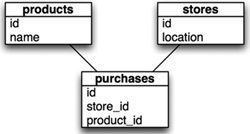

You can use [figure
1.1](https://github.com/fenago/ruby-programming/blob/master/lab_guides/Lab_1.md)
as a model to create the tables (if you prefer to use some sort of GUI
tool), or you can use the SQL in [listing
1.1](https://github.com/fenago/ruby-programming/blob/master/lab_guides/Lab_1.md).

##### Listing 1.1. SQL for graph example database

``` {.code-area}
CREATE DATABASE `paper`; CREATE TABLE `products` (  `id` int NOT NULL auto_increment,  `name` text,  PRIMARY KEY  (`id`) ); CREATE TABLE `purchases` (  `id` int NOT NULL auto_increment,  `product_id` int default NULL,  `store_id` int default NULL,  PRIMARY KEY  (`id`) ); CREATE TABLE `stores` (  `id` int NOT NULL auto_increment,  `location` text,  PRIMARY KEY  (`id`) );
```

[copy **](javascript:void(0))

Now, let’s set up ActiveRecord to work with the database. ActiveRecord
is typically used inside of a Rails application, and because we’re not
using it in that environment, it takes a few more lines of
configuration. See our configuration and implementation code in [listing
1.2](https://github.com/fenago/ruby-programming/blob/master/lab_guides/Lab_1.md).

##### Listing 1.2. Setting up our database with ActiveRecord

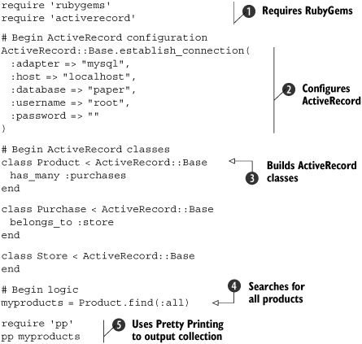

As you can see, it doesn’t take a lot of code to get a full
object-relationally mapped database connection. First, we import the
RubyGems library , so we can then import
ActiveRecord. Next, we establish a database connection with ActiveRecord
. Normally this configuration data would live
in a database configuration file in a Rails application (such as
database.yml), but for this example we chose to run outside Rails, so
we’ve used establish\_connection directly. Next, we create ActiveRecord
classes and associations to map our database
. Finally, we execute a query
 and output its results using Pretty Printing
(pp) .

Just fill in some testing data (or download the script from the course’s
source code to generate some for you), and run the script. You should
see something like the following output:

``` {.code-area}
[#<Product:0x639e30 @attributes={"name"=>"Envelopes", "id"=>"1"}>, #<Product:0x639e08 @attributes={"name"=>"Paper", "id"=>"2"}>, #<Product:0x639c00 @attributes={"name"=>"Folders", "id"=>"3"}>, #<Product:0x639bb0 @attributes={"name"=>"Cardstock", "id"=>"4"}>]
```

[copy **](javascript:void(0))

Our database is set up and our query works, so let’s move on to
generating a graph from the data. First, remove those last two lines
from [listing
1.2](https://github.com/fenago/ruby-programming/blob/master/lab_guides/Lab_1.md)
(they’ll be superfluous by the time we’re done). Now let’s take the data
we retrieved, process it, and build the graph using Scruffy. In [listing
1.3](https://github.com/fenago/ruby-programming/blob/master/lab_guides/Lab_1.md),
you’ll see how to do that.

##### Listing 1.3. Generating a graph with Scruffy

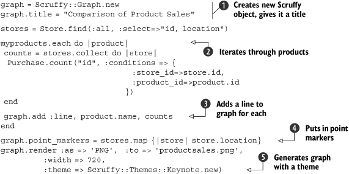

First, we create a Scruffy::Graph instance and do a little bit of setup
. Next, we iterate through the products we
found earlier and calculate the sales counts for each store location
. Then we add a line on the graph showing the
sales trends for that product across the stores
. Before we render the graph, we need to add
the markers to indicate which sales location we’re looking at
. Finally, we render the graph to a PNG file
using one of Scruffy’s built-in themes .

If you open the graph and look at it, you can see that it is polished
(ours looks like [figure
1.2](https://github.com/fenago/ruby-programming/blob/master/lab_guides/Lab_1.md).

##### Figure 1.2. Our finished graph: in about 40 lines of code, we pulled data from the database, processed it, and graphed it in a rather attractive fashion.


Not bad for 40 lines of code, including whitespace, comments, and more
verbose than required constructs. Sure, this example isn’t
representative of every situation—you can’t develop a full CRM solution
in Ruby with 40 lines of code—but it speaks volumes about the
expressiveness of the language and the power of its toolkit.

In the next section and subsequent labs, we’ll look at a lot of the
concepts that power this example, so you can start building applications
and tools that take full advantage of Ruby’s features.

### 1.3. Facets of Ruby

Now that we’ve discussed the “why” of Ruby, let’s look at the “how.” One
of the goals of this course is to make you into a truly effective Ruby
developer; we want you to be able to use Ruby to reframe problems and
craft solutions. In this section, we’ll discuss Ruby concepts and unique
“Rubyisms” that will help you do this and that will power the examples
and libraries you’ll see throughout the rest of the course. We intend that
you’ll come away with a grasp of these advanced concepts and know how to
craft code that is readable, expressive, and “good” (by whatever
subjective method you use to measure that). If we’re successful, you’ll
be able to use Ruby to do your job more effectively and develop more
maintainable applications.

But what do we mean when we talk about reframing problems in Ruby? Every
programming language has its own set of idioms and best practices. Once
you’re comfortable with the syntax and know your way around the
libraries, you start to explore that which makes the language unique.
You explore the character of the language, if you will: the way it
promotes a certain style of programming and rewards you for following
it. If you work with the language, it will work for you.

Object-oriented languages, for example, ask you to encapsulate behavior
and data into objects, and they reward you for that in reuse. If you’re
coming from Java, you know the value of using JavaBeans and the standard
collections library, of throwing and catching exceptions, and so on.
Today we take those for granted, but in the early days of Java
development, many developers would use Java as if it were C or Visual
Basic. They wrote code that didn’t follow Java idioms, which made it
harder to maintain and use.

Like Java, Ruby has its own set of idioms. For example, in Ruby you
often use *blocks* to keep your code simple and readable. You can write
methods that extend classes with new functionality (metaprogramming).
You enrich classes with common behavior by mixing in modules, fondly
known as *mixins*. You can use *blocks* to abstract loops and even
extend methods and reduce code duplication.

Let’s say you were writing a script to interface with an old legacy
server. It accepts TCP connections and operates on simple commands like
LOGIN, GET, DELETE, and so on. Each time you start a session with the
server, you need the same setup and teardown, but you want to do
different things during the socket’s connection each time. You could
write a number of methods for each sequence of events, duplicating the
setup and teardown code in each one, or you could use a block. [Listing
1.4](https://github.com/fenago/ruby-programming/blob/master/lab_guides/Lab_1.md)
shows a simple implementation of this script.

##### Listing 1.4. Using blocks to reduce code duplication

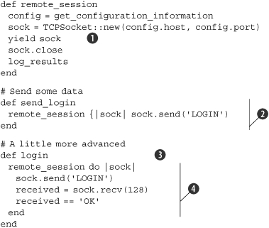

First, we create a method to execute our setup and teardown, with a
yield statement inside . That yield statement
tells Ruby to execute the block that is fed to the method as a
parameter. Next, we create a simple method to send the LOGIN command to
our server . Note that a block is fed to this
method as a parameter. The sock parameter is the socket from our setup
method (remote\_session) that is given to the block to use. We do the
same for the login method , but this time we
send the login and do something with the returned data
. Notice the code duplication we’ve
eliminated by putting all of our setup and teardown into a separate
method; this is just one of the many facets of Ruby that make
development with it that much cleaner and easier.

Ruby is a dynamic language, and as you get to explore that facet of
Ruby, known as *duck typing*, you’ll notice that you don’t need to use
interfaces and abstract classes as often. The way Ruby allows you to
extend objects and use constructors relieves you from juggling
factories. Iteration is often done with blocks and functions, whereas in
nonfunctional languages you tend to use for loops and define anonymous
classes.

Once you get the hang of all these ideas, you’ll start reframing
problems in terms of Ruby, rather than thinking out a solution in a
language you’re more familiar with, and writing it in the Ruby syntax.
You will often find that reframing problems changes the way you think
about code, and you’ll discover new ways to become a better developer.

Imagine a method that queries the database for products based on
different criteria. You could call the method with any number of
arguments. But it’s hard to understand exactly what criteria it’s using
if your code looks like this:

``` {.code-area}
find_products nil, nil, nil, nil, 5, 50, 250
```

[copy **](javascript:void(0))

What does the 5 stand for? What about the 50? Some languages promote the
idiom of method overloading, creating several methods with different
signatures, depending on the expected call. But overloading doesn’t
always work if all the arguments are integers. In that case you’ll want
to follow a different idiom, creating an object, populating its fields,
then passing it to the method. Those are all good idioms, but not the
ones you’ll likely use with Ruby.

Ruby has a convenient syntax for handling hashes, which you can use to
simulate named arguments. Instead of method overloading and populating
objects, you can write something like this:

``` {.code-area}
find_products :category => 5, :price => 50..250
```

[copy **](javascript:void(0))

Duck typing even makes it possible to call the following line and let
the method extract the identifier from the storage object:

``` {.code-area}
find_products :category => storage, :price => 50..250
```

[copy **](javascript:void(0))

As you practice these idioms, you’ll notice certain things change. For
one, you’ll have fewer methods in your objects, making your APIs easier
to understand. In fact, you’ll have fewer classes to deal with. In this
example, we’ve eliminated an object to hold all the properties and a
class to define it. With fewer classes and methods, it’s easier to
understand the overall design of your software and how all the pieces
fit together.

This discussion has barely scratched the surface. This course is not a
walkthrough of the Ruby language; we only wanted to give you a taste for
the language’s features. We could go on and on about all of the dynamic
features of Ruby, but it would ultimately be redundant. We’ll cover some
of these concepts, features, and practices in This lab, but
throughout the course you’ll see these and other Ruby idioms in practice,
which is where real education happens: when you use your knowledge in
practice. We hope that we can help you learn those mostly by example,
with some explanations along the way. The more you invest in learning
the language, the better a developer you’ll be. There’s always a
learning curve, but fortunately there’s not a lot to it with Ruby.
You’ll see the benefit of Ruby while you’re learning and practicing the
language, but you’ll want to take that information and go deeper to get
even better.

One of the killer apps for Ruby is the Ruby on Rails web application
framework. Developers are attracted to the magic of Rails and the
productivity gains therein, but, in reality, most of the magic is good
Ruby programming applied to web applications. Think about this: what if
you could make the same magic work for you in other domains, to make you
a better developer for any problem you need to solve? What if you could
take those same productivity gains and magic methods, and use them in
*your* code? Let’s look at some of the facets of this gem we call Ruby
that can make this possible: duck typing, simplicity, efficiency, and
functional programming.

#### 1.3.1. Duck typing

Ruby uses dynamic typing rather than static typing, and Ruby’s brand of
dynamic typing has been dubbed *duck typing.* It’s not so much that
Ruby’s typing behaves differently than most dynamically typed languages;
it’s merely that one thinks about objects based on behavior rather than
type: if an object walks like a duck and quacks like a duck, then it
must be a duck.

In a static typing system, an object’s type is determined by its class
definition at compile time. Static typing forces each object to declare
its heritage, so you’re always asking, “where are you coming from?” In
dynamic languages, behavior is captured by the object, not the
interface. Dynamic typing only cares about merits, so the question to
ask each object is, “what can you do?”

You can do the same with reflection in Java or C\#, but reflection hides
your business logic in a haystack of type-bypassing code. With dynamic
typing, you don’t have to declare so many interfaces and abstract
classes in anticipation of reuse, you don’t have to write adapters and
decorators as often, and you don’t need to choose between readability
and functionality. All these help you reuse code more often.

A byproduct of duck typing is that method calls do not check their
recipient’s type beforehand. Your code calls a method, and if it fails,
it raises an exception. This concept sounds a little cloudy, so let’s
look at a piece of code to explain it. Let’s say we have a method that
calls size and returns it in a friendly message.

``` {.code-area}
def print_size(item) puts "The item's size is #{item.size}."end
```

[copy **](javascript:void(0))

Our method calls size on the object without regard for its class, so if
you feed it an object that responds to the size method, it will work.

``` {.code-area}
mystring = "This is a string."print_size(mystring)          # => The item's size is 17.myarray = [1,2,3,4,5]print_size(myarray)          # => The item's size is 5.myfile = File::Stat.new("readme.txt")print_size(myfile)          # => The item's size is 432.
```

[copy **](javascript:void(0))

This is a perfect illustration of duck typing: all three objects walk
and talk like ducks. We’re expecting the object to do something, and we
only have to ask: does it do that?

Duck typing is a trade-off. You no longer have a compiler that will
catch type errors upfront, but you do have fewer opportunities for
errors. In a statically typed language, you’ll repeat the type
declaration in multiple places: class definition, variable declaration,
constructor, method arguments, and so on. If you need to refactor code,
perhaps splitting a class into an interface and separate implementation,
maybe adding a factory or writing a decorator, you end up making type
changes in multiple places, and you’ll want a type-checking compiler to
help you minimize errors.

That’s not a problem with Ruby. As you grow more familiar with Ruby,
you’ll notice that you don’t have to declare types that often, or repeat
them all over the place. You rarely need to separate interfaces and
implementation classes, or conjure factories and decorators. When you
have fewer types to deal with, type checking is less of an issue. What
you get in return is being able to do more with less code, which means
fewer places for bugs to hide. Give it a shot. We doubt you’ll miss type
checking.

If you do end up needing a way to assert that an object at least
responds to a method, every object defines a method named respond\_to?
that will respond true or false depending on whether or not that object
will respond to the method indicated:

``` {.code-area}
3.respond_to?(:to_s)      # => true3.respond_to?(:im_fake)    # => false"string".respond_to?(:gsub) # => true
```

[copy **](javascript:void(0))

This isn’t type checking, but it’s a pretty good indicator of an
object’s identity if you need it. This is also useful if you want to
branch depending on the parameter given to the method:

``` {.code-area}
if param.respond_to?(:convert) param.convertelse MyClass.from_object(param)end
```

[copy **](javascript:void(0))

This technique can help make your API simpler, and, depending on how the
code is written, make your code shorter.

#### 1.3.2. Simplicity

Ruby values simplicity. To be fair, all programming languages do, each
striving for simplicity in its own way. But they don’t all achieve it in
the same way. A language cannot enforce simplicity any more than it can
keep your code bug free, but it can certainly reward you for keeping
things simple. Or, it can reward you for making things complex, often in
the form of over-engineering.

As much as we hate to admit it, once we write a piece of software and
release it to the world, the software becomes harder to change. Yet, it
often needs to change to add new features, switch databases, support
more protocols, or integrate with other systems. And so we plan for
change.

Each language has its own patterns that deal with change. In a
statically typed language like Java, you need to think about these
requirements upfront: once the implementation has been fixed, it is hard
to change. You tend to figure out the interfaces upfront, use factories
liberally, allow for decorators, and so on. Because those changes are
hard to make later on, you’re better off doing them up front, just in
case, even for cases that will never happen. In their own way,
statically typed languages reward you for over-engineering.

In contrast, you’ll find that it’s much easier to make local changes
with Ruby without affecting the rest of your code because it’s a dynamic
language. When change is easy to make, you don’t have to plan as much
for every eventuality. In dynamic languages, there’s less need to design
interfaces that are separate from the implementation, because it’s
possible to refactor the implementation without breaking code all
around. You won’t need to bury the business logic in layers of
factories, decorators, listeners, and anonymous classes. That might seem
hard to imagine if you have a strong background with statically typed
languages, but as you get comfortable with Ruby, you’ll notice it too.
Ruby will reward you for keeping things simple, and saying no to code
you don’t need will reward you with quicker development and easier
maintenance.

#### 1.3.3. DRY efficiency

Ruby is a DRY language. DRY stands for: Don’t Repeat Yourself.
Syntactically, it’s an efficient language: you can express the same
thing with fewer lines of code. As we know, computers are fast enough
that more lines of code do not slow them down, but what about you? When
it comes to debugging and maintaining, the more code you have to deal
with, the harder it is to see what it does and find the problems that
need fixing. Ruby helps you keep your code short and concise.

[Listing
1.5](https://github.com/fenago/ruby-programming/blob/master/lab_guides/Lab_1.md)
shows this with a simple example. The first style is Ruby, but you’ll
notice that it looks similar to many other programming languages. The
second style is the preferred way of doing it in Ruby: shorter and less
repetitive (and if this is the last value in a method, the return is
superfluous). There’s not a lot to this example, but imagine that you
could do this throughout your code, eliminating thousands of lines of
unnecessary cruft.

##### Listing 1.5. A small example of DRY syntax

``` {.code-area}
# The long way record = Hash.new record[:name]  = "Dave" record[:email] = "admin@net.com" record[:phone] = "555-1235" return record # The Ruby way return { :name=>"Dave", :email=>"admin@net.com", :phone=>"555-1235" }
```

[copy **](javascript:void(0))

Though this example is a bit contrived, it illustrates part of a
consistent effort to make Ruby’s syntax efficient without being
unreadable. Ruby’s syntax has a lot of little features like this that
end up giving you huge gains: blocks, iterators, open classes, and more.
And many of these features are due to Ruby’s ties to functional
programming.

#### 1.3.4. Functional programming

Ruby is an object-oriented language: it is objects all the way down.
Like many other dynamic languages, functions are also first-class
citizens. Couple that with outstanding support for closures, and it’s
easy to adopt a functional style of programming. But unlike more
traditional functional programming languages, like LISP or Haskell, Ruby
is easier to pick up, and it can let you enjoy both worlds of functional
and procedural style.

Why is functional programming so important? For one, it helps you write
shorter and more concise code, and some things are easier to express in
functional style. For another, the functional style leads to code that
doesn’t depend on state and has fewer side effects. Code like that is
much easier to mold and refactor, and it gives you more opportunities
for reuse. It also makes it easier to build applications that scale.

The easiest way to build software that scales is using the “shared
nothing” architecture. The less shared state you have to deal with, the
easier it is to scale. Although Ruby comes with modern libraries that
support threads, locks, mutexes, and other concurrency mechanisms, it
helps that you don’t have to use them often.

We’re sure a lot of this discussion sounds like academia mixed with
astronaut buzz talk. Functional programming hasn’t yet hit the big time
in the world of software development, but perhaps you’re familiar with
the Google MapReduce algorithm, which achieves unparalleled scalability
by running tasks independently of each other. Its efficiency is achieved
through two main algorithms or methods: map and reduce. You can see
Ruby’s “map” in [listing
1.6](https://github.com/fenago/ruby-programming/blob/master/lab_guides/Lab_1.md)
as the obviously named map method; the “reduce” part in Ruby is most
often done using the inject method.

##### Listing 1.6. Map is one way Ruby uses functional programming for parallelism

``` {.code-area}
# Code that iterates in order to map one array to another application_names = [] for application in applications  application_names << application.visible_name end # Code that maps one array to another applications.map { |application| application.visible_name } # An even shorter way to express it in Rails and Ruby 1.9 applications.map &:visible_name
```

[copy **](javascript:void(0))

Code that has fewer dependencies is easier to run in parallel, taking
advantage of modern multicode CPUs, or when deploying on a cluster of
servers. There are other ways to do it, but functional programming makes
it extremely easy.

Now let’s look at one of the most attractive features of Ruby. In
covering these facets of Ruby, we’ve been working our way toward one of
the biggest features of the language: metaprogramming.

### 1.4. Metaprogramming

We talked in the beginning about reframing solutions in terms of Ruby.
Software development bridges the gap between your ideas and applications
you can use. The smaller that gap, the more quickly you can cross it.
We’re going to stop the analogies here, but the point is that you want
to translate your ideas into code quickly and easily. The language you
choose can increase or reduce this distance between ideas and your
implementation (see [figure
1.3](https://github.com/fenago/ruby-programming/blob/master/lab_guides/Lab_1.md).

##### Figure 1.3. Some languages create a gulf between your ideas and working code.

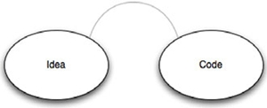

But as you progress and become an expert with the tools of your trade
(regardless of which language you use), this gap will slowly close.
You’ll be able to frame things in terms of a language’s idioms, keeping
the language’s limitations, strengths, and so on, in the back of your
mind. Your ideas are then much closer to real code ([figure
1.4](https://github.com/fenago/ruby-programming/blob/master/lab_guides/Lab_1.md)
illustrates this).

##### Figure 1.4. Ideas can more closely match the resulting code if your expertise and perspective create an overlap between the framing of an idea and the real code that will execute it.

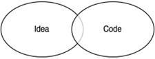

Most programming languages are content being what they are. Some
languages are more generic, but they force you to deal with more
details. Other languages help you deal with a specific domain problem
but tend to be simple and inflexible, such as SQL, RuleML, XML Schema,
Ant, and CSS. Through *metaprogramming*, Ruby allows you to have a
mixture of both. You can extend Ruby with mini-languages that can get
you closer to the problem you’re solving, and you can still use all the
expressive power of Ruby (see [figure
1.5](https://github.com/fenago/ruby-programming/blob/master/lab_guides/Lab_1.md).

##### Figure 1.5. Ruby can be bent to your problem domain, making the overlap between your problem domain and real code significant.

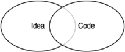

This course isn’t focused on teaching much Ruby “teachnique” in the sense
of the core language, but there are a couple of powerful tools that will
let you crank your developer volume all the way to 11 and give you the
ability to solve problems with ease. We think it’s worthwhile to spend a
few minutes introducing you to these tools: metaprogramming and
domain-specific languages.

#### 1.4.1. Getting started with metaprogramming

The software industry always looks for that one silver bullet that can
turn ideas into code without the “overhead” of software developers.
We’re not too worried about losing our jobs, but software that writes
software is a wonderful tool, even if it only takes on part of the
workload. Compilers that turn source code into machine code do that—they
let us work with higher-level languages. Source code generators and IDE
wizards give us a head start by writing boilerplate code and skeletons.
And even further up the ladder, there’s *metaprogramming*, writing code
that writes code.

##### Methods that define methods

If you come from a background in Java or C\#, you learned that objects
and classes are different in one fundamental way. Objects are mutable,
so you can change them by calling methods on them, but classes are
immutable: their definitions are written down, and once compiled, cannot
be changed. In Ruby, classes, like objects, are mutable. You can call a
method on a class that will change the class definition.

Let’s look at a simple example. Suppose we have a Project that has an
owner, an attribute you can both get and set. [Listing
1.7](https://github.com/fenago/ruby-programming/blob/master/lab_guides/Lab_1.md)
shows two ways to express that. We can write a couple of methods, or we
can call attr\_accessor. By calling this method on the class, we allow
it to change the class definition and essentially define a method for
getting the value of the instance variable @owner, and a method for
setting it.

##### Listing 1.7. Using attr\_accessor to define accessor methods on your class

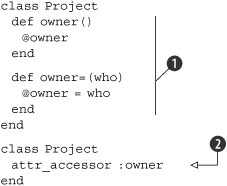

The class definitions in [listing
1.7](https://github.com/fenago/ruby-programming/blob/master/lab_guides/Lab_1.md)
both do the same thing: define an attribute owner that you can get and
set. The first version is rather explicit ,
but the second version uses a lot less code .
This seems a little contrived now, but imagine having 12 or 15
attributes in a class. Then you’re going from 40 or 50 lines of code
down to 1. That’s a *huge* spread across an entire application. Even
better, you describe the intent of what needs to happen (accessing an
attribute) without having to be totally verbose about it.

But how does it work? Let’s take a look at an implementation of
attr\_accessor in Ruby in [listing
1.8](https://github.com/fenago/ruby-programming/blob/master/lab_guides/Lab_1.md).
This is not *the* implementation from Ruby, but it has the same effect.

##### Listing 1.8. A reimplementation of attr\_accessor

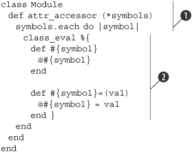

Using Ruby’s open classes, we reopen the class definition of the Ruby
core class Module  and add a method,
attr\_accessor, to it. This method takes each provided symbol and
executes a code block in the context of the class definition using
class\_eval . You will become familiar with
the \*\_eval family of methods in your metaprogramming. Check out [table
1.1](https://github.com/fenago/ruby-programming/blob/master/lab_guides/Lab_1.md)
for a summary of their usage.

##### The eval family of methods

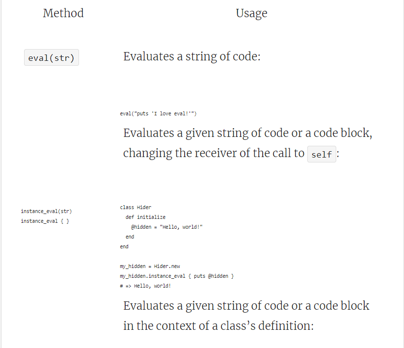

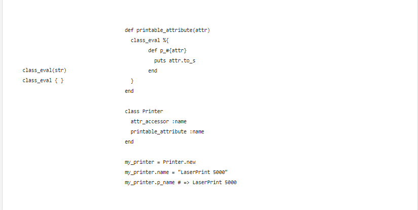

Now that we have added our method to the class definition, every
instance of a Module or Class object has this method available to it.

Now let’s look at a more complex example. We’re further along in the
development of our application, and we realize there will be a lot of
projects to manage. We want to help users by giving them a way to tag
projects, so they can then find projects through tags and through
related projects. We need a separate table to hold the tags, and we need
to add methods to retrieve projects by tags, to delete tag associations
when a project is deleted, and so forth.

That’s quite a lot of work: a lot of database work for inserting new
tags, editing and deleting tags, not to mention searching. We decide to
reinvent the wheel some other time, and instead we download a plugin
called ActsAsTaggable. [Listing
1.9](https://github.com/fenago/ruby-programming/blob/master/lab_guides/Lab_1.md)
shows how we use it.

##### Listing 1.9. Using ActsAsTaggable to get a lot of features in one line of code

``` {.code-area}
class Project < ActiveRecord::Base  acts_as_taggable end
```

[copy **](javascript:void(0))

Why is this a more complex example when it’s no longer than the previous
one? Because acts\_as\_taggable adds a lot of functionality to our
Project model that would take us several days to do otherwise. Now our
Project model has access to a set of tags in the database and has
methods to search with baked right in (such as find\_tagged\_with). We
can call Project.find\_tagged\_with(:all =\> 'ruby') and get an array of
models that have the tag ruby. It required little code on our part: that
is the power of metaprogramming.

Ruby is flexible enough that in addition to defining new methods, you
can extend existing methods. Think of this as aspect-oriented
programming baked into the language. It can also let you define complete
classes, from the simple Struct, which declares a JavaBean-like class in
one method call, to more complicated mechanisms, such as creating a
collection of model classes from your database schema.

Now let’s look at dynamic method definition.

##### Implementing methods dynamically

This style of metaprogramming happens at class definition, but
metaprogramming can also be used to dynamically alter objects. With
languages that have static (or early) binding, you can only call a
method if that method is part of the class definition. With languages
that have dynamic (or late) binding, you can call any method on an
object. The object then checks its class definition to decide how to
respond to the method call.

This means that in Ruby, if the method is not part of the class
definition, the object calls method\_missing. Typically, method\_missing
will throw an exception, but you can override it to do more interesting
things. Let’s try to create an XML document (an RSS feed for our
projects) using XML::Builder. Take a look at [listing
1.10](https://github.com/fenago/ruby-programming/blob/master/lab_guides/Lab_1.md).

##### Listing 1.10. Building an RSS feed for our projects

``` {.code-area}
xml = XML::Builder.new xml.rss "version"=>"2.0" do  xml.channel do   xml.title "Projects"   xml.pubDate CGI.rfc1123_date(Time.now)   xml.description "List of all our projects"   for project in projects do    xml.item do     xml.title project.name     xml.guid project_url(project), :permalink=>true     xml.pubDate CGI.rfc1123_date(project.created_on)     xml.description project.details    end   end  end end
```

[copy **](javascript:void(0))

If you’re looking for the step where we use a DTD or XML Schema to
generate source code, you won’t find it. Builder uses method\_missing to
create elements based on the method name, attributes from the method
arguments, and text nodes from the first argument, if it’s a string. So
a simplified version of that method might look like [listing
1.11](https://github.com/fenago/ruby-programming/blob/master/lab_guides/Lab_1.md).

##### Listing 1.11. A simplified look at XML::Builder’s use of method\_missing

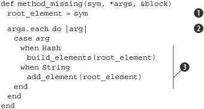

Using Ruby’s open classes, Builder overrides the method\_missing method.
Builder takes the name of the missing method that is called
, and the value provided
, and makes elements out of them depending on
the value’s type . You’ll likely find coding
like this sprinkled throughout your favorite and most-used libraries,
including ActiveRecord.

Builder is one of those staple libraries you’ll use quite often in your
projects, and it’s an interesting library to analyze if you’re curious
about metaprogramming. If you learn enough about it, metaprogramming can
help you build mini-languages that you can use to reframe business logic
in terms of the problem domains, rather than in terms of a language’s
syntax. We’re talking about *domain-specific languages*.

#### 1.4.2. Domain-specific languages

Functions, objects, libraries, and frameworks all help you work at a
higher level of abstraction, closer to the problem. If you look at the
software landscape, you’ll see a lot of different specialty domains. You
can imagine languages, each of which is designed to solve a specific set
of problems by expressing solutions in a way that’s easy and natural for
that specific domain. Perhaps you hadn’t heard of domain-specific
languages (DSLs) before reading this course, but you certainly have used
them. Do any of the following names sound familiar: SQL, regular
expressions, HTML, Make, WSDL, .htaccess, UML, CSS, Ant, XSLT, Bash?
These are all domain-specific languages.

Within the domain of relational databases, there needs to be a way to
define new tables. There needs to be a way to query these tables and
return the results, to create new records, to update and delete existing
records. You could do those things by delving into low-level database
APIs, creating the table structures directly, iterating over B-tree
indexes to fetch records, performing joins in memory, and sorting the
data yourself. In fact, many system developers used to do just that.
Nowadays, we use SQL.

But DSLs have a limit: it’s hard to create a programming language that
has good support for variables, expressions, functions, objects, and all
the tooling around it. So DSLs tend to be simple, static, and
inflexible. HTML, for example, can express rich multimedia content,
including text, images, audio, and video. But if you want to do anything
dynamic, like pull-down menus, partial updates, or drag and drop, you
need a more generic programming language. You’ll want to use JavaScript.
On the other hand, because JavaScript is a generic programming language,
it will take a mountain of statements to create a page using the DOM
API. But what if you could mix a generic programming language with a
domain-specific language?

Let’s look at XML Schema definitions, for example. The XML Schema
language was originally designed to validate XML documents. With it, you
can express what a valid XML document looks like, so you can check XML
documents against these rules before deciding whether or not to process
them. It’s much easier to use than iterating over the DOM and checking
whether the current element is allowed to follow the previous element,
and whether it has all the right attributes.

But, like most DSLs, XML Schema has its limits. For example, you can
check that a customer element has optional contact data, such as email,
phone, or IM handle, but there’s no easy way to require that at least
one of these elements exists. There’s no easy way to validate that all
U.S. addresses have a state, or that the ZIP Code matches the address.
But if we created a DSL using a powerful host language (like Ruby), we
could come up with something that looks like [listing
1.12](https://github.com/fenago/ruby-programming/blob/master/lab_guides/Lab_1.md).

##### Listing 1.12. A validation domain-specific language example

``` {.code-area}
contact_information_verification do |the_persons|  the_persons.name.is_required  the_persons.address.is_required  the_persons.address.must_be(10).characters_long  the_persons.phone.must_be(10).characters_long  the_persons.im_handle.must_not_be(in_existing_accounts) end
```

[copy **](javascript:void(0))

This gives us a nice set of readable rules that can be updated by anyone
(probably even your secretary), which will generate or execute the
validations we need. DSLs can bring the same simplicity and abstraction
to a lot of your specific problems.

* * * * *

##### Note

What we’ve created here is not *technically* a DSL in the purest sense,
but an embedded DSL (EDSL)—a domain-specific language that’s embedded
inside a host language, in this case Ruby. Throughout this course, we’ll
show different Ruby libraries and tools that include their own
mini-languages, all of which are EDSLs.

* * * * *

Think about code that expresses business rules or composes tasks, and
you’ll find many opportunities to simplify and reduce noise. DSLs don’t
just help your secretary or business manager keep your code up, they can
also help you as a developer keep yourself sane. Using Ruby’s
metaprogramming capabilities, you can build these sorts of solid,
literate tools and fluent interfaces.

#### 1.4.3. Refining your metaprogramming

If you’ve never built a DSL, it can be slightly daunting to make sure
your implementation stays flexible yet still clean. Even the masters
have to take a step back to rethink things every once in a while. (For
example, Rspec, a popular Ruby testing library, changed its DSL numerous
times before settling on the current implementation.) But there are
steps you can take to make sure that you’re approaching the right
problems the right way with metaprogramming, and to ensure that you
aren’t carrying around a hammer looking for a nail to hit.

The place to start is with the problem you solve over and over again.
When you see a lot of repetition in your code, or when you find yourself
getting bogged down by details, that’s the right time to simplify
things. Metaprogramming helps you simplify by creating an easier, more
expressive way to write code. There’s no point in writing a DSL that you
will only use once, but it pays several times over if you use it
repeatedly.

You could let your imagination run wild and use metaprogramming to solve
problems you think you’ll have someday, but you’ll quickly realize that
those are just mental exercises. Instead, look for patterns you have in
your code right now, for practices and idioms you use often, and use
metaprogramming to simplify those. This process is called *extraction*,
and it’s based on what you need and use, not what you could imagine
doing some day. You’ll notice that Rails, Rake, RSpec, and many of the
other frameworks we cover in this course all came from extractions, from
looking at existing solutions and finding better, easier ways to write
those.

The best way to write a DSL is to practice *intentional programming*.
Step away from the code and ask yourself, “if I were not limited by the
language I use right now, if I could express the solution itself in some
other language, what would my code look like?” Try to write that code as
if that language already exists. You’ve just defined a DSL. Now you have
to go and implement it, but the hardest part is behind you.

So how do you know you’re successful? A good DSL has two interesting
qualities. The first is that you’ll want to use it. You know you’re
successful when, out of all the possible things you can do that day,
just after coffee, you decide to write code using that DSL.

The second quality of a good DSL is that you can throw away the
documentation and still use it, or you might say it follows the “the
rule of least surprise.” When the code comes naturally to you, it’s
easier to write and less painful to maintain. When we work with Rails,
we never have to stop to ask, “how do we access the order\_on field?” We
know that in Rails it’s accessed with the order\_on method. We know that
to find an employee record by their name, we use find\_by\_name. The
rule of least surprise is one of those, “I’ll know it when I see it”
guidelines. Just ask your teammates what they expect to happen, and if
you’ve followed the rule closely enough, they should be able to tell
you.

Using method\_missing and a few other fun metaprogramming tricks, you
may work yourself into a position where you have a lot of methods that
aren’t explicitly defined. The Rails API is much larger than the API
documentation indicates because there is so much runtime code generation
that goes on. How do you make sure that your users and coworkers know
what your code can do, that your code is testable, and, above all, that
your intentions are clear (even six months from now)? You document, of
course. And if you follow the rule of least surprise, you have little to
worry about: other developers will intuitively know which methods to
expect when it all makes sense.

But what about testing? Don’t the dynamic features make it harder to
test? Testing metaprogramming is no different from testing any other
piece of code. There’s nothing magical about it, no hidden traps. You
can use any tool available for testing, and, in fact, in the next
lab we’re going to talk about testing at length.

### 1.5. Summary

Ruby has gained a lot of popularity in recent times because it’s a
simpler, expressive alternative to other contemporary languages. This
success is partially due to the emergence of Rails as a tangible tool
that developers can use to develop production-quality software that’s
still developer friendly. Rails owes this friendliness to Ruby, which
offers a lot of features, such as metaprogramming, that make Ruby more
expressive and even fun.

As more and more developers pick up Ruby, they will want to use their
current programming paradigms, like aspect-oriented programming or
declarative programming, and development practices such as Scrum or
test-driven development. Ruby has a number of libraries to help bring
these old practices into your new environment (such as Ruleby or
AspectR). In the next lab, we’ll concentrate on the most prevalent
of these—test-driven development—and we’ll look at testing Ruby code
using the built-in testing library and some related third-party tools
and libraries.

