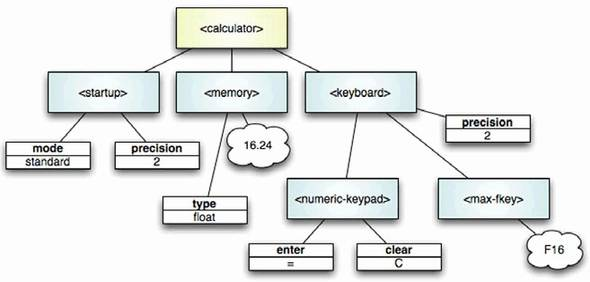
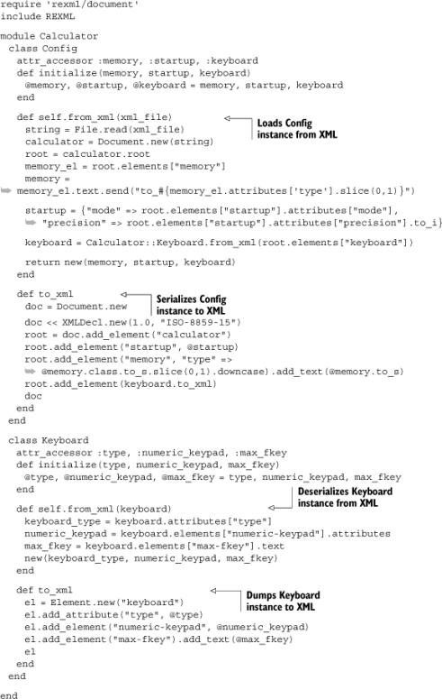
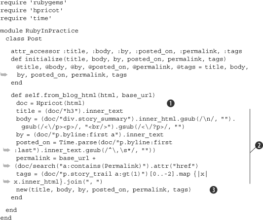
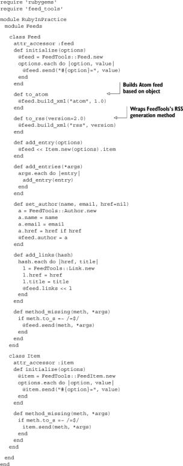

Lab 10. Structured documents
================================

### This lab covers

-   Using XML to read configuration files
-   Working with HTML
-   Generating XML with Hpricot
-   Reading RSS feeds

Almost any Ruby program you write will involve either loading data from
an external source or exporting data produced in your program to an
external source, which will be reloaded later or loaded by another
program. You might use a dead-simple representation like YAML or a more
complex one like Atom to store the data, but the basic principles will
remain the same.

While you’ll have the ability to choose the data format for your
configuration files or external storage, you will often run into
situations where you need to use data produced by someone else, often by
programs written in other programming languages or even created manually
by human beings. In these cases, you might need to be able to read in,
and correctly interpret, broken data files. The most common example of
this is reading HTML files from the internet, which are frequently
impossible to parse without first repairing the data.

Thankfully, almost every structured format you might come across has an
associated Ruby library that will make reading in data for use by your
program, or writing out information you’ve collected, a trivial matter.
Some of these libraries, like the Hpricot library that we will discuss
later, also specialize in fixing broken input before giving you a simple
API to parse and manipulate the data.

In This lab, we’ll look at XML, including specific forms like RSS,
Atom, and XHTML. We’ll also look at YAML, Ruby’s built-in, simple
serialization format, and CSV, which is commonly exported by programs
like Microsoft Excel and Outlook.

#### Pre-reqs:
- Google Chrome (Recommended)

#### Lab Environment
Al labs are ready to run. All packages have been installed. There is no requirement for any setup.

All exercises are present in `~/work/ruby-programming/` folder.


### 10.1. XML in practice

The most common data-interchange format is XML. It is used to encode all
sorts of information from documents produced in Microsoft Word to the
votes of members of Congress made available online. Virtually all
programming languages have extremely good support for XML, so it’s
virtually guaranteed that information exported by one program will be
easily interpreted by any other. Vendors frequently use XML as a format
for configuration files because they have to do little or no custom work
to read or write them.

Because XML is such a common interchange format, there are a number of
extremely common uses, like using XHTML for web pages and RSS or Atom
for online feeds. We’ll get to those cases later, but another extremely
common use of XML is for storing configuration data for applications.
Sooner or later, you will likely need to parse legacy or configuration
data in the form of XML, and Ruby has a nice set of XML libraries to
help you out.

For our first couple of examples, we’ll look at parsing the
configuration for a fictitious calculator program that performs
similarly to the calculator built into Apple’s Mac OS X or Microsoft
Windows. Let’s assume that the calculator supports two modes, standard
and scientific, and that we’ll store its starting position in our
configuration file. We’ll also store information about the decimal-point
precision, as well as the number currently in memory, if any.

#### 10.1.1. Using XML to read configuration files

One of the most common uses for XML in both development and consumer
environments is storing configuration values. XML is a staple of Java
and C\# development, where many project presets are managed by XML
files. XML files are an excellent way to integrate with an existing
codebase or to use existing configuration data in a new Ruby (or other
language) application.

##### Problem

You need to load and parse an XML configuration file for a new
application.

##### Solution

For our calculator, we need to be able to read in the configuration
details and instantiate a calculator object with the settings that were
previously saved by the user. A sample configuration file for the
calculator is shown in [listing
10.1](https://github.com/fenago/ruby-programming/blob/master/lab_guides/Lab_1.md).

##### Listing 10.1. Our calculator’s XML configuration file

``` {.code-area}
<?xml version="1.0" encoding="ISO-8859-15"?> <calculator>  <startup mode="standard" precision="2" />  <memory type="float">16.24</memory>  <keyboard type="Macintosh">   <numeric-keypad enter="=" clear="C" />   <max-fkey>F16</max-fkey>  </keyboard> </calculator>
```

[copy **](javascript:void(0))

This is a very simple configuration file, but it offers enough variance
to explore the features of Ruby’s built-in XML parser, REXML. [Figure
10.1](https://github.com/fenago/ruby-programming/blob/master/lab_guides/Lab_1.md)
shows the XML represented graphically as a tree of nodes.

##### Figure 10.1. A graphical representation of the calculator XML document. Element nodes are represented by rounded rectangles, attributes by squared rectangles, and text nodes by bubbles.



There are a number of libraries that allow us to parse XML in Ruby. For
this simple case, REXML, the XML parser that is built into Ruby, will do
the trick. Check out [listing
10.2](https://github.com/fenago/ruby-programming/blob/master/lab_guides/Lab_1.md)
to see how natural the implementation is.

##### Listing 10.2. Getting our XML into Ruby with REXML

``` {.code-area}
require 'rexml/document' include REXML module Calculator   class Config    def initialize(memory, startup, keyboard)     @memory = memory, @mode = mode, @keyboard = keyboard    end   end   class Keyboard    def initialize(type, numeric_keypad, max_fkey)     @type = type, @numeric_keypad = numeric_keypad,  @max_fkey = max_fkey   end  end end string = File.read("calculator.xml") calculator = Document.new(string) root = calculator.root memory = root.elements["memory"] memory = memory.text.send("to_#{memory.attributes['type'][0.1]}") startup = {:mode => root.elements["startup"].attributes["mode"],  :precision => root.elements["startup"].attributes["precision"]} keyboard = root.elements["keyboard"] keyboard_type = keyboard.attributes["type"] numeric_keypad = keyboard.elements["numeric-keypad"].attributes max_fkey = keyboard.elements["max-fkey"].text keyboard = Calculator::Keyboard.new(keyboard_type,  numeric_keypad, max_fkey) config = Calculator::Config.new(memory, startup, keyboard)
```

[copy **](javascript:void(0))

In [listing
10.2](https://github.com/fenago/ruby-programming/blob/master/lab_guides/Lab_1.md),
we started by producing a hypothetical API for our calculator
configuration object. Because, in this example, we are producing both
the application and the XML configuration we’ll read in, we are free to
create an API for our application that closely mirrors the XML format.
In this case, we used the simple XML reading methods of REXML to extract
the information we needed from the configuration file and populate our
configuration object. In a real-world scenario, this configuration
object would presumably be passed into the application when it was
instantiated.

For simplicity, we have left out any error handling, but you would
probably want to handle errors caused by incorrectly formatted XML more
gracefully than simply throwing an error and exiting the application, as
this example would.

##### Discussion

Because this example is so simple, there are only a few things that need
discussion. First off, the example uses a common Ruby trick to produce
the correct value for the starting memory value. The XML format can only
return strings, but we wanted to be able to specify that the value in
memory was some other type. In our case, we wanted to allow integers or
floats to be loaded in. Because Ruby allows conversion from string to
numeric formats via to\_f for floats and to\_i for integers, we were
able to provide a single character in the type attribute of memory, and
then easily call the appropriate conversion function by using the send
method.

REXML allows you to use XPath selectors and returns the appropriate node
type based upon the selector. For instance, when getting the precision,
we used the object’s methods:
root.elements["startup"].attributes["precision"]. We could have instead
used an XPath attribute selector: root.elements["startup/@precision"].
Because the @ sign indicates that it’s an attribute selector, the
expression will return an attribute’s value. In other cases, if we were
to select elements, we could get elements back.

Another neat trick is that the attributes method on an element returns a
Hash. As a result, if you structure your API to accept a Hash, you can
simply pass in the result of the attributes method, as we did for
numeric\_keypad. This allows us to support an arbitrary (and even
changing) set of options for the numeric keypad without having to change
the way we parse the configuration file.

#### 10.1.2. Writing configuration data to disk

Now that we’ve put together some code for reading in configuration data
from an XML file, what happens if you want to save changes to the XML?
Unless you expect your user to modify the document by hand, you need a
way to output any changes back to the configuration file.

##### Problem

Now that you’ve read in the configuration file, you need to write an
edited configuration file to disk.

##### Solution

For the purposes of this example, let’s assume that we need to produce a
function that will take a configuration object, as we defined it
previously, and serialize it back into outputtable XML. Because we’re
doing more than just pulling in some data from a file, we’ll get a bit
more object oriented this time, and take the opportunity to write tests
proving that our function works.

In addition to creating a mechanism for outputting our configuration
object to XML, we’ll pull our input conversion into Calculator::Config.
We’ll create to\_xml and from\_xml methods on the Config class. And to
make things even more encapsulated, we’ll create to\_xml and from\_xml
methods on the Keyboard class, which will allow us to specify how we
want keyboard specification objects to be saved and restored within the
larger specification XML. See [listing
10.3](https://github.com/fenago/ruby-programming/blob/master/lab_guides/Lab_1.md)
for our implementation.

##### Listing 10.3. Reading and writing the configuration



All of the code inside the new from\_xml method should look very
familiar, as it’s basically cribbed out of our example in [section
10.1.1](https://github.com/fenago/ruby-programming/blob/master/lab_guides/Lab_1.md).
However, we moved the logic dealing with the Keyboard into a from\_xml
method on the Keyboard object, which allows us to pass in the root
\<keyboard\> XML node, and have it return a Keyboard object, which we
can use to instantiate our specification object.

Note that Keyboard.from\_xml is a class method on the Keyboard class,
just as Config.from\_xml is a class method on the Config class. There’s
a slight incongruity between the two in that Config takes a filename,
while Keyboard takes a DOM node. This is because of the way we expect to
instantiate the objects: Configs will pull in an external file, while
Keyboards will receive part of an existing DOM structure.

The to\_xml function we wrote in the Config class is even simpler to
understand than the original parsing function. First, we create a new
XML Document. We then add an XML declaration (which should appear at the
top of the XML files, if we’re following good form), and then the root
element (\<calculator\>). The add\_element function has a nice property
that makes the next step very simple. It takes an element name as its
first parameter, and an optional Hash object for any attributes you wish
to instantiate. Well, holy attributes, Batman! We already store the
startup attribute of Config as a Hash, so we can simply pass it in.
Elegant, huh?

We’re not quite as lucky with memory, because we have to reverse the
procedure we used in from\_xml to store the number and its type. For
type, we slice off the first character of the memory object’s class,
lowercase of course (s for String, i for Integer, and f for Float). For
the value, which we store as text inside the \<memory\> node, we use
to\_s to stringify the value. The real trick, however, comes next, with
our encapsulated Keyboard object.

As you recall from [section
10.1.1](https://github.com/fenago/ruby-programming/blob/master/lab_guides/Lab_1.md),
we decided to keep the Keyboard information in its own object, which
would encapsulate information about a Keyboard. At the time, there was
very little utility in this decision, but when we made our code more
object oriented, we got to make further use of this encapsulation. Since
our Config object has a Keyboard object in its keyboard attribute, we
can simply call keyboard.to\_xml to get the appropriate XML for the
keyboard.

The Keyboard\#to\_xml function is also pretty simple. We start by
creating a new wrapper element (\<keyboard\>), and adding the type
attribute based upon the object’s @type instance variable. You might
have thought you could use the shortcuts we use with add\_element to add
the attributes when you create the elements, but unfortunately
Element.new does not support that shortcut. We then use the shortcut
syntaxes we used earlier to finish up the element, and we return it.

##### Discussion

The takeaway from all this XML creation is that writing somewhat elegant
REXML code requires a good knowledge of the chaining and shortcut
possibilities. Because add\_element returns the element in question, for
instance, we can immediately throw an add\_text on top of it. We can
also use existing hashes that we have created for our application for
the attributes of any node—a trick we made extensive use of.

So far, we’ve been parsing and working with plain vanilla XML, but in
the next section we’re going to look at how to work with a
domain-specific variety of XML: HTML.

### 10.2. Parsing HTML and XHTML with Hpricot

With the explosion of the web more than a decade ago, a tremendous
amount of information has become available on the internet in HTML form.
Unfortunately, that information is rarely, if ever, presented in fully
valid, parsable form. Since we can’t control the creation of the data
we’ll be reading in, it is important for us to have fast, dead-simple
tools for taking broken markup and converting it into machine-readable
content.

Fortunately, Hpricot, an XML parser written by Ruby luminary “why the
lucky stiff”
([http://github.com/why/hpricot/tree/master](http://github.com/why/hpricot/tree/master)),
provides us with just that. Its most performance-related features are
written in C, so it’s very fast, and it uses CSS3 selectors (plus a
number of custom CSS extensions), so finding precisely the nodes you
want, which is very important in massive, markup-heavy HTML pages, is
much simpler than in REXML. Finally, it was born out of the philosophy
of the popular jQuery JavaScript library, so you’ll find that certain
common tasks, like adding a class to a series of elements in a document,
become extremely simple.

In this section, we will explore processing HTML documents that we
create, as well as reading files in from the wild.

#### 10.2.1. Post-processing HTML output

Suppose you use a Ruby web framework like Ruby on Rails, Merb, or Nitro,
and you have a number of pages that produce tables. You want all of the
tables to have zebra-striping (even numbered rows should be colored
light blue) when your pages are rendered by the browser. You’ve already
explored a few options, but none of them have met your needs.

You’ve tried using client-side JavaScript code, but some of your tables
are quite large, and those pages can take minutes to load with this
solution. You’ve considered manually ensuring that your tables are
properly striped, but you have so many different mechanisms for creating
tables that trying to manually ensure that the striping occurs has
quickly become tedious. That said, it is not difficult for you to ensure
that all tables that need to be striped have a specific class, such as
zebra.

##### Problem

You need to process and transform HTML output from your web application.

##### Solution

We’ll use Hpricot to post-process the rendered page and set an
appropriate style on every other row. Then, we’ll use a CSS stylesheet
to pull in the style. We’ll use Ruby on Rails for this example, but the
general solution is framework-agnostic. As long as you have access to
the rendered response, you can use the technique outlined here to
postprocess your HTML. See [listing
10.4](https://github.com/fenago/ruby-programming/blob/master/lab_guides/Lab_1.md)
for our implementation; the CSS is in [listing
10.5](https://github.com/fenago/ruby-programming/blob/master/lab_guides/Lab_1.md).

##### Listing 10.4. A simple postprocessing filter

``` {.code-area}
class ApplicationController < ActionController::Base  after_filter :zebra  def zebra    doc = Hpricot(response.body)    doc.search("table.zebra tbody  tr:nth-child(even)").add_class("even")    response.body = doc.to_s  end end
```

[copy **](javascript:void(0))

##### Listing 10.5. The associated CSS

``` {.code-area}
.zebra .even {   background-color: #ddf; }
```

[copy **](javascript:void(0))

First off, note that we kept the example very simple, just to
demonstrate the technique at hand. Later in This lab, we will
explore more features of Hpricot, which you will be able to use together
with this technique to do more advanced postprocessing of HTML data.

With that said, let’s look at the example. You can ignore the
Rails-specific semantics. All that we’re doing is saying that the
postprocessing should occur for all pages in the application (by
including it in ApplicationController), and specifying that we will do
the postprocessing via an after\_filter. The real action happens in the
zebra method, and you’re probably surprised at how short the code is.

The first line simply grabs the existing response body and parses it via
Hpricot. Next, we find the rows we want to change. This might look a bit
odd, but it’s just a simple CSS3 selector. We find all tables with the
class zebra, which is how we’re going to specify that we want a table
zebra-striped. Then, we’ll jump down to the \<tbody\>, because we
probably don’t want to be striping our rows in the table head (if we
have any).

Once we have the tbody, we get all the even-numbered rows, relative to
their parent. We need to use :nth-child (rather than the :even selector
supported by Hpricot) in case we have multiple tables on the page. If we
simply used :even, if the first table ended on an odd row, the next
table would have the striping skewed by one. Using :nth-child scopes the
evenness to the table in question.

Once we’ve gotten the rows we need, we can use the add\_class
convenience method provided by Hpricot to add the even class to every
matched row.

As we’ll see later, Hpricot returns the Elements set that was matched by
the original selector from add\_class, so you can chain further
modifications onto the end of it. Finally, we reset response.body to our
modified document, and we’re off to the races. Simple, huh?

##### Discussion

While we noted one important difference in behavior between the :even
selector and even, there is another. The :even selector and even also
index the rows in the tables differently. When you use the :even
selector, the table is indexed as 0-based, which causes it to get the
first, third, fifth rows, and so on. This differs from even, which
indexes the table’s rows starting with 1, fetching the second, fourth,
sixth rows, and so on.

In the next section, we’ll look at solving a nearly inevitable problem
for developers working with HTML: fixing a broken HTML document.

#### 10.2.2. Reading broken HTML

Broken HTML is a regular problem for developers who work with HTML for
any period of time. Whether the cause is bad editors or web designers
who fail to follow conventional web standards, there’s a big, busted
world of HTML to deal with. Fortunately, parsers have reached a point of
reasonable intelligence and can fairly easily render broken HTML into
something usable.

Let’s say we have an application that reads in data from a series of
blogs and aggregates the data for our readers. In most cases, the blogs
provide a nice RSS feed, and we can happily use the feeds to get the
data. Unfortunately, a few of them don’t provide any kind of feed, and
the HTML is extremely sloppy. On the bright side, they haven’t updated
their layout in at least a decade or two, and you can be pretty sure
that the template they’re using isn’t going to change any time soon. An
example of a typical post can be seen in [listing
10.6](https://github.com/fenago/ruby-programming/blob/master/lab_guides/Lab_1.md).

##### Listing 10.6. A sample blog entry

``` {.code-area}
<h3>Open Thread </h3> <p class="byline"><i>by</i> <a href="http://foo.com/">Mr. Foo</a>, Fri Aug 17, 2007 at 11:15:45 PM EST</p> <div class="story_summary"> <p>Some Text Here</p> <p>Lorem ipsum dolor sit amet, consectetur adipisicing elit, sed do eiusmod tempor incididunt ut labore et dolore magna aliqua. Ut enim ad minim veniam, quis nostrud exercitation ullamco laboris nisi ut aliquip ex ea commodo consequat. Duis aute irure dolor in reprehenderit in voluptate velit esse cillum dolore eu fugiat nulla pariatur. Excepteur sint occaecat cupidatat non proident, sunt in culpa qui officia deserunt mollit anim id est laborum.</p> <p> </div> <p class="byline story_trail"> <br><a href="/story/2007/8/17/55555/5555">Permalink</a>  :: 5 <a href="/story/2007/8/17/55555/5555#commenttop">Comments</a> <br>Tags: <a href="http://www.myblog.com/tag/foo%20tag">  foo tag   </a>  (<a href="http://www.myblog.com/tag">all tags</a>) <br> </p>
```

[copy **](javascript:void(0))

The post in [listing
10.6](https://github.com/fenago/ruby-programming/blob/master/lab_guides/Lab_1.md)
uses a typical blog engine and includes information about the person who
wrote the article and when it was created, a permalink to the entry, and
some tags, among other things. We want to get the information from the
blog entry into an object we can use elsewhere in our application.

##### Problem

You need to parse and manipulate chunks of broken HTML.

##### Solution

Although it would be very common to store the information from the post
in an ActiveRecord object, which is exposed by the Ruby on Rails
framework and used on its own by other applications, we will use a
run-of-the-mill class for this example. The code to accompany this
lab includes an example of using
ActiveRecord to scrape and store information that is very similar to the
solution we’ll use here.

First, you’ll notice that there’s a little bit of broken HTML in
[listing
10.6](https://github.com/fenago/ruby-programming/blob/master/lab_guides/Lab_1.md).
While it’s mostly acceptable, it’s a far cry from perfectly valid XHTML
(there’s an open \<p\> tag on its own before the close of the \<div\>
tag, and the \<br\> tags aren’t self-closing). Hpricot will attempt to
fix these problems when it parses the HTML, so the output you’ll
eventually get will be, at the least, parsable. [Listing
10.7](https://github.com/fenago/ruby-programming/blob/master/lab_guides/Lab_1.md)
shows how to use Hpricot to implement this.

##### Listing 10.7. Getting the HTML into a Post object



The example in [listing
10.7](https://github.com/fenago/ruby-programming/blob/master/lab_guides/Lab_1.md)
is fairly rudimentary, but it allows us to take a look at a number of
techniques you can use with Hpricot to get very specific pieces of
information quickly and easily. But first, let’s peruse the structure
we’re using here.

As in [listing
10.3](https://github.com/fenago/ruby-programming/blob/master/lab_guides/Lab_1.md),
where we read and wrote the configuration data, we have separated out
the initialization of the class from the function that will pull the
information from an external source.

This is an important technique, because it will allow us to extend this
class later with additional parsers that can scan different types of
blog entries. You might have Post.from\_wordpress\_entry,
Post.from\_typo\_entry, and Post.from\_mephisto\_entry methods (and
while all of those methods have RSS feeds, let’s pretend we needed to do
some screen-scraping for the sake of argument). Because we’ve left the
initialization method so generic, we can easily plug into it after doing
whatever complex parsing we need to do. That said, let’s take a look at
the actual code we use to get the various pieces of information out of
the HTML fragment in [listing
10.6](https://github.com/fenago/ruby-programming/blob/master/lab_guides/Lab_1.md)
that we pulled from the web page.

The first thing we do, as in [listing
10.4](https://github.com/fenago/ruby-programming/blob/master/lab_guides/Lab_1.md),
is create an Hpricot object from the HTML .
To get the title, we simply grabbed the inner\_text from the document’s
\<h3\> element. Marvel at the simplicity of the API before we move on
. The body of the article was in a \<div\>
with the class of story\_summary. All we need to do to get the contents
of that element is to use elementary CSS knowledge: div.story\_summary
represents a \<div\> with the class story\_summary, so that’s all we
need here. We do some fancy gsubbing to normalize line spacing, and
we’re done.

Getting the byline is a bit trickier. Examining the HTML, we see that
it’s inside a link that’s inside a \<p\> element with the class byline.
Unfortunately, there are two \<p\> elements with that class on the page,
but that poses no difficulty for the dexterity of Hpricot. Using the
custom :first extension to the typical CSS3 syntax, we can grab just the
first matched element. Putting it together, p.byline:first a matches the
link we need, and, as before, inner\_text will grab the text inside it.

We then move on to find the date and time the post was created, and we
encounter another difficulty. The time is formatted well enough for our
needs, but it’s not surrounded by any tags. That, too, poses no problem
for Hpricot. Examining the HTML, we see that the time is in the first
\<p\> element with the byline class, and that it’s the very last thing
in the \<p\>. Because all of the text is grouped together, Hpricot
considers it a single text node, so the selector p.byline:first :last
matches it. The :last selector is another one of Hpricot’s custom
extensions, and the space in between the two parts of the selector
indicate that Hpricot should find the last child of the first p.byline.
Using Time.parse, which is included from the standard library when we
did require 'time' wraps it all up.

Getting the permalink proves easy compared to the last two problems.
Hpricot supports the CSS3 selector :contains, which returns all elements
whose text contents match the text passed in to :contains. In this case,
the link we want has the text “Permalink” helpfully embedded, so we get
the element and use the handy attr method to get its href attribute. We
then append the href to the base\_url passed in, because we can see that
the permalink provided in the HTML is a relative URL.

Then we get the tags attached to the article. Looking at the HTML, we
can see that the tags are all enclosed inside links in a \<p\> element
with the class story\_trail. Looking closer, we see that we don’t want
to include the first, second, or last links. Using Hpricot’s :gt
selector, we can filter out the first two elements. Once we have those,
we can use Ruby’s Array\#[] operator (since an Hpricot element
collection is simply an extension of the base Array class) to remove the
last link. We then create an array containing the inner\_text of the
links, and join them with a comma, producing a nice comma-separated list
of tags.

Finally, we feed all this harvested data into a new object
.

##### Discussion

All in all, using Hpricot to scrape information from typical HTML sites
is a piece of cake once you learn the supported selectors. But it’s key
that you do. Most of the power of Hpricot comes from being able to drill
down into the dark corners of the document you’re parsing without
resorting to manually iterating through them. Since Hpricot supports all
of the same selectors as jQuery, you can get documentation on supported
selectors by visiting
[docs.jquery.com/Selectors](http://docs.jquery.com/Selectors).

Now that we’ve learned a bit about Hpricot, let’s take a brief detour to
look at how we could rewrite our configuration example from [section
10.1.2](https://github.com/fenago/ruby-programming/blob/master/lab_guides/Lab_1.md)
using Hpricot.

### 10.3. Writing configuration data: revisited

A rare but valid use case for Hpricot is generating XML. It’s not that
Hpricot is *bad* at generating markup; it’s just that that’s not what
it’s built for. Fortunately, because we have tests for the class we
wrote, we can simply
reimplement our serialization methods and make sure they work.

#### Problem

You want to use Hpricot to generate the XML configuration file rather
than adding another library to the requirements list.

#### Solution

We’re going to show only the modified \#to\_xml methods from Config and
Keyboard, which reflect the usage of Hpricot instead of REXML (which was
shown in [listing
10.2](https://github.com/fenago/ruby-programming/blob/master/lab_guides/Lab_1.md).
Using the code in [listings
10.8](https://github.com/fenago/ruby-programming/blob/master/lab_guides/Lab_1.md)
and
[10.9](https://github.com/fenago/ruby-programming/blob/master/lab_guides/Lab_1.md),
all tests written for [section
10.1.2](https://github.com/fenago/ruby-programming/blob/master/lab_guides/Lab_1.md)
still pass.

##### Listing 10.8. Redone Config\#to\_xml

``` {.code-area}
def to_xml   doc = Hpricot.XML("<?xml version='1.0' encoding='ISO-8859-    15'?><calculator/>")   (doc/"calculator").append("<startup/>").    search("startup").attr(@startup)   (doc/"calculator").append("<memory>#{@memory.to_s}</memory>").    search("memory").attr("type" => @memory.class.to_s.slice(0,1).downcase)   (doc/"calculator").append(keyboard.to_xml)   doc.to_s end
```

[copy **](javascript:void(0))

##### Listing 10.9. Redone Keyboard\#to\_xml

``` {.code-area}
def to_xml  el = Hpricot.XML("<keyboard/>")  (el/"keyboard").attr("type" => @type).   append("<numeric-keypad/>").   append("<max-fkey>#{@max_fkey}</max-fkey>").   search("numeric-keypad").attr(@numeric_keypad)  el.to_s end
```

[copy **](javascript:void(0))

Using Hpricot for XML creation involves a lot of literal node creation.
You create fragments of XML and stick them where they belong, and
Hpricot takes care of creating XML nodes out of them. In [listings
10.8](https://github.com/fenago/ruby-programming/blob/master/lab_guides/Lab_1.md)
and
[10.9](https://github.com/fenago/ruby-programming/blob/master/lab_guides/Lab_1.md),
we also used a fair amount of chaining, taking advantage of the fact
that Hpricot tends to return the original Elements array from operations
performed on it.

Quickly looking through Config\#to\_xml ([listing
10.8](https://github.com/fenago/ruby-programming/blob/master/lab_guides/Lab_1.md),
you can see that we replaced our individual calls that created the XML
document, its root node, and the XML declaration with a single call to
Hpricot.XML. We use Hpricot.XML rather than the typical Hpricot call
when we want the parser to use strict XML semantics instead of HTML
semantics. We then find the \<calculator\> node and append the empty
\<startup\> node. Because the append method returns the original
Elements array, we can then search for the new \<startup\> node and set
its attributes in the same way we did in the REXML solution ([listing
10.2](https://github.com/fenago/ruby-programming/blob/master/lab_guides/Lab_1.md).
We use the same techniques until the end of the method, when we append
the XML returned by Keyboard\#to\_xml.

Because Hpricot uses string-based manipulation, we put together the XML
for the Keyboard in much the same way that we created the Config’s XML
in [listing
10.7](https://github.com/fenago/ruby-programming/blob/master/lab_guides/Lab_1.md),
but we return a String so that it can be appended to the \<calculator\>
node in the Config object. Rerunning the tests gives us solid green, so
we’re good to go.

#### Discussion

The main thing to remember about using Hpricot to produce XML is that
you’ll be mostly producing XML fragments and using methods like append,
inner\_html=, and attr to set up your document. Once you get comfortable
with this, it’s extremely powerful.

Now that we’ve taken a look at HTML and generic XML, let’s take a look
at another form of rich markup: RSS.

### 10.4. Reading RSS feeds

Over the last few years, RSS has become a common way for content authors
to keep readers updated about the material they are posting. Blog
authors use RSS to keep their readers updated with their freshest
content, booksellers use RSS to let people know about new books they are
selling, and podcasters use a specialized form of RSS to point listeners
to their latest episodes.

Because RSS content is so consistent, it’s very easy to write web
applications that take advantage of its aggregation capabilities. Feed
readers galore have popped up, allowing users to enter their favorite
feeds and giving them different ways to view the contents. We’re going
to take a look at how Ruby allows us to read through an RSS document,
and we’ll build a rudimentary feed reader to get information about our
favorite feeds.


#### Problem

You want to build a simple feed reader that will allow your users to get
the titles, URLs, brief descriptions, and publication dates for the
articles in a feed. You want to be able to display the data on the
command line by accepting command-line arguments, or on the web, as
formatted HTML.

#### Solution

In this solution, we’ll be using familiar tools, like Hpricot, and some
not so familiar, like open-uri, to parse RSS. [Listings
10.10](https://github.com/fenago/ruby-programming/blob/master/lab_guides/Lab_1.md)
and
[10.11](https://github.com/fenago/ruby-programming/blob/master/lab_guides/Lab_1.md)
show our implementation of a simple RSS feed reader.

##### Listing 10.10. A simple RSS parser

``` {.code-area}
require 'rss' require 'open-uri' require 'rubygems' require 'hpricot' module RubyInPractice  class RssParser   attr_accessor :rss   def initialize(file, options = {})    f = open(file)    s = f.read    @rss = RSS::Parser.parse(s)    @options = {:truncate => 500}.merge(options)   end   def titles    @rss.items.map {|x| x.title}   end   def short_info    @rss.items.map {|x| [x.title, Hpricot(x.description).  inner_text[0..100] + "..."]}   end   def details    @rss.items.map do |item|      [item.title,       item.pubDate,       item.link,       Hpricot(item.description).   inner_text[0..@options[:truncate]] + "..."      ]     end    end    def to_html     @rss.items.map do |item|      %{       <h3><a href="#{item.link}">#{item.title}</a></h3>       <h4>#{item.pubDate}</h4>       <div class="body">#{item.description}</div>      }     end    end   end  end
```

[copy **](javascript:void(0))

##### Listing 10.11. A small command-line script for running the RSS parser

``` {.code-area}
#!/usr/bin/env ruby require 'optparse' require 'rss_parser.rb' module RubyInPractice  class RssRunner    def self.parse_options     @config = {}     OptionParser.new do |opts|      opts.banner = "Usage: rss_parser [options]"      opts.separator ""      opts.on "-f", "--file [FILE]",  "the file or URL you wish to load in" do |file|        @config[:file] = file      end      opts.on "-t", "--titles", "specify titles only" do |titles|        @config[:titles] = true      end      opts.on "-s", "--short",  "show a short version of the feed" do |short|        @config[:short] = true      end      opts.on "-r", "--truncate [NUMBER]",  "the number of characters to truncate the long  version to (defaults to 500)" do |trunc|        @config[:truncate] = trunc.to_i      end     end.parse!    end    def self.run     parse_options     file = @config.delete(:file)     r = RubyInPractice::RssParser.new(file, @config)     if !@config[:titles] && !@config[:short]      r.details.each do |item|       puts "\"#{item[0]}\" published at #{item[1]}"       puts "Available at #{item[2]}"       puts       puts item[3]       puts       puts      end     elsif !@config[:titles]      r.short_info.each do |item|       puts "\"#{item[0]}\""       puts item[1]       puts      end     else      puts r.titles.join("\n")     end    end  end end RubyInPractice::RssRunner.run
```

[copy **](javascript:void(0))

There are two parts to the solution provided here. First up, we created
a small class to read in an RSS feed and extract the useful information
into some useful configurations ([listing
10.10](https://github.com/fenago/ruby-programming/blob/master/lab_guides/Lab_1.md).
Second, we created a command-line script written in Ruby that accepts a
filename and spits out a human-readable version of the feed ([listing
10.11](https://github.com/fenago/ruby-programming/blob/master/lab_guides/Lab_1.md),
using the class we created in the previous listing. Before we take a
look at the command-line script, let’s take a look at the class that
does the hard work.

At the very top, we initialize our class with a filename. Because we
have required open-uri, we can provide either a local filename or an
internet URL, which makes the code more versatile than it appears at
first glance. We use RSS::Parser.parse to read the file into an RSS
object, which will give us access to its contents. We also provide
default options, which we will allow to be set using command-line
switches later on.

We’ll then create the methods that will aggregate the information from
the feeds that we’ll need later. Pretty much all you need to know here
is that the RSS object exposes an items array, and that each Item has
several pieces of information associated with it, including its title, a
link to the URL, the publication date, and a description. The
description will frequently have HTML data in it, so we’ll strip that
out using Hpricot if the data is being dumped to the terminal.

We also create a to\_html method, which can be used by web frameworks to
take the RSS feed and produce simple web-ready content. To see how it
might be used, look at the rss\_controller.rb file included with the
downloadable files for This lab. Note that we do not strip out the
HTML content in the to\_html method, because we are assuming it provides
useful formatting instructions. You could use the techniques we covered
in the previous sections to convert the description HTML into a more
usable format.

In the command-line script ([listing
10.11](https://github.com/fenago/ruby-programming/blob/master/lab_guides/Lab_1.md)
we use simple techniques to make the class we just created produce
useful content. It’s not important that you fully understand how it
works, but the basic principles should be obvious. We’re using Ruby’s
built-in option parser to accept options to pass into our RSS parsing
class. We accept a file parameter, which will be passed directly into
our class (and, as a result, will support either a local file or a URL).
We also support a choice of long, short, or titles-only display.
Finally, we allow the user to specify how many characters to retain when
we truncate the long version’s descriptions.

Because we are using optparse, we automatically support -h (or --help),
which will provide usage instructions based upon the information we
specified. You can see for yourself by running parse\_it.rb, which is
provided with the downloadable materials for This lab. Try entering
the URL to the feed for your favorite blog. If you don’t have one, check
out the official Rails blog’s feed at
[http://feeds.feed-burner.com/RidingRails](http://feeds.feed-burner.com/RidingRails).

Returning briefly to the command-line script, you can see two main
sections: \#parse\_options and \#run. These names are not required, but
they’re conventional. At the end, you can see that we call
RubyInPractice::RssRunner.run, which itself calls parse\_options. The
option parser will take apart the arguments you passed in to the
function and set up the @config instance variable, which we use in \#run
to determine the filename and to pass configuration options to the RSS
parser.

#### Discussion

We used optparse to handle our argument parsing in this section, mostly
because it’s built into Ruby’s standard library, but there are a few
libraries out there that handle the same functionality in a prettier
shell. For example, the Trollop library
([http://trollop.rubyforge.org/](http://trollop.rubyforge.org/)) offers
a much nicer syntax at the cost of a bit of power. Here is a Trollop
version of our arguments code from [listing
10.11](https://github.com/fenago/ruby-programming/blob/master/lab_guides/Lab_1.md):

``` {.code-area}
require 'trollop'opts = Trollop::options do banner "Usage: rss_parser [options]" opt :file, "the file or URL you wish to load in" opt :titles, "specify titles only" opt :short, "show a short version of the feed" opt :truncate,"the number of characters to truncate            the long version to (defaults to 500)",            :type => :int,            :short => "r"end
```

[copy **](javascript:void(0))

You’ll notice you can’t use a proc like we did in [listing
10.11](https://github.com/fenago/ruby-programming/blob/master/lab_guides/Lab_1.md),
so if you need to do any processing other than setting a value, perhaps
this isn’t the library for you. Other libraries include Optiflag
([http://optiflag.rubyforge.org/](http://optiflag.rubyforge.org/)), a
very nice library with a rather powerful syntax, and Choice
([http://choice.rubyforge.org/](http://choice.rubyforge.org/)), a
concise DSL for handling argument parsing. Any of these will work well;
the choice largely hinges on the sort of syntax and the amount
DSL-driven syntactic sugar you like to work with.

Now that we’ve taken a look at reading feeds, let’s turn our attention
to generating our own feeds.

### 10.5. Creating your own feed

Now that you’ve learned how to read feeds from other sites, you might be
thinking that you’d like to create your own feed. Unfortunately, there
are a number of feed formats, and creating a program that exports only
to RSS1, for instance, will leave some of your potential readers in the
dark. Thankfully, a library called FeedTools will allow you to create a
generic feed and then export it in multiple formats.

#### Problem

You want to create a feed for your website, but you only want to have to
create a single feed and have it export feeds in the formats you want.
Ideally, you would be able to decide at a later point exactly which feed
formats you want to support, so the Ruby class should be flexible enough
to support various formats.

#### Solution

We’ll create a wrapper around FeedTools that will allow us to easily
create a new feed and export it to whichever format we want. We’ll only
wrap a few commonly used functions for demonstration purposes, but it’s
trivial to extend this wrapper to provide additional functionality.

First, you’ll need to install the feedtools gem:

``` {.code-area}
gem install feedtools
```

[copy **](javascript:void(0))

Once you have FeedTools installed, the code in [listing
10.12](https://github.com/fenago/ruby-programming/blob/master/lab_guides/Lab_1.md)
will implement a feed generator.

##### Listing 10.12. Wrapping FeedTools



While FeedTools is quite cool, in that it provides a single API for
multiple feeds, it suffers from extreme API complexity. Adding an author
to a feed, for instance, requires creating a new FeedTools::Author
object (trying to call set\_author on a feed with a String will populate
only the name field of the object). To simplify things a bit, we have
created a new class called RubyInPractice::Feeds::Feed, which accepts a
series of fields and instantiates the feed quickly and easily.

Because most of the fields on the FeedTools::Feed object are set by
calling methods like link=, id=, and copyright=, we’ve instantiated our
wrapper object with a Hash with corresponding values. For instance, to
create a new Feed object with the feed’s ID set to
“[http://www.manning.com](http://www.manning.com/)”, you would use this
one-liner:

``` {.code-area}
RubyInPractice::Feeds::Feed.new(:id => "http://www.manning.com")
```

[copy **](javascript:void(0))

Adding entries is a similarly complex process with FeedTools, so we have
created a similar API for adding new entries. Once you have your wrapper
object (let’s call it feed), you would call add\_entry:

``` {.code-area}
feed.add_entry(:id       => "http://www.manning.com/foo",          :title     => "NEW!",          :abstract   => "Brand new feed entry",          :description => "This is the first feed entry for our feed",          :content    => "Some longer content would go here")
```

[copy **](javascript:void(0))

If you were creating an iTunes feed, there would be additional
properties, like enclosure, itunes\_summary, itunes\_image\_link—more
than can be set using this method. Keep in mind that Atom feeds require
unique IDs; those IDs must be URLs, or you will not be able to generate
an Atom feed.

Because setting up an author correctly using FeedTools can also be
complex, we have added a set\_author method that takes a name, email,
and optional href, creates the required FeedTools::Author object, and
associates the object with the wrapped feed. We do a very similar thing
with the add\_links method, which allows the creation of a
FeedTools::Link object by simply passing in a hash of href =\> title
pairs. You would do something like this:

``` {.code-area}
feed.add_links("http://www.manning.com" => "Manning Publications")
```

[copy **](javascript:void(0))

To facilitate the creation of RSS and Atom feeds, we have also created
two generation methods: to\_rss and to\_atom. Both methods simply
delegate to the build\_xml method of the underlying FeedTools::Feed
object.

#### Discussion

[Listing
10.13](https://github.com/fenago/ruby-programming/blob/master/lab_guides/Lab_1.md)
shows an example of the feeds that will be generated using our wrapper
script.

##### Listing 10.13. Creating a new feed

``` {.code-area}
f = RubyInPractice::Feeds::Feed.new(:id =>  "http://rubyinpractice.manning.com", :title => "Ruby in Practice Feed",  :description => "A sample feed for the Ruby in Practice lab on Data  parsing") f.set_author "Yehuda Katz", "wycats@gmail.com" f.add_entry(:title => "NEW!", :abstract => "This is a new feed",  :summary => "This is a new feed for testing", :id =>  "http://rubyinpractice.manning.com/new", :content => "There might  normally be some long content here")
```

[copy **](javascript:void(0))

The API using our wrapped set is fairly simple, as you can see. Now,
let’s see what happens when we go to generate the feeds using our
to\_atom and to\_rss methods. [Listings
10.14](https://github.com/fenago/ruby-programming/blob/master/lab_guides/Lab_1.md)
and
[10.15](https://github.com/fenago/ruby-programming/blob/master/lab_guides/Lab_1.md)
show markup generated by our code.

##### Listing 10.14. Generating RSS 2.0

``` {.code-area}
<?xml version="1.0" encoding="utf-8"?> <rss xmlns:taxo="http://purl.org/rss/1.0/modules/taxonomy/" xmlns:rdf="http://      www.w3.org/1999/02/22-rdf-syntax-ns#" xmlns:itunes="http://      www.itunes.com/dtds/podcast-1.0.dtd" version="2.0" xmlns:media="http://      search.yahoo.com/mrss" xmlns:dc="http://purl.org/dc/elements/1.1/"      xmlns:content="http://purl.org/rss/1.0/modules/content/"      xmlns:trackback="http://madskills.com/public/xml/rss/module/trackback/">   <channel>    <title>Ruby in Practice Feed</title>    <link>http://rubyinpractice.manning.com/</link>    <description>A sample feed for the Ruby in Practice lab on  Data parsing</description>    <managingEditor>wycats@gmail.com</managingEditor>    <ttl>60</ttl>    <generator>http://www.sporkmonger.com/projects/feedtools/</generator>    <item>      <title>NEW!</title>      <link>http://rubyinpractice.manning.com/new</link>      <description>This is a new feed for testing</description>      <content:encoded>        <![CDATA[There might normally be some long content here]]>      </content:encoded>      <pubDate>Tue, 28 Aug 2007 13:37:55 -0000</pubDate>      <guid isPermaLink="true">http://rubyinpractice.manning.com/new</guid>    </item>   </channel> </rss>
```

[copy **](javascript:void(0))

##### Listing 10.15. Generating ATOM 1.0

``` {.code-area}
<?xml version="1.0" encoding="utf-8"?> <feed xml:lang="en-US" xmlns="http://www.w3.org/2005/Atom">  <title type="html">Ruby in Practice Feed</title>  <author>   <name>Yehuda Katz</name>   <email>wycats@gmail.com</email>  </author>  <link href="http://rubyinpractice.manning.com/" rel="alternate"/>  <subtitle type="html">A sample feed for the Ruby in Practice lab  on Data parsing</subtitle>  <updated>2007-08-28T13:38:09Z</updated>  <generator>FeedTools/0.2.26 -  http://www.sporkmonger.com/projects/feedtools/</generator>  <id>http://rubyinpractice.manning.com</id>  <entry xmlns="http://www.w3.org/2005/Atom">   <title type="html">NEW!</title>   <author>     <name>n/a</name>   </author>   <link href="http://rubyinpractice.manning.com/new" rel="alternate"/>   <content type="html">There might normally be some long content  here</content>   <summary type="html">This is a new feed for testing</summary>   <updated>2007-08-28T13:37:55Z</updated>   <id>http://rubyinpractice.manning.com/new</id>  </entry> </feed>
```

[copy **](javascript:void(0))

As you can see, we get back two very different feeds with all of the
required feed-specific data, even though we were able to create them
very simply. As we said previously, the wrapper API is far from
complete, but the code should provide you with enough to get started
adding more functionality for working with RSS. Unfortunately, the RDoc
for FeedTools is not easily available online; however, it is installed
with the gem. The easiest way to take a look at it would be to run
gem\_server and navigate to
http://localhost:8808/doc\_root/feedtools-0.2.29/rdoc/index.html.

Now let’s take a look at YAML, another markup format that isn’t based on
XML at all.

### 10.6. Using YAML for data storage

We first looked at YAML in [lab
9](https://github.com/fenago/ruby-programming/blob/master/lab_guides/Lab_9.md).
It is a lightweight alternative to XML, which, even in its more
structured and parsable forms, requires quite a bit of code to get
simple things done. At first glance, YAML can store and reload simple
objects like hashes, arrays, integers, and strings, which will allow you
to develop a serialization and load strategy for your configuration
objects. For instance, Ruby on Rails uses YAML files to store
information about the database it uses in different operating modes.

YAML is even more powerful, however, in that it is able to do
quick-and-dirty serialization of your custom objects, as long as they’re
relatively simple. In this section, we’ll take one final foray into the
land of calculator configuration to see how we can use YAML to make the
entire process of serializing a configuration object and reloading it
later absolutely trivial.

#### Problem

You want to take an existing Calculator::Config object and store it to
disk. When your application starts, you want to load in the file from
disk and create a new Calculator::Config object for use.

#### Solution

In [section
10.1](https://github.com/fenago/ruby-programming/blob/master/lab_guides/Lab_1.md),
we looked at how to use XML as a configuration store. Now, we’ll use
Ruby’s built-in YAML functionality to replace our previous XML plumbing.
[Listings
10.16](https://github.com/fenago/ruby-programming/blob/master/lab_guides/Lab_1.md)
and
[10.17](https://github.com/fenago/ruby-programming/blob/master/lab_guides/Lab_1.md)
show our implementation.

##### Listing 10.16. Using YAML to solve the calculator config problem

``` {.code-area}
require 'yaml' module Calculator  class Config   attr_accessor :memory, :startup, :keyboard   def initialize(memory, startup, keyboard)    @memory, @startup, @keyboard = memory, startup, keyboard   end   def save_to(file)    f = File.open(file, "w")    f.puts(self.to_yaml)       end   def self.get_from(file)    YAML.load(File.read(file))      end  end  class Keyboard   attr_accessor :type, :numeric_keypad, :max_fkey   def initialize(type, numeric_keypad, max_fkey)    @type, @numeric_keypad, @max_fkey = type, numeric_keypad, max_fkey   end  end end
```

[copy **](javascript:void(0))

In [listing
10.16](https://github.com/fenago/ruby-programming/blob/master/lab_guides/Lab_1.md),
you can see that we kept the same API to the outside world but replaced
the guts of our configuration parser with YAML. The API here is
beautifully simple. To save our configuration to a file, we use the
to\_yaml method and write that data to the file
. Most of Ruby’s core objects implement
to\_yaml in one form or another, so it should work for most values. We
also load in the file and get a usable Ruby object in one fell swoop
using the load method . This process is
simple and straightforward (much like the YAML format itself!). Our
class should now behave the same as before, except that our
configuration file will have to be in the YAML format.

Now that the guts are in place, we need to test and make sure it works.
[Listing
10.17](https://github.com/fenago/ruby-programming/blob/master/lab_guides/Lab_1.md)
shows a short script that does that.

##### Listing 10.17. Using the YAML solution in an equivalent manner to our XML solution

``` {.code-area}
k = Calculator::Keyboard.new("Macintosh", {"enter" => "=",   "clear" => "C"}, "F16") c = Calculator::Config.new(16.24, {"mode" => "standard",   "precision" => 2}, k) c.save_to("config.yml") Calculator::Config.get_from("config.yml")
```

[copy **](javascript:void(0))

Using Ruby’s built-in YAML serialization, we are able to take a complex
problem that we previously solved using XML serialization in [section
10.1](https://github.com/fenago/ruby-programming/blob/master/lab_guides/Lab_1.md),
and convert it to a one-liner.

#### Discussion

YAML serialization isn’t the solution for every problem, because it can
only serialize data structures, not objects that contain baked-in code
(like procs and metaclass methods). However, for most configuration
requirements, simple data structures are more than adequate. If you’re
getting much more clever than this, you’re probably doing something
wrong. Creating a separate Keyboard class to hold keyboard information
was pushing it for us, but it was useful for the examples at hand.

For more complex examples, you can configure the YAML serialization. By
defining the to\_yaml\_properties method to return an array of the
properties you wish to serialize, you can cause YAML\#dump to ignore
properties that are not appropriate for serialization. You can also
define yaml\_dump and yaml\_load methods on the object you are
serializing to use a custom serialization strategy. You can get more
information about customizing the default load and dump in the Pickaxe
book (*Programming Ruby: The Pragmatic Programmers’ Guide*, by Dave
Thomas, with Chad Fowler and Andy Hunt).

### 10.7. Summary

Ruby’s toolset for working with structured documents is excellent. Ruby
can handle any major interchange format: XML, HTML, or YAML.

XML has bindings for almost any language, and Ruby’s built-in REXML
library is excellent for parsing XML. The Hpricot gem is even better,
since it can handle the rich context of formats like HTML and can
generate markup. Paired with the FeedTools gem, Hpricot can even handle
RSS.

If YAML is your preference, Ruby’s built-in YAML library is one of the
best available. As such, YAML is used extensively in a lot of Ruby
applications; it’s preferred to XML not only for its superior bindings
but also for its low visual noise and human readability.

In the next lab, we’re going to take a look at using authentication
and authorization in Ruby and Rails applications.