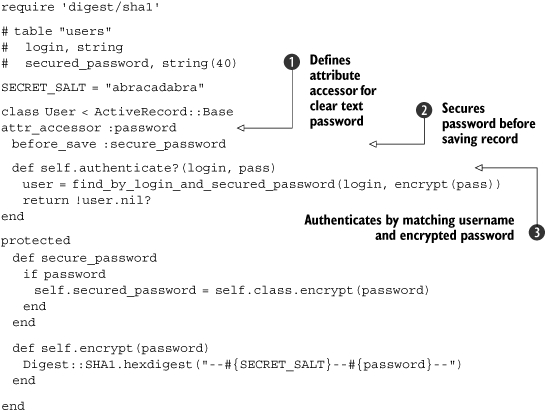
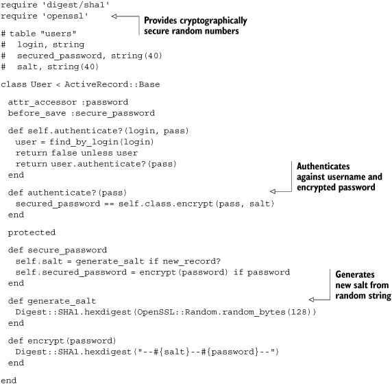

Lab 11. Identity and authentication
=======================================

### This lab covers:

-   Storing passwords securely
-   Authenticating users against LDAP and Active Directory
-   Authenticating Rails applications using restful\_authentication
-   Authenticating semiprivate personal feeds
-   Authenticating using HTTP Basic authentication
-   Authenticating Rails applications using OpenID

Trust is the foundation of successful networked systems. If you are
providing a personalized service over a network, you need to be able to
trust that your users are who they say they are, and your users must
trust you with their identity and their personal data. This lab
looks primarily at how you can trust your users—by implementing a robust
authentication mechanism. How well you execute that authentication will
influence how much trust your users will place in your application. Your
approach to security has a big impact, whether you are ensuring that
users’ passwords are safe, or you are offering an authentication option
that involves a trusted third party.

In This lab, we take a look at how to use Ruby and Rails to
implement your own secure authentication schemes as well as integrate
with established authentication mechanisms like Lightweight Directory
Access Protocol (LDAP), Active Directory, and OpenID.

#### Pre-reqs:
- Google Chrome (Recommended)

#### Lab Environment
Al labs are ready to run. All packages have been installed. There is no requirement for any setup.

All exercises are present in `~/work/ruby-programming/` folder.


### 11.1. Securely storing a password

With few exceptions, your users’ passwords should never be persisted in
a way that would allow anyone access to them. For example, if a hacker
were to get hold of your site’s database, he shouldn’t find a column
filled with passwords as plain text. Hopefully, this is obvious, but
enough sites on the web violate this rule that it is worth making sure
your applications don’t make this mistake.

#### Problem

You need to store a password for later authentication, and do it
securely.

#### Solution

Securely hash the password using a salt, and store the resulting string.
When it is time to authenticate a user, run the submitted password
through the same one-way process and compare the result to what you
stored.

* * * * *

##### Hashes with salt

A salt is the common term for a secondary input to a cryptographic
function. It is typically used with a hash function, in order to make
dictionary attacks on encrypted data difficult. A good summary of how
this works can be found in Philippe Oechslin’s article, “Password
Cracking: Rainbow Tables Explained”
([http://www.isc2.org/cgi-bin/content.cgi?page=738](http://www.isc2.org/cgi-bin/content.cgi?page=738)).

* * * * *

[Listing
11.1](https://github.com/fenago/ruby-programming/blob/master/lab_guides/Lab_1.md)
shows an example of an ActiveRecord class implementing this approach.

##### Listing 11.1. An ActiveRecord class implementing password hashing



In this example, the database table has a column named
secured\_password. This code supports setting the user’s password, as
well as authenticating a user. The password is assigned as clear text to
the password attribute defined using attr\_accessor
. The before\_save callback encrypts the
value of that attribute and stores it as the secured\_password
, which gets persisted to the database. When
it is time to authenticate a given username and password, the
authenticate method searches for a matching username and password, using
the one-way encrypted password value .

#### Discussion

An implementation of the SHA1 algorithm is included in the Ruby standard
library—it was written in C to make it perform as quickly as possible.
The properties of this government-standard algorithm make it a great
solution to the problem of storing passwords. Specifically, it is
repeatable and nonreversible. It is important that it be *repeatable* so
that the same password will always produce the same result, which can be
compared to previous results. It is important that it be *nonreversible*
so that if someone gains access to the encrypted string, it is
computationally infeasible to discover the actual password.

The salt makes it more difficult to do a dictionary attack against your
encrypted passwords—computing a list of the encrypted versions of common
passwords and checking them against yours.

Although the SHA1 algorithm is in wide use, vulnerabilities have been
discovered. The vulnerabilities are not believed to be serious, because
to make use of them, an attacker would need much greater computational
power than is typically available. Still, developers with healthy
paranoia would do well to consider the more secure cousins of SHA1,
known collectively as SHA2. The implementations of SHA2 that are
included in Ruby’s standard library are SHA256, SHA384, and SHA512. Here
is some sample usage:

``` {.code-area}
require 'digest/sha1'puts Digest::SHA256.hexdigest("Please hash me.")puts Digest::SHA384.hexdigest("Please hash me.")puts Digest::SHA512.hexdigest("Please hash me.")
```

[copy **](javascript:void(0))

There is also an alternate approach to the solution that adds complexity
but offers a more secure system overall. Instead of using a single salt,
we will create a salt for each user and store it as an additional field.
This dramatically increases the resources necessary for a dictionary
attack. It also means that if two users choose the same password, the
encrypted versions will still be different. If one of them had access to
the encrypted passwords, it could not discover that it was using the
same password as the other user. [Listing
11.2](https://github.com/fenago/ruby-programming/blob/master/lab_guides/Lab_1.md)
shows an implementation of this approach.

##### Listing 11.2. Per-user salt for password hashing



In this version, a row must be retrieved from the database in order to
validate a password. This is because the salt is stored alongside the
login and secured password. At first glance, this seems like it might be
insecure, and indeed, the separate location of the salt and secured
password is an advantage of the original implementation. However, that
advantage is outweighed by how much more difficult we are making life
for an attacker by having a unique salt for each user.

To generate a different salt for each user, we need to pick a random
value. Don’t make the mistake of using the system time—if the attacker
can guess when the account was created, it’s easy for her to generate
all the possible salt values and crack the password. And quite often,
we’ll store the account creation time directly in the users table. Using
Ruby’s rand method doesn’t help either, because the random numbers it
generates are not that random. They’re based on the system clock, and
even though they look secure, they can be cracked in a few seconds with
today’s hardware. Instead, we opted to use the OpenSSL library to
generate a cryptographically secure random number to protect our salt
from brute force attacks.

* * * * *

##### Note

This use of multiple salts is the approach used by the
restful\_authentication Rails plugin, discussed in [section
11.3](https://github.com/fenago/ruby-programming/blob/master/lab_guides/Lab_1.md).

* * * * *

If we go through great efforts to avoid persisting our users’ passwords
in plain text, it would be careless to write passwords to our log files.
To avoid this in your Rails applications, add the following code to the
controller that handles authentication, where password is the name of
your password parameter:

``` {.code-area}
class UsersController < ApplicationController filter_parameter_logging :password ...end
```

[copy **](javascript:void(0))

This will replace the value of any parameter whose name contains
“password” with the string [FILTERED].

Now that we’ve looked at a simple authentication scheme, let’s take a
look at authentication and identity with LDAP.

#### 11.1.1. Authenticating against LDAP

LDAP is an open standard for interacting with hierarchical sets of
people, groups, or resources. Popular open source LDAP servers include
OpenLDAP and Fedora Directory Server (FDS). Commercial offerings include
Sun’s Java System Directory and Novell’s eDirectory.

LDAP servers are well-suited to hold information about people and their
security credentials. As a result, they are commonly used for
authentication purposes. Let’s take a look at how we can accomplish this
with Ruby.

##### Problem

You need to authenticate users against an LDAP server.

##### Solution

We can use a Ruby LDAP library like the **ruby-net-ldap gem** to
validate a username/password pair. [Listing
11.3](https://github.com/fenago/ruby-programming/blob/master/lab_guides/Lab_1.md)
shows an implementation of LDAP authentication with Ruby.

##### Listing 11.3. Authenticating with ruby-net-ldap

``` {.code-area}
require 'net/ldap' def valid_user?(username, password)  ldap = initialize_ldap(username, password)  ldap.bind end def initialize_ldap(username, password)  Net::LDAP.new(:base => 'dc=example,dc=com',                :host => 'your-ldap-server',                :auth => {:username => "uid=#{username},cn=users",                       :password => password,                       :method => :simple}) end
```

[copy **](javascript:void(0))

The method LDAP.bind attempts to connect to the LDAP instance using the
credentials we supply. It returns true if successful, and false if not.

##### Discussion

The primary alternative to the **ruby-net-ldap gem** used in [listing
11.3](https://github.com/fenago/ruby-programming/blob/master/lab_guides/Lab_1.md)
is **ruby-ldap.** While **ruby-net-ldap** is a pure Ruby LDAP client
implementation, **ruby-ldap** is a wrapper around the OpenLDAP C
library. As you might guess, this means that **ruby-net-ldap** is far
more portable and easier to install, though **ruby-ldap** offers
significantly better performance.

R**uby-ldap** has an interesting library built on top of it called
Ruby/ActiveLdap. ActiveLdap maps LDAP entries to objects in much the
same way that ActiveRecord maps database rows to objects. Here is an
example of defining a User class using ActiveLdap:

``` {.code-area}
class User < ActiveLdap::Base ldap_mapping :dn_attribute => 'uid', :prefix => 'cn=users',          :classes => ['top','account'] belongs_to :groups, :class => 'Group', :many => 'memberUid',         :foreign_key => 'uid'end
```

[copy **](javascript:void(0))

ActiveLdap is likely overkill if your only use for LDAP is
authentication. In that case, **ruby-net-ldap** is probably fast enough
and your best bet. On the other hand, if your application is doing a lot
with LDAP entries, like queries and read-write operations, ActiveLdap is
definitely worth a look.

Leveraging a central corporate LDAP directory is a great strategy for
applications being deployed internally. Your users will thank you for
not making them create and remember yet another password!

### 11.2. Authenticating against Active Directory

Active Directory from Microsoft is used by many businesses for identity
management. Integrating your authentication system with Active Directory
is a great way to provide a good logon experience for internal
applications and help the business keep identity and password management
centralized.

#### Problem

You need to authenticate users against an existing Active Directory
installation.

#### Solution

Fortunately, Active Directory is compatible with the LDAP spec, so we
can use a Ruby LDAP library, like the **ruby-net-ldap** gem, to validate
a username/password pair. See [listing
11.4](https://github.com/fenago/ruby-programming/blob/master/lab_guides/Lab_1.md)
for an example.

##### Listing 11.4. Authenticating against Active Directory using ruby-net-ldap

``` {.code-area}
equire 'net/ldap' def valid_user?(username, password)  ldap = initialize_ldap(username, password)  ldap.bind end def initialize_ldap(username, password)  Net::LDAP.new(:base => 'dc=example,dc=corp',            :host => 'exampledomaincontroller',            :auth => {:username => "#{username}@example.corp",                    :password => password,                    :method => :simple}) end
```

[copy **](javascript:void(0))

Ask your Active Directory administrator for the name of the domain
controller—that’s the LDAP host in the case of an Active Directory
installation.

This example takes advantage of a convenience offered by Active
Directory: you can send user@domain as the username for the purposes of
binding, and Active Directory will handle it properly. Normally, LDAP
instances expect a distinguished name (DN) in this spot.

#### Discussion

The approach in [listing
11.4](https://github.com/fenago/ruby-programming/blob/master/lab_guides/Lab_1.md)
is suitable for an application that should be available to any member of
the Active Directory instance, but if you need more information about a
user, you can call the search method, which returns a collection of LDAP
entries, in place of the bind method, which simply confirms that the
provided credentials are valid. This would be useful, for example, to
validate that a user is not only who she says she is (via password), but
also that she is a member of a particular group. The search method uses
a filter based on the sAMAccountName attribute, which is the closest
thing to a simple username attribute in Active Directory’s schema.

Here’s an example:

``` {.code-area}
def valid_app_user?(username, password) ldap = initialize_ldap(username, password) entries = ldap.search :filter => "sAMAccountName=#{username}" return false unless entries && !entries.empty? return member_of_ad_group?("G-MyAppUsers", entries.first)enddef member_of_ad_group?(group, ldap_entry) group_names = ldap_entry[:memberof] # returns a collection of fully-                           # qualified Active Directory groups group_names.any?{|name| name.include? 'CN=#{group},' }end
```

[copy **](javascript:void(0))

The array of groups returned by the :memberof attribute of an Active
Directory LDAP entry contains the distinguished name of the groups.
Something like this:

``` {.code-area}
CN=G-MyAppUsers,OU=Groups Security,OU=Example,DC=example,DC=corp
```

[copy **](javascript:void(0))

In the member\_of\_ad\_group? method, we’re looking for a match in the
first part, the common name (CN).

If you want a solution specific to Active Directory,
**ruby-activedirectory** takes all the features and idiosyncrasies of
Active Directory into account. It provides classes for Users, Groups,
and Computers. The ActiveDirectory::User authenticate method will
validate a particular user’s password. Using it is straightforward:

``` {.code-area}
require 'activedirectory'def valid_user?(username, password) user = ActiveDirectory::User.find('jdoe') user.authenticate(password)end
```

[copy **](javascript:void(0))

This library depends on **ruby-ldap** being installed, which can be a
little tricky, as it wraps the OpenLDAP C library. If you can get over
that hurdle, **ruby-activedirectory** is quite useful in working with an
Active Directory installation.