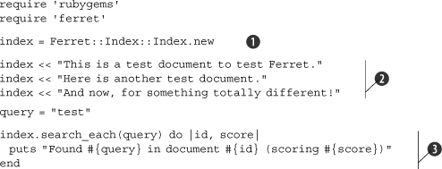
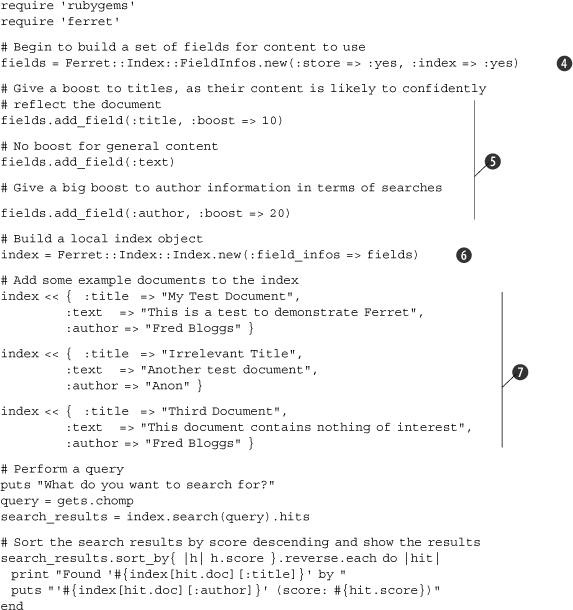
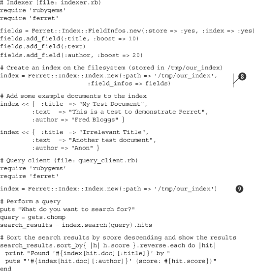
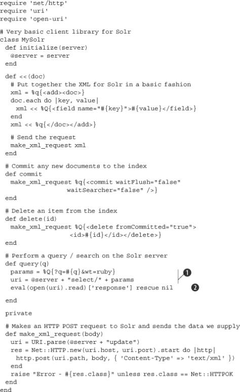
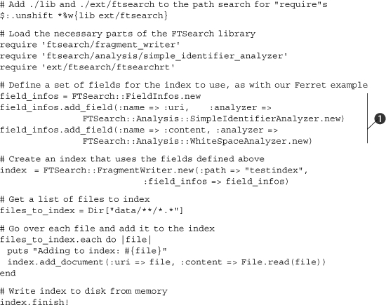
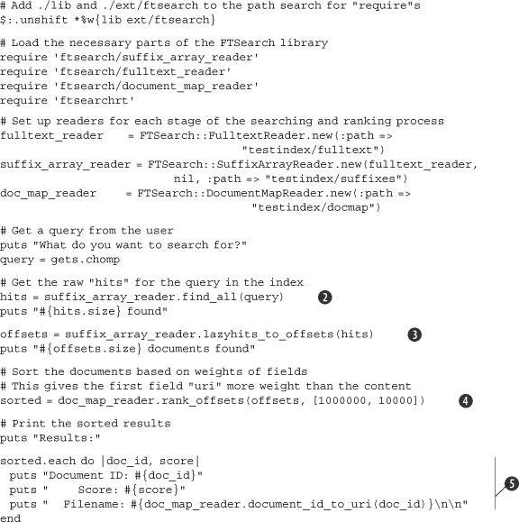
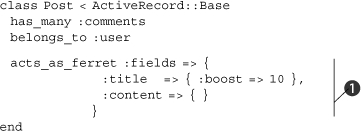
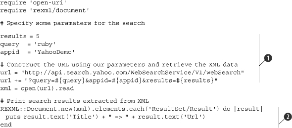
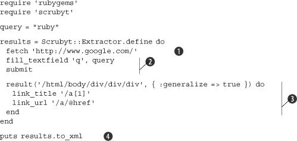

Lab 12. Searching and indexing
==================================

### This lab covers

-   Searching databases
-   Indexing content using Ferret and Solr
-   Searching with other technologies
-   The scraping technique

Throughout this book, and throughout your entire programming life,
you’ve been used to dealing with data, because it forms the input and
output for all computer programs. So far, we have mostly looked at
transforming data from one state to another, but in This lab we’re
going to investigate Ruby’s abilities to let you *search through* data.

Unfortunately, as a language that has reached maturity only in the last
few years, Ruby is not blessed with hundreds of search-related
libraries. This is not necessarily a bad thing, as search technologies
progress quickly, and most of the available Ruby search solutions are up
to date and ready to use in production immediately.

In This lab, we’ll look at Ruby-specific techniques for searching
and indexing data, and we’ll examine some solutions to common
search-related problems.

We’re going to look at standalone libraries and techniques available to
Ruby developers, and we’ll walk through the process of indexing content
using two Apache Lucene-based libraries, Ferret and Solr, as well as a
performance-driven Ruby-only library called FTSearch. We’ll also look at
integrating search features with other technologies, and at searching
the web, searching databases, and adding indexing and search features to
Ruby on Rails applications.

First, we’ll define searching and indexing, as well as other related
terminology.


#### Pre-reqs:
- Google Chrome (Recommended)

#### Lab Environment
Al labs are ready to run. All packages have been installed. There is no requirement for any setup.

All exercises are present in `~/work/ruby-programming/` folder.


##### Note

We will only cover search libraries that are under active development
and that have been updated in the last year. There are several older
libraries that you may hear about, but we feel it’s important to focus
on up-to-date, well-supported tools, so that the level of documentation
and support you would expect is still present.

* * * * *

### 12.1. The principles of searching

*Searching* refers to the process of taking a collection of data,
processing it so that it can be scanned quickly, then enabling a program
or a user to find small elements of data within the larger set. Google
provides the most ubiquitous form of search technology in our lives
today. If you want to find a web page that contains a certain word, or
set of words, you go to [http://www.google.com](http://www.google.com/),
type in your query, and receive your results almost instantaneously.

The amount of data Google can search across is somewhere in the range of
billions of pages, which take up thousands of gigabytes of space.
Google, therefore, certainly can’t scan every page, byte by byte,
looking for results to your query. It could take days (or longer!) to
get your search results that way, although it would still, technically,
be a “search engine.”

The process that allows Google to produce search results in under a
second is *indexing*, and the performance benefits of indexing are so
significant that every search library or tool must provide indexing
services of one form or another.

Indexing technologies can be extremely advanced, but at their most
basic, they work in the same way as an index in a book. For example, if
you turn to the index of this book and search for a particular term, you
know roughly where in the index to look, because the index is in
alphabetical order. Furthermore, once you find your desired term, you’re
provided with a set of page numbers to refer to. This contrasts
significantly with having to read through every page of the book to find
something. Computers use similar techniques. A search engine’s indexer
makes a note of words and phrases on a page, and links those terms
(using, for performance and efficiency, a unique numeric ID that
references each distinct term) to the page it is indexing. When a search
is run, the query engine can quickly look up the IDs of pages that match
the terms provided by a user’s search query.

### 12.2. Standalone and high-performance searching

In this section, we’re going to look at generic, standalone searching
and indexing scenarios with the simplest problem we can provide:
indexing, and then querying, a corpus of documents. This contrasts with
the latter half of This lab, where we will look at how to use and
integrate search techniques in busier situations, such as on the web or
within a database-driven web application.

#### 12.2.1. Standalone indexing and search with Ferret

Ferret is a Ruby implementation of Apache Lucene, an open source search
and indexing library written in Java. Lucene is incredibly popular in
the open source world, and a significant amount of software, and many
libraries, use it for implementing large and small search systems.
Lucene is an indexing and search library, and so does not include any
features relating to obtaining or specially parsing content. These
features are provided by other libraries, or by the software using
Lucene. As a Ruby implementation of Lucene, Ferret shares the same
characteristics.

Ferret will not crawl the web for you, download emails, or index
different types of content in unique ways. Instead, you have to use
Ferret from your Ruby programs in a generic way. Like Lucene, Ferret can
deal with different data formats, and as long as you can extract the
textual content of the data you wish to index, Ferret can handle it.
Ferret works with the concepts of *documents* and *fields*, where
documents represent individual groups of content to be indexed (such as
a single web page, an email message, or the lyrics of a song) and fields
are more detailed elements of data with documents (such as dates, author
information, and other metadata).

In this section, we’re going to look at using Ferret to index and search
through documents we provide.

##### Problem

You wish to be able to index, and then search via query, an arbitrary
set of documents (that may or may not contain multiple fields of
metadata, such as titles, descriptions, and author information) quickly
and efficiently. You do not care if the index is usable only from Ruby.

##### Solution

We’ll look at three solutions to the problem. The first, in [listing
12.1](https://github.com/fenago/ruby-programming/blob/master/lab_guides/Lab_1.md),
implements a basic text-only indexing and searching system. The second,
in [listing
12.2](https://github.com/fenago/ruby-programming/blob/master/lab_guides/Lab_1.md),
looks at indexing and searching through content that contains metadata
and multiple fields. The third solution, in [listing
12.3](https://github.com/fenago/ruby-programming/blob/master/lab_guides/Lab_1.md),
looks at storing an index to disk and then loading it from another
program (which allows the index to persist).

Each solution assumes that you have installed the **ferret** gem. This
is very simple to do on a system running Ruby and RubyGems; use gem
install ferret.

##### Listing 12.1. Basic document search



##### Listing 12.2. Multifield document search



##### Listing 12.3. Separate indexer and query client programs



These three solutions are very similar, but they show different
approaches and levels of complexity. All of them use a Ferret index,
with the first two solutions storing the index in memory for immediate
use only, and the final solution storing the index to and loading it
from the disk.

In [listing
12.1](https://github.com/fenago/ruby-programming/blob/master/lab_guides/Lab_1.md),
we can see how simple it is to create an index by creating a new object
from the Ferret::Index::Index class .

Next, we supply the index with multiple documents to be indexed
. We used strings, but we could have used
almost any form of data in Ruby that can translate to a string (such as
an array or a hash).

Whether we use an in-memory or on-disk index, “pushing” documents to the
index causes them to be indexed immediately. Finally, we query the index
using the search\_each method, which performs a search and iterates over
each result, passing in the document ID of the matching document, along
with a quality score, each time .

We did not give our documents ID numbers, but Ferret did this for us in
the order that we supplied the documents. For example, the first
solution performs a query of “test”, which nets the following results:

``` {.code-area}
1Found test in document 0 (scoring 0.70710676908493)Found test in document 1 (scoring 0.5)
```

[copy **](javascript:void(0))

Because the word “test” wasn’t mentioned in the third document (the
document that has an ID of 2, due to 0-indexing), it’s not returned as a
result.

[Listing
12.2](https://github.com/fenago/ruby-programming/blob/master/lab_guides/Lab_1.md)
shows how the previous solution can be extended with an option to
include information about a set of fields that exist on the supplied
documents. We define these fields first into a group using class
Ferret::Index::FieldInfos, then pass that composite object through to
the index as an option.

Defining fields to be indexed and managed separately by Ferret is easy.
First, we create the FieldInfos object that will hold all of the
information .

This constructor takes many different options, but the important ones
are :store and :index. These options act as the default choices for all
the fields we define from here on out. The :store option lets us choose
whether the index will store the *actual content* of a field (or whether
the content should be compressed and/or processed and then discarded
entirely) and :index specifies whether a field should be indexed at all.
In our case, we want the default to be yes for both.

Next, we define three fields: a “title” field, a “text” or content
field, and an author field . Adding the
fields is as easy as calling add\_field on the FieldInfos object. Then
we specify the field name, along with any options. In this case, the
default options of :store =\> :yes and :index =\> :yes are used on all
of the fields, but on two of the fields we provide a “boost.”

Boosting is useful when you have columns that contain data that’s more
important than data in other columns. In this case, for example, we give
document titles more importance in the rankings than the main content
(in the text field). We then give the author name even more importance
than the title, so that if one document contains “Fred” in the title,
and another was written by someone named “Fred,” the latter document
would probably score more highly.

Once the fields are defined in the FieldInfo set, we define the index
much like in our first example, but we also pass through the field data
.

Then, to add documents with defined fields, we use hashes
. Because the fields are delimited in these
sample documents, Ferret knows how to handle them in relation to the
fields defined in the index.

If we run this example and provide it with a test query, we can see how
the boosts affect the results:

``` {.code-area}
1What do you want to search for?> documentFound 'Third Document' by 'Fred Bloggs' (score: 1.97577941417694)Found 'My Test Document' by 'Fred Bloggs' (score: 0.922030389308929)Found 'Irrelevant Title' by 'Anon' (score: 0.065859317779541)
```

[copy **](javascript:void(0))

Notice that even though each document contains the word “document,” the
document that ranks highest is the one with the word in both the title
and the content, whereas the second result lacks the word in the
content, and the third document, with an extremely low score, merely
contains it in the text field.

[Listing
12.3](https://github.com/fenago/ruby-programming/blob/master/lab_guides/Lab_1.md)
demonstrates how to store and retrieve an index from disk. Ferret makes
it extremely simple; it is only necessary to specify the pathname within
the construction of the index object .

If the directory specified using the :path parameter doesn’t exist,
it’ll be created, as it is in the first example of this third solution.
In the second example, the index is loaded in much a similar fashion
.

Because the index should already exist, and the field information is
predefined, we don’t need to construct and pass through the field
information to Ferret, as it’s already part of the index’s structure.
The rest of the third solution then uses the same querying code as used
earlier.

##### Discussion

While the queries we performed in the solutions were simple, single-word
queries, Ferret has support for complex queries, as you’d expect from a
search tool. You can search for phrases, perform Boolean operations
(“fred OR martha” or “foo AND bar”), and use wildcards (such as
“fre\*”).

You can learn more about the query syntax supported by Lucene at
[http://lucene.apache.org/java/docs/queryparsersyntax.html](http://lucene.apache.org/java/docs/queryparsersyntax.html).

You can also learn more about how to use Ferret by looking at the
official tutorial at
[http://ferret.davebalmain.com/api/files/TUTORIAL.html](http://ferret.davebalmain.com/api/files/TUTORIAL.html).

Next, we’re going to look at a true Apache Lucene instance, installed
and made available remotely by another Apache product: Solr.

#### 12.2.2. Integrating with the Solr search engine

In the previous section, we looked at using Ferret, a Ruby
implementation of Apache Lucene, to index and search data. As we
discovered, Ferret and Lucene are indexing and searching libraries, and
the ability to parse the data to be indexed, as well as to interpret the
results of searches, rests with the client application.

In this section, we’re going to look at Lucene from a different angle,
using the Solr search server. Solr, another Apache project, is an open
source search server that uses Lucene. Whereas Lucene is only a
searching and indexing library, Solr provides higher-level features such
as XML and JSON HTTP-based APIs, replication, caching, and a web-based
administration interface. If Lucene is the guts of a searching and
indexing system, Solr provides the friendly face necessary to use it at
a higher level.

Whether you choose to use Ferret or Solr depends on your preferences and
the fit between your requirements and the pros and cons of each
technology. Even though both provide Lucene-based functionality, their
interfaces are so radically different that careful consideration is
required. Solr wins out if you need features like replication and the
ability to rapidly scale or to easily access indexes over a network, or
if you want to provide the same index to multiple applications,
including non-Ruby applications. Ferret wins out if you want a simple,
single-machine, Ruby-only solution, because it can be installed in one
step using RubyGems, whereas Solr requires you to install several pieces
of software just to get started.

The solution covered in this section expects that you have Apache Solr
installed and running correctly. The installation of Solr is beyond the
scope of This lab, but the official home page is at
[http://lucene.apache.org/solr/](http://lucene.apache.org/solr/), and
information about its dependencies, such as Java 1.5 (or higher), and
how to download Solr, is available in the main tutorial provided on the
site.

##### Problem

You wish to use a Solr installation to index and query a set of
documents, whether the Solr server is local or remote. This will give
you the ability to perform searches over HTTP and to use Solr’s features
to gain access to a more robust, scalable, cross-application search
solution.

##### Solution

In our solution in [listing
12.4](https://github.com/fenago/ruby-programming/blob/master/lab_guides/Lab_1.md),
we assume Solr is installed and running, and that access to the admin
interface is possible at http://localhost:8983/solr/admin/. If the
server is running on a different machine or port, replace localhost
references in the code with the relevant hostname, IP address, and/or
port.

##### Listing 12.4. The MySolr class



A class is specially provided here, as current libraries available are
focused on integration with Ruby on Rails, rather than for use directly
from Ruby. As such, this basic library demonstrates how Solr works at a
deeper level by making the HTTP requests directly. Once you become
familiar with Solr, you may choose to take a different approach, or to
use one of the Rails/ActiveRecord-based solutions.

The MySolr class ([listing
12.4](https://github.com/fenago/ruby-programming/blob/master/lab_guides/Lab_1.md)
is used by the remainder of this solution, so you’ll need to include it
at the top of the code in [listings
12.5](https://github.com/fenago/ruby-programming/blob/master/lab_guides/Lab_1.md)
through
[12.7](https://github.com/fenago/ruby-programming/blob/master/lab_guides/Lab_1.md)
or require it in. These three code examples give demonstrations of some
of the most basic functions provided by both Solr and the MySolr
interface class.

##### Listing 12.5. Adding and indexing documents

``` {.code-area}
1# Create an index object using the MySolr class index = MySolr.new("http://localhost:8983/solr/") # Add documents to the index index << { :id   => 1,         :name  => "My Test Document",         :text  => "This is a test to demonstrate Solr" } index << { :id   => 2,         :name  => "Irrelevant Title",         :text  => "Another test document" } # Commit the documents to the index index.commit
```

[copy **](javascript:void(0))

##### Listing 12.6. Querying the index

``` {.code-area}
1results = index.query('title') # Print the results puts "#{results['numFound']} result(s) found!" puts results['docs'].each do |result|  puts "Document ID: #{result['id']}"  puts "    Title: #{result['name']}\n\n" end
```

[copy **](javascript:void(0))

Running [listing
12.6](https://github.com/fenago/ruby-programming/blob/master/lab_guides/Lab_1.md)
after the indexing routine in [listing
12.5](https://github.com/fenago/ruby-programming/blob/master/lab_guides/Lab_1.md)
should produce a result like the following:

``` {.code-area}
11 result(s) found!Document ID: 2    Title: Irrelevant Title
```

[copy **](javascript:void(0))

##### Listing 12.7. Deleting items from the index

``` {.code-area}
1index.delete(1) index.delete(2) index.commit
```

[copy **](javascript:void(0))

As a search engine system with a network-accessible API, most of the
code that makes up the MySolr library is concerned with making HTTP
connections and moving XML data around. This contrasts with our earlier
experiments with Ferret, which work in a very natural, Ruby-coded way.
Solr, on the other hand, accepts XML instructions over HTTP, although
its internal operation is somewhat similar to that of Ferret.

The MySolr class is not to be considered a particularly reliable Solr
client library, although it works well for our demonstration of how to
integrate with Solr at the HTTP level. One major flaw with the library
is that it doesn’t construct XML documents in a reliable way. (The
intricacies of building XML documents is long-winded and beyond the
scope of This lab.)

This solution depends on a Solr server being installed and running when
MySolr is used. It also expects you to be using the “example” Solr
server that’s built by default when you install Solr. This example
server includes a schema with predefined field types that we use in the
solution (namely, id, name, and text). If you wanted to build your own
schema from scratch, you would need to cater for this in the documents
you index from Ruby, and ensure that they only present the legitimate
fields to Solr; otherwise an error will result.

From the client’s point of view, using MySolr is similar to using the
Ferret library. In [listing
12.5](https://github.com/fenago/ruby-programming/blob/master/lab_guides/Lab_1.md),
we create an index and push documents onto it. Querying is quite
different, as you can see in [listing
12.6](https://github.com/fenago/ruby-programming/blob/master/lab_guides/Lab_1.md).
Solr accepts queries over HTTP to a URL like so:

``` {.code-area}
1http://hostname:port/solr/select?q=query
```

[copy **](javascript:void(0))

If you have Solr running, you can use such a URL and see the results
come back in XML format. For our purposes, we add an extra option that
makes Solr return the results in a Ruby-friendly format, by using a URL
like this:

``` {.code-area}
1http://hostname:port/solr/select?q=query&wt=ruby
```

[copy **](javascript:void(0))

This technique is apparent in the query method of MySolr ([listing
12.4](https://github.com/fenago/ruby-programming/blob/master/lab_guides/Lab_1.md)
when we put the URL together . Solr will
return a string that can be evaled by Ruby:

``` {.code-area}
1{'responseHeader'=>{'status'=>0,'QTime'=>0,'params'=>{'q'=>'title', 'wt'=>'ruby'}},'response'=>{'numFound'=>1,'start'=>0,'docs'=> [{'name'=>'Irrelevant Title','id'=>'2','sku'=>'2','popularity'=>0, 'timestamp'=>'2007-07-12T03:56:49.618Z'}]}}
```

[copy **](javascript:void(0))

We evaluate this and return the relevant section from the query method
( in [listing
12.4](https://github.com/fenago/ruby-programming/blob/master/lab_guides/Lab_1.md).
This eval line downloads the results (using open-uri’s convenient
technique), evaluates the Ruby-friendly text response, then returns only
the response section, because the responseHeader section only contains
information about the request and how long it took to complete.

The information that gets returned to the main client is then a hash
that looks like this:

``` {.code-area}
1{'numFound'=>1,'start'=>0,'docs'=>[{'name'=>'Irrelevant Title','id'=> '2','sku'=>'2','popularity'=>0,'timestamp'=>'2007-07-12T03:56:49.618Z'}]}
```

[copy **](javascript:void(0))

With this information, it’s rudimentary to walk through the information
and present the results.

Deleting items indexed by Solr is achieved, again, by a simple HTTP
call. The code in [listing
12.7](https://github.com/fenago/ruby-programming/blob/master/lab_guides/Lab_1.md)
demonstrates how this feature of MySolr is used, and the code in the
library illustrates the API call at a more direct level.

##### Discussion

In this section we have interfaced with Solr, a system that provides a
network-accessible API using HTTP to a search indexer and query engine.
Ruby is particularly well equipped to deal with engaging with remote
APIs, and Solr is a great example of where using a system built upon a
non-Ruby technology can still have a good fit with Ruby code.

Our solution focused primarily on the mundane indexing and querying, but
behind the scenes were many API calls produced by MySolr and delivered
using HTTP.

You can learn more about Solr’s HTTP API calls and how to index data and
configure Solr at the Solr Wiki at
[http://wiki.apache.org/solr/FrontPage](http://wiki.apache.org/solr/FrontPage).

Later in This lab, we will look briefly at how to use Solr from a
Ruby on Rails application, where the acts\_as\_solr plugin takes care of
all of the intricacies of XML and HTTP.

#### 12.2.3. Ultrafast indexing and searching with FTSearch

The previous two sections have looked at Apache Lucene-based searching
and indexing tools. In this section, we’re going to look at a more
grassroots, specialized, and high-performance library called FTSearch.

FTSearch is a performance-focused search library written primarily in
Ruby (with a little C, for performance) by Mauricio Fernandez. FTSearch
began its life when Fernandez wanted to create a tool that could search
Ruby’s documentation faster than the existing ri tool. He decided to
start by writing a basic suffix-array-based full-text search engine, and
his first pure Ruby implementation—achieved in merely 300 lines—was
already many times faster than ri’s existing search.

With further work, and the addition of a little C code, FTSearch became
so fast that Fernandez began to test FTSearch on the source code for
Linux rather than on the trivial amount of Ruby documentation available.
At the end of 2006, Fernandez’s benchmarks showed that FTSearch was
outperforming Ferret (and therefore the Lucene approach in general) by
between 3 and 30 times.

These characteristics, coupled with FTSearch’s current lack of many
features Ferret and Solr provide, mean FTSearch is ideally equipped for
situations where you have a massive set of text files (such as source
code) and all you need to do is index and perform queries on their raw
contents very rapidly.

##### Problem

You want to index, and then search via query, an arbitrary set of
documents or files extremely quickly, without using an Apache Lucene
derivative. Raw indexing and query performance are the overriding
considerations, as opposed to features.

##### Solution

We will use an indexer ([listing
12.8](https://github.com/fenago/ruby-programming/blob/master/lab_guides/Lab_1.md),
which will define the fields, iterate through the files, and index them.
We’ll then use a query script ([listing
12.9](https://github.com/fenago/ruby-programming/blob/master/lab_guides/Lab_1.md)
to query the index we created.

##### Listing 12.8. Using FTSearch to build an indexer



##### Listing 12.9. Querying the index



Before we look at how the FTSearch library is used, it’s necessary to
cover its installation process. As a prerelease library, FTSearch
requires a manual installation. The library, in its current state, can
be installed using the Darcs package manager (darcs.net/), like so:

``` {.code-area}
1darcs get http://eigenclass.org/repos/ftsearch/head/
```

[copy **](javascript:void(0))

Or, if you don’t want to download and install Darcs, you can mirror or
manually download all of the files directly from
[eigenclass.org/repos/ftsearch/head/](http://eigenclass.org/repos/ftsearch/head/).

Once you have all of the files, the README file explains how to compile
the C portion of the library. On most systems, this is as easy as
running this command:

``` {.code-area}
1cd ext/ftsearch && ruby extconf.rb && make
```

[copy **](javascript:void(0))

The FTSearch solution is split into an indexer and a program that
performs queries upon the index. The indexer ([listing
12.8](https://github.com/fenago/ruby-programming/blob/master/lab_guides/Lab_1.md)
looks very similar to the Ferret indexer. Fields are defined, again
using a FieldInfos class . Notice that we
specify different analyzers to be used on the two fields. The content is
indexed with each word being parsed once it is broken up by whitespace.
But filenames are divided up by other separators, and the
SimpleIdentifierAnalyzer looks for groups of alphanumeric characters,
whether or not separated by whitespace. This will allow the query client
to search for words within filenames.

The rest of the indexer retrieves a list of files from the data
subdirectory and provides them to the index object to be indexed.
Finally, the finish! method is called on the index to write the data to
disk.

The querying program ([listing
12.9](https://github.com/fenago/ruby-programming/blob/master/lab_guides/Lab_1.md)
looks a little more complex. Due to FTSearch’s young age, it’s necessary
to do more work than you need to do with Ferret. We have to require
quite a few library files (which, in future, will hopefully be replaced
with a single require "ftsearch"!) and create instances of readers for
the different types of files in the index. Usually these functions would
be abstracted away within a library, and it’s anticipated that this will
happen with FTSearch in the future.

Once the reader objects are prepared and the user has supplied a query,
the first step is to get a list of all of the “raw hits” for the query
. With the list of raw hits in the bag, it’s
time to refer them to the documents , and
then sort our results by the scores with rank\_offsets
. The second argument to rank\_offsets is an
array with weights for each field used in the index. Whereas with Ferret
the boost values could be provided up front and stored in the index,
with FTSearch it is currently necessary to provide these figures at the
time of search. Therefore, we’re giving words within the filename a
“boost” of 1,000,000, and words within the files themselves a boost of
only 10,000.

Displaying the sorted results is easy, as rank\_offsets returns an array
containing document IDs and scores .

##### Discussion

If the source code to the Linux 0.01 kernel
([http://www.kernel.org/pub/linux/kernel/Historic/linux-0.01.tar.gz](http://www.kernel.org/pub/linux/kernel/Historic/linux-0.01.tar.gz))
is extracted into the “data” directory, the code in [listing
12.9](https://github.com/fenago/ruby-programming/blob/master/lab_guides/Lab_1.md)
is run, and a query of “Linus” is supplied, the results should look like
this:

``` {.code-area}
12 found2 documents foundResults:Document ID: 68    Score: 2  Filename: data/linux/kernel/vsprintf.cDocument ID: 28    Score: 1  Filename: data/linux/include/string.h
```

[copy **](javascript:void(0))

If you want to run your own tests, make sure you provide a large corpus,
such as the large collection of source code found in the Linux kernel.
FTSearch’s techniques are better suited to indexing and searching large
sets of data, not small sets, so it makes sense to test it out properly!

The FTSearch installation comes with a README file and several excellent
examples, all of which are more in-depth than the simple solution
demonstrated here. By reading through the examples, the full power of
FTSearch becomes apparent. A FTSearch vs. Ferret benchmarking tool is
also included, so you can see FTSearch’s significant speed advantages
for yourself.

#### 12.2.4. Indexing and searching Rails data with Ferret and Solr

When approaching search with Rails, you might be asking, “Why use Ferret
or Solr or Sphinx from Rails? Can’t I search with a database and
ActiveRecord?”

Rails and ActiveRecord provide an abstraction between classes, objects,
and data stored in a database. Rails supports a number of different
database systems, such as MySQL, PostgreSQL, Microsoft SQL Server, and
Oracle. Unfortunately all of these database systems work in different
ways.

Some of the database engines Rails supports include advanced full-text
search features and others do not. Furthermore, different data and table
types within each engine can have different search characteristics. This
has meant that Rails and ActiveRecord have not been able to provide a
generic, easy way to perform full-text searches on tables within Rails
applications, instead leaving users to perform sloppy, non-portable SQL
hacks like this (for MySQL):

``` {.code-area}
1results = Post.find(:all, :conditions => "title LIKE '%search phrase%'")
```

[copy **](javascript:void(0))

The downside to the preceding code line is that it forces the database
to go through every row in the posts table to find an entry with a title
containing the necessary word or phrase. As we discussed in [section
12.1](https://github.com/fenago/ruby-programming/blob/master/lab_guides/Lab_1.md),
this is considered to be a search, but without any indexing process it’s
extremely inefficient and slow, particularly on larger datasets.

To get around the performance problems, it’s possible to use the
Lucene-inspired Ferret library that we looked at in [section
12.2.1](https://github.com/fenago/ruby-programming/blob/master/lab_guides/Lab_1.md)
to index data that’s in our database, and then query the index when we
want to perform searches, rather than querying the database directly.
Once Ferret returns the correct document IDs, we can use standard
ActiveRecord methods to extract the data from the live database.

##### Problem

You want to index, then search via query, data stored in a single Rails
model using a Ferret- or Solr-based index.

##### Solution

We are going to focus on a Ferret-based solution, and then we’ll take a
quick look at how to change the solution to work using Solr. As the
interfaces of the two plugins are so similar, a full, second solution
for Solr is not necessary.

Note that this solution relies on having Ferret installed (as explained
in [section
12.2.1](https://github.com/fenago/ruby-programming/blob/master/lab_guides/Lab_1.md).
You will also need the **acts\_as\_ferret** Rails plugin, which can be
installed simply:

``` {.code-area}
1gem install acts_as_ferret
```

[copy **](javascript:void(0))

Once acts\_as\_ferret is installed, add the following line to the end of
your **config/environment.rb** file, and the remainder of the solution
will work:

``` {.code-area}
1require 'acts_as_ferret'
```

[copy **](javascript:void(0))

Once **acts\_as\_ferret** is installed and included in our Rails
application, using Ferret’s features on our models becomes extremely
trivial. To get started, open your model file (**app/models/post.rb** or
whichever model you please), and edit it so it looks similar to [listing
12.10](https://github.com/fenago/ruby-programming/blob/master/lab_guides/Lab_1.md).
Note the call to acts\_as\_ferret; this tells the plugin that this model
is searchable.

##### Listing 12.10. A simple search-enabled class using acts\_as\_ferret



Querying the index is very simple and offers helpers that will work from
models, controllers, and views:

``` {.code-area}
1Post.find_by_contents("test").each do |post| result_title = post.title result_score = post.ferret_scoreend
```

[copy **](javascript:void(0))

The acts\_as\_ferret line throws a whole set of gears into action that
take care of indexing and tracking the title and content
fields/attributes on our Post objects. But a more powerful style to
follow is the style shown in [listing
12.10](https://github.com/fenago/ruby-programming/blob/master/lab_guides/Lab_1.md)
. This style is more complex, but it allows
us to specify options for each field, much as we did in [section
12.2.1](https://github.com/fenago/ruby-programming/blob/master/lab_guides/Lab_1.md).
Similar to our example in [listing
12.2](https://github.com/fenago/ruby-programming/blob/master/lab_guides/Lab_1.md),
we apply a boost to a particular field. This means that words contained
within the title of a post are considered more important than those in
the content. Because titles are usually more concise and targeted than
the content of blog posts, this is a good use of the boost technique.

You can also specify whether or not Ferret should store the data it’s
indexing by using the :store option, much as we did in [listing
12.2](https://github.com/fenago/ruby-programming/blob/master/lab_guides/Lab_1.md)
(by default, storing is off):

``` {.code-area}
1acts_as_ferret :fields => {             :title   => { :boost => 10, :store => :yes },             :content => { }            }
```

[copy **](javascript:void(0))

Now let’s add posts to be indexed to our database (you can do this using
the **script/console tool** to make it easier):

``` {.code-area}
1Post.create(:title => "Test Post", :content => "A test document!")Post.create(:title => "Another Post", :content => "More test stuff!")Post.create(:title => "Third Post", :content => "End of testing")
```

[copy **](javascript:void(0))

**The acts\_as\_ferret** plugin takes care of the indexing
automatically, so we can immediately start making queries using the
find\_by\_contents method that acts\_as\_ferret adds to models it’s
supporting:

``` {.code-area}
1Post.find_by_contents("test").each do |post| puts "#{post.title} - #{post.ferret_score}"end
```

[copy **](javascript:void(0))

With our example data, we get these results:

``` {.code-area}
1Test Post - 1.0Another Post - 0.025548005476594
```

[copy **](javascript:void(0))

Naturally, more complex examples are possible, as you get the full range
of Boolean, wildcard, and other searches that Ferret supports:

``` {.code-area}
1Post.find_by_contents("te*").each { |p| puts p.title }
```

[copy **](javascript:void(0))

It’s also possible to query the index without returning each matching
object. This could be useful if you just wanted to count the number of
results, do pagination, or get access to the metadata:

``` {.code-area}
1Post.find_id_by_contents("test*")
```

[copy **](javascript:void(0))

The preceding search results in an array like the following:

``` {.code-area}
1[3, [{:score=>1.0, :model=>"Post", :id=>"1", :data=>{}},     {:score=>0.0157371964305639, :model=>"Post", :id=>"2", :data=>{}},     {:score=>0.0157371964305639, :model=>"Post", :id=>"3", :data=>{}}]]
```

[copy **](javascript:void(0))

**The** find\_by\_contents method also supports the :limit and :offset
features that will be familiar from other finders:

``` {.code-area}
1Post.find_by_contents("*", :limit => 1, :offset => 1)
```

[copy **](javascript:void(0))

This search will return not the first result, but the second result, and
it can also be useful for pagination.

You can learn a lot more about how **acts\_as\_ferret** works from the
official wiki at
[http://projects.jkraemer.net/acts\_as\_ferret/wiki](http://projects.jkraemer.net/acts_as_ferret/wiki).

##### Discussion

Now that we’ve covered **acts\_as\_ferret** sufficiently, let’s look at
using the same code with Solr, a Lucene-based search server. The
**acts\_as\_solr** plugin provides a very similar interface to
**acts\_as\_ferret**, and its API documentation is available at
[http://api.railsfreaks.com/projects/acts\_as\_solr/](http://api.railsfreaks.com/projects/acts_as_solr/).

**The acts\_as\_solr** plugin is installed in the same way as most Rails
plugins, using the **script/plugin** tool (which requires Subversion to
be installed):

``` {.code-area}
1ruby script/plugin install  svn://svn.railsfreaks.com/projects/acts_as_solr/trunk
```

[copy **](javascript:void(0))

The plugin can use a remote Solr install (as we did in [section
12.2.2](https://github.com/fenago/ruby-programming/blob/master/lab_guides/Lab_1.md)—you
should even be able to use the same example install that we used
previously) but it also comes with its own version of Solr, which makes
things easier. To run it, type this:

``` {.code-area}
1cd vendor/plugins/acts_as_solr/solr/java -jar start.jar
```

[copy **](javascript:void(0))

Solr will then be running permanently, and you can continue developing
on another shell or terminal.

Before we change any code in the Rails application, the configuration
file in **db/solr.yml** must be updated to use the correct address and
port number for the currently running version of Solr. Update this for
both production and development environments before continuing, or the
**acts\_as\_solr** plugin might break in one or the other environment.
The address of the Solr server will have been printed on the screen when
you ran the Solr server.

Changing the **Post** model from that in the Ferret example to using
acts\_as\_solr, results in the following:

``` {.code-area}
1class Post < ActiveRecord::Base has_many :comments belongs_to :user acts_as_solr :fields => [{:title => {:boost => 10}}, :content]end
```

[copy **](javascript:void(0))

The syntax is a little different for specifying the boost (and any other
options you might choose to use), but the technique is almost the same
as for **acts\_as\_ferret.** For example, querying is very similar:

``` {.code-area}
1Post.find_by_solr("test")
```

[copy **](javascript:void(0))

Or, if you’d like to get a full set of results:

``` {.code-area}
1Post.find_by_solr("test").records.each { |p| puts p.title }
```

[copy **](javascript:void(0))

Both of these solutions (Ferret and Solr) are great in themselves, but
they can sometimes suffer from corrupted indexes, complex deployments,
or performance problems. The Sphinx full-text search engine, covered in
the next section, isn’t perfect, but it does solve some of these
problems and offers a compelling alternative to Lucene-based solutions.

#### 12.2.5. Searching in Rails with Ultrasphinx

Ferret and the other search options we discuss in This lab are
tested and proven to work well in most situations, but some environments
call for more-performant and better-scaling solutions. Sphinx, a search
daemon written by Andrew Aksyonoff, is a high-performance full-text
search engine that works with MySQL and PostgreSQL. In this section,
we’ll look at using Sphinx in your Rails applications using a plugin.

Before getting started, you’ll need to install the Sphinx search engine,
available from
[http://www.sphinxsearch.com/](http://www.sphinxsearch.com/). Once you
get it installed, we can look at how to use it with Ruby.

##### Problem

You need to do high-performance indexing and searching in our Rails
application.

##### Solution

The Ultrasphinx plugin by Evan Weaver is by far the best Sphinx
interface for Ruby. It supports all the basic features of Sphinx (plus a
few extras like spell-checking), and wraps all this in an incredibly
simple API that works with ActiveRecord.

* * * * *

##### Note

If the Ultrasphinx syntax doesn’t work for you, try Thinking Sphinx. It
offers nearly the same functionality with a different syntax. You can
get it at
[http://github.com/freelancing-god/thinking-sphinx](http://github.com/freelancing-god/thinking-sphinx)

* * * * *

To get the Ultrasphinx plugin working, you’ll first need to install it.
Ultrasphinx requires the Chronic gem, so you’ll have to install it too:

``` {.code-area}
1sudo gem install chronicscript/plugin install –x svn://rubyforge.org/var/svn/fauna/ultrasphinx/trunk
```

[copy **](javascript:void(0))

After you get that installed, copy the **default.base** file from the
plugin’s examples directory to your config/ultrasphinx directory. Now we
can add the Ultrasphinx calls to the models we want to index. [Listing
12.11](https://github.com/fenago/ruby-programming/blob/master/lab_guides/Lab_1.md)
shows a basic indexed model.

##### Listing 12.11. A model that’s indexed with Ultrasphinx

``` {.code-area}
1class Article < ActiveRecord::Base  is_indexed :fields => ['title', 'content', 'byline'] end
```

[copy **](javascript:void(0))

Note that we specify the fields to index along with the call to
is\_indexed. Only the fields we indicate here will be indexed.

Finally, we need to let Ultrasphinx set up the Sphinx daemon and build
the index. Ultrasphinx encourages you *not* to edit the configuration
files by hand, because they include a lot of Ultrasphinx- and
Rails-specific options that need to stay the way they are for the plugin
to work. To get everything set up, run the following Rake tasks:

``` {.code-area}
1rake ultrasphinx:configurerake ultrasphinx:indexrake ultrasphinx:daemon:start
```

[copy **](javascript:void(0))

The Sphinx daemon should now be configured, the models indexed, and the
daemon started.

* * * * *

##### Tip

You can also run rake ultrasphinx:bootstrap to do the same thing as the
Rake commands.

* * * * *

[Listing
12.12](https://github.com/fenago/ruby-programming/blob/master/lab_guides/Lab_1.md)
shows how to execute a search.

##### Listing 12.12. Executing a full-text search with Ultrasphinx

``` {.code-area}
1@search = Ultrasphinx::Search.new(:query => 'excellent food') @search.run @results = @search.results
```

[copy **](javascript:void(0))

After the search in [listing
12.12](https://github.com/fenago/ruby-programming/blob/master/lab_guides/Lab_1.md)
is run, the @results variable will have an enumerable collection of
ActiveRecord objects returned for “excellent food”, and you can use them
as you would anything else that includes Enumerable (e.g., \#each, \#[],
and so on).

When it comes times to rotate your Sphinx index, you can do so by
running the following Rake task:

``` {.code-area}
1rake ultrasphinx:index
```

[copy **](javascript:void(0))

This will rotate the index leaving the daemon in its current state
(started or stopped).

##### Discussion

We’ve just covered the basic case here, but there are a lot of useful
options available in Ultrasphinx that go beyond a simple use case.

One great feature of the Ultrasphinx plugin is its built-in support for
the de facto standard pagination plugin: **will\_paginate** from Mislav
Marohni? and P.J. Hyett. To get paginated results from your searches,
you’ll first want to install **will\_paginate**:

``` {.code-area}
1script/plugin install git://github.com/mislav/will_paginate.git
```

[copy **](javascript:void(0))

Then, in your controller, feed a page parameter to the initializer for
Ultrasphinx:: Search. In this case, we’ll use params[:p] as the value:

``` {.code-area}
1@search = Ultrasphinx::Search.new(:query => @query,:page => params[:p])
```

[copy **](javascript:void(0))

Then, in your views, you’ll need to use the will\_paginate view helper.

``` {.code-area}
1<%= will_paginate(@search) %>
```

[copy **](javascript:void(0))

You can then operate on your search results like other collections you
previously paginated using will\_paginate.

If you’d like to have your results highlighted to show matches in the
fields, you can tell Ultrasphinx to highlight matched sections by
calling excerpt instead of run:

``` {.code-area}
1@results = @search.excerpt
```

[copy **](javascript:void(0))

After this, the model instances in @results will be frozen and have
their contents changed to the excerpted and highlighted results.

If you’d like to weight the results of your search, you can provide a
hash with the field-to-weight ratios in them. For example, if we wanted
the title and byline of an article to have more weight in the results
than the body, we’d do something like this:

``` {.code-area}
1@search = Ultrasphinx::Search.new(:query => @query, :weights => { [CA]'title' => 2.0, 'byline' => 2.0})
```

[copy **](javascript:void(0))

Now the search results will be ordered by the weight of the matches on
the indexed fields.

You can also provide a number of options for indexing. If you want to
cut down on indexing overhead, you can switch to delta indexing, which
lets you provide a constraint on what values will be indexed. For
example, if we wanted to only index records that had been changed in the
last day, we could do something like the following in our **.base** file
in **config/ultrasphinx/**:

``` {.code-area}
1delta = <%= 1.day + 30.minutes %>
```

[copy **](javascript:void(0))

To tell Ultrasphinx that models should use the delta index, you’ll need
to change the call to is\_indexed slightly to add :delta =\> true:

``` {.code-area}
1is_indexed :fields => ['title', 'body'], :delta => true
```

[copy **](javascript:void(0))

The only catch to this is that it builds a separate index. This means
you’ll need to rotate it using a different Ultrasphinx Rake task (rake
ultrasphinx:index:delta) and you’ll need to merge the changes into the
main index inside the delta period (for example, if your delta is one
day, you’ll need to do it daily). If you keep this in mind, a delta
index is an excellent way to keep your indexing overhead to a minimum.

You can also assign arbitrary conditions to indexing. For example, if
you only want to index videos that have not been marked as “deleted,”
you could do something like the following:

``` {.code-area}
1class Video < ActiveRecord::Base is_indexed :fields => ['title', 'desc'], :conditions => "deleted = 0"end
```

[copy **](javascript:void(0))

From now on, Sphinx will only index records whose deleted attribute is
false (or, in SQL, 0). This is useful for situations where content may
be hidden or otherwise masked from users and, as such, should not show
up in searching.

Next, we’re going to change gears significantly. We’ll move away from
the dry, technical world of directly interfacing with indexing and
querying routines and rely on more-automated indexing solutions.

### 12.3. Integrating search with other technologies

So far, we’ve focused on indexing and querying various collections of
local data, but now we’re going to look at how we can use and integrate
searching and indexing techniques with other technologies, such as the
web and database-driven applications.

#### 12.3.1. Web search using a basic API (Yahoo!)

In the eyes of many, search means Google. We know that there’s a lot
more to search than that, but it’s impossible to escape the fact that,
to many people, “search” relates to the ability to search the web. This
isn’t a bad assumption to make, because the web, coupled with search
engines like Google and Yahoo!, provides a relatively device- and
format-agnostic way to search large sets of data. In the rest of this
lab, we’re going to look at how you can perform your own web
searches with Ruby on both Google and Yahoo! using two different
techniques, a search API and “scraping.”

In this solution, we’ll query Yahoo! and process the results it returns
in a basic XML format, although a similar approach can be used for many
systems that provide basic APIs where the query can be specified on a
URL and the results are returned in a structured format (such as
searches made with Amazon.com’s developer APIs).

##### Problem

You want to perform web searches using search engines, such as Yahoo!,
that return structured data.

##### Solution

We’ll use the Yahoo! Web Search API to search for the five top results
for “ruby”; our implementation is in [listing
12.13](https://github.com/fenago/ruby-programming/blob/master/lab_guides/Lab_1.md).

##### Listing 12.13. Searching for “ruby” using Yahoo!’s API



Yahoo! provides access to its Web Search API via simple URLs. The first
half of our program is concerned entirely with loading up the libraries
we need to use (code omitted below) and building up one of these URLs
.

The basic parameters required by Yahoo! are the number of results to
return (in this case, 5), an application ID (YahooDemo), and a query (in
this case, ruby). There are about ten other parameters that access
advanced features, like removing adult sites, choosing sites from
certain countries, and so forth. They are covered in detail at
[http://developer.yahoo.com/search/web/V1/webSearch.html](http://developer.yahoo.com/search/web/V1/webSearch.html).

The application ID in our example is YahooDemo, which Yahoo! provides
for test purposes only. It should work for a few queries, but if you
want to use the Yahoo! Web Search API seriously, you’ll need to apply to
Yahoo! for your own application ID and agree to their terms and
conditions. You can learn more about this, and the rest of Yahoo!’s APIs
at
[http://developer.yahoo.com/search/](http://developer.yahoo.com/search/).

After the URL has been put together, we use open-uri’s useful open
method to download the XML:

``` {.code-area}
1xml = open(url).read
```

[copy **](javascript:void(0))

The resulting XML is too long and complex to print in this book, but its
format becomes apparent from the code we use to parse it
. This code uses Ruby’s standard XML process
library, REXML, to iterate over each Result element of the XML from
Yahoo!, and then to print out the contents of the inner Title and Url
elements in each case:

``` {.code-area}
1Ruby Programming Language => http://www.ruby-lang.org/enRuby (programming language) - Wikipedia, the free encyclopedia =>http://en.wikipedia.org/wiki/Ruby_programming_languageRuby Central => http://www.rubycentral.com/Ruby Annotation => http://www.w3.org/TR/ruby/Ruby Programming Language => http://ruby-lang.org/
```

[copy **](javascript:void(0))

##### Discussion

The Yahoo! Web Search API represents, to us as programmers, an excellent
web search API because the results are returned in a programmer-friendly
XML format. This format has been defined by Yahoo! and will remain
consistent and documented (at Yahoo!’s developer site).

The results of running this program—a Yahoo! web search using the query
“ruby”—will look something like this:

``` {.code-area}
1Ruby Programming Language => http://www.ruby-lang.org/enRuby (programming language) - Wikipedia, the free encyclopedia =>http://en.wikipedia.org/wiki/Ruby_programming_languageRuby Central => http://www.rubycentral.com/Ruby Annotation => http://www.w3.org/TR/ruby/Ruby Programming Language => http://ruby-lang.org/
```

[copy **](javascript:void(0))

Next, we’re going to move on to a rougher approach to searching—a Google
“screen scraping” approach.

#### 12.3.2. Web search using a scraping technique (Google)

Let’s face it, Google is the granddaddy of search, so it’s natural to
want to be able to use its results in a programmatic fashion. Or how
about other sites, like the Internet Movie Database
([http://www.imdb.com](http://www.imdb.com/)) or a typical e-commerce
site? Unfortunately, we need to resort to the dark magic of scraping.

##### Problem

You want to perform web searches and extract data from search engines or
other websites that don’t present their results in a structured way.
This forces you to use a scraping technique.

##### Solution

Until the end of 2006, Google provided access to a SOAP-based search
API, but this has been withdrawn from use for all except existing users.
As this system is now deprecated and closed to the public, we cannot go
into its operation. Google replaced the SOAP-based API with an
AJAX-based one to be used directly on web pages, but this API is not of
significant use to us.

It should be noted that scraping search results in an automated fashion
is against Google’s terms of service, although it is generally allowed
for nonautomated, personal use. We expect you to use any code provided
in this section in good faith and in compliance with Google’s terms of
service (or those of any other site you choose to scrape).

To start, you need to install the scRUBYt! library. scRUBYt!
([http://scrubyt.org/](http://scrubyt.org/)) is a Ruby library,
developed by Peter Szinek, that makes it easy to automate and process
data on the web. It is available as a gem and can be installed as
follows:

``` {.code-area}
1gem install scrubyt
```

[copy **](javascript:void(0))

On some platforms, you may also need to install an extra gem (only do
this if there is an error when running this solution):

``` {.code-area}
1gem install ParseTreeReloaded
```

[copy **](javascript:void(0))

Now, let’s get down to scraping. [Listing
12.14](https://github.com/fenago/ruby-programming/blob/master/lab_guides/Lab_1.md)
shows how to fetch a Google results page and scrape the results from it.

##### Listing 12.14. Scraping Google for results for “ruby”



The conciseness of the main part of our code emphasizes how easy
scRUBYt! makes processing data on the web.

The steps involved should be clear. As scRUBYt! features its own
domain-specific language (DSL), we define an extractor through the
Scrubyt::Extractor class, and then the fun can begin.

The first step of the extraction process is to fetch the
[http://www.google.com](http://www.google.com/) homepage
. That done, we can fill out the search form
with our desired query and submit the form. In this case, it’s easy to
see by looking at the source code that the Google search form uses a
text field with a name of q to accept the user’s query, so we use
fill\_textfield to do this job for us, and submit the form
.

Once the form is submitted, a results page will be returned, and we need
to define a pattern to match against each result. scRUBYt! is powerful
enough to allow us to specify example results, obtained by hand, and
then work out the XPath rules to scrape that data from a page. In this
case, to ensure that the example works, I have specified the XPath rules
explicitly .

The result block gives us access to each result (found with an XPath
query of /html/body/div/div/div) and allows us to define which elements
of the result we want to extract. In this case, we’re extracting the
title and URL of the links, although you could extract the result
descriptions too, with an extra rule. These methods are simple patterns
and could use any name, other than link\_title and link\_url. scRUBYt!’s
DSL is clever enough to work out that these are the names we’re giving
to the respective elements, and it will use these names in the resulting
XML. For example, this code is as valid and would result in XML output
using slightly different element names:

``` {.code-area}
1result_title '/a[1]'result_url '/a/@href'
```

[copy **](javascript:void(0))

The resulting XML that comes from the final puts line
 can then be processed using any XML
library, such as REXML or SimpleXML.

The results returned by this program, after a whole collection of raw
debugging information, should look something like this:

``` {.code-area}
1<root> <result>  <link_title>Ruby Programming Language</link_title>  <link_url>http://www.ruby-lang.org/</link_url> </result> <result>  <link_title>Ruby Home Page - What's Ruby</link_title>  <link_url>http://www.ruby-lang.org/en/20020101.html</link_url> </result> <result>  <link_title>     Ruby (programming language) - Wikipedia, the free encyclopedia   </link_title>   <link_url>     http://en.wikipedia.org/wiki/Ruby_programming_language   </link_url> </result> <result>  <link_title>Ruby - Wikipedia, the free encyclopedia</link_title>  <link_url>http://en.wikipedia.org/wiki/Ruby</link_url> </result> [.. extra results removed to preserve space ..]</root>
```

[copy **](javascript:void(0))

##### Discussion

As Google doesn’t supply a programmer-friendly API, we had to resort to
scraping Google’s data from the regular HTML pages. As explained
earlier, automating this process on a mass scale is against Google’s
terms and conditions, so tread with caution. That said, you will be able
to use this same technique with other websites and search engines, and
the scraping library, scRUBYt!, comes with many examples of using the
library to scrape sites like IMDB, Yahoo! Finance, Amazon.com, and so
on.

### 12.4. Summary

This lab has covered a tight niche, in terms of Ruby. As we’ve seen,
only a handful of search libraries and techniques have been developed in
Ruby so far, but all of them are reasonably powerful and ready to be
used in production scenarios.

We first looked at the general principles of searching and indexing, and
then looked at some high-performance, standalone solutions in the guises
of Ferret, a Ruby Apache Lucene port, Solr, an HTTP-based search server
and interface to Lucene, and FTSearch, a high-performance
suffix-array-based indexer and search library. We then discussed how to
search in your Rails applications using solutions like acts\_as\_ferret,
acts\_as\_solr, and Ultrasphinx—plugins that bridge the gap between
Rails applications and search libraries.

Finally, This lab has shown you how to get your bearings with the
search technologies available to you in Ruby. It’s also shown you some
further technologies and libraries you can explore and look out for in
the future.

In the next lab, we’re going to move on to document processing and
report generation. 