Lab 2. Testing Ruby
=======================

### This lab covers

-   Testing principles
-   Test-driven development
-   Behavior-driven development
-   Using stubs and mocks
-   Testing your tests

How do you currently test your code? From what people tell us, it seems
the most popular testing methodology is “works now, works later”: they
test their software by playing around with it, and if it works now, they
assume it always will. If this is your approach, you’ve surely
encountered many of the problems we did when we used that method:
changes to one part of the system breaking another, unexpected edge
cases (or non-edge cases!) causing the software to behave unexpectedly,
and so on. Then comes the inevitable debugging. The whole business is a
huge time and effort sink.

You can avoid this entire situation and gain more assurances along the
way by using automated testing. Ruby makes it easy by including a
unit-testing library with its standard distribution (and more tools are
available via third-party libraries). But before we use that library,
let’s take a look at the basics of software testing.

#### Pre-reqs:
- Google Chrome (Recommended)

#### Lab Environment
Al labs are ready to run. All packages have been installed. There is no requirement for any setup.

All exercises are present in `~/work/ruby-programming/` folder.


### 2.1. Testing principles

*Automated testing* is a process in which code is written to test the
behavior of other code. For example, if you wrote a shopping cart web
application, you would write code that would call the various pieces of
the application and verify its results (to ensure the calculate\_total
method gave you a correct total), test all the “moving parts” of your
application (by calling a piece of code that uses the database to ensure
your database code is behaving properly), and so on. These sorts of
tests are called automated because, well, they are. You write the test
code, you run it (typically inside a container specifically meant for
testing), and it tests the code it’s written to test. This means no more
clicking around on your application for 10 minutes to ensure that one
feature is functioning properly; no more writing that fake input file
and hoping it treats other input files the same way; and no more wasting
hours of time trying to nail down what part of your big system is
causing that little error to pop up. (OK, so maybe not “no more,” but at
least a lot less!)

So what exactly do we mean by a *test*? A test at its core is a piece of
code that ensures that another piece of code does what it’s supposed to.
In testing, you’re seeking to set up a test state in your application
and check for (the right) changes to that state after the tests run. You
write tests that will verify the results of a method or other
value-bearing code to ensure that, in most cases, the input is handled
properly.

If you wanted to write tests for your method get\_results\_as\_string,
you would write a test to ensure it returned a string. You would also
write a test that made sure it raised exceptions with the wrong input as
a safeguard: you want it to complain when it’s improperly used (you want
to test what works, and what doesn’t). You are testing the behavior of
your code in an isolated environment to ensure it behaves as it should.
This may sound abstract now, but we’ll take a look at what these tests
look like in Ruby later in This lab.

#### 2.1.1. Why bother with testing?

Many developers avoid testing because of all that extra code, and we’ll
certainly give it to you honestly: testing creates more code. But don’t
let that scare you. Although testing may cost you some keystrokes,
you’ll appreciate it later when it saves brain power and time. Testing
keeps your other code in line; it lets you know if your code is still
behaving the same way, rather than your having to think hard about
whether or not it is, or, even worse, finding out it’s not when you’ve
deployed it and it crashes hard.

So, the first benefit of testing is obvious: you know that the code
works. You could just run the code and see for yourself—there’s no need
to write automated test cases. But consider the huge time sink that
would become: spending hours a day poking at your application, making
sure each piece is working properly. Using automated tests gives you
peace of mind and a productivity boost because if the tests pass (and if
they’re well-written tests) you can be assured your code is behaving
properly.

As we all know, code has a sensitive personality: you fix things in one
place, and it may get upset and break in another place. Testing helps
you maintain the behavior of your application; if you add code or
refactor it, how can you be sure that your application will behave the
same way unless you test it? And what better way to test it than with
consistent, automated tests? Let’s say you refactor a class’s methods
and cut them down from 13 to 6. Can you be sure that the methods that
are exposed to the rest of the application still behave the same? If
you’ve written a solid test suite, it should be easy. Just run the
tests, and if they all pass, it should presumably work in the same
fashion as it did before.

Another benefit of automated tests is that they help with debugging.
Some bugs are notoriously hard to find when you have to repeatedly run
the code, each time going through manual steps like creating and
deleting data to make the bug surface, fixing and testing it again to
see if you got to the root of the problem. Test cases are more granular,
and they tell you exactly what they’re doing, so by running the test
cases you can find bugs and fix them easily.

* * * * *

##### Testing and dynamic languages

Many critics of dynamic typing say that debugging dynamic languages is
harder because the compiler doesn’t help you with debugging through type
checking, but testing can help you get over a dependence on this static
compiler behavior. Because Ruby objects are defined by behavior rather
than a static definition, you can use tests to verify their behavior
more effectively than by relying on the compiler. Compilers don’t test
for nulls, string values, integers out of range, or partially
constructed objects, and they are easily fooled by type casting. Testing
gives you the same level of granularity with a much wider test spectrum,
and as such, more information when trying to debug.

* * * * *

Now that we’ve covered the basic principles of testing, let’s look at
testing in Ruby. The “burden” of testing is much lighter in Ruby, thanks
to its built-in testing libraries and third-party tools. In this
section, we’ll take a look at these tools and how they can help you
effectively write tests and code faster and easier.

#### 2.1.2. Types of testing

When people refer to testing, they are usually talking about *unit
tests*. Unit tests test your code in small, discrete units: methods or
classes or whatever small units of code you care to test. These tests
are the core of all testing, because they test your code at its lowest
level and verify its basic behaviors. Unit tests are the bread and
butter of testing; typically these will be the first tests you write and
will act as the foundation that other test types are built from. You
wouldn’t want to write tests for a database application and all of its
queries without first writing a test to ensure it can connect and make a
query, right?

Unit tests should be concentrated. They should test the smallest unit
possible: a single method at a time, a single call signature at a time,
a single class at a time, a single module at a time, and so on. In doing
this, you create a set of tests that depends only on what’s being
tested, making their results more accurate. This way the foo method
can’t make the test for bar fail.

* * * * *

##### Note

Most developers initially have difficulty gaining this separation of
concerns. Don’t worry! There are plenty of techniques and libraries to
help you out. Further on in This lab, we discuss some of these
strategies.

* * * * *

Higher up in the architecture we find *integration tests*. These tests
involve larger pieces of code, and you can think of them as being
something like compound unit tests. As the name suggests, they test the
integration of your application’s pieces. For example, Rails’s
integration tests allow you to test an entire application flow, from
logging in, through filling a form, to getting a page with search
results. Other integration tests could test a full application
operation, like an e-commerce transaction or a sequence of actions like
downloading, extracting, and using data. Their purpose is to make sure
that all of the moving parts of your application, like your code, the
database, any third-party code, and so on, are all moving in the right
direction.

There are many other types of testing (functional tests, acceptance
testing, regression testing, and so on), but these are beyond the scope
of this book (and you may never need to write any of these sorts of
tests if you have a testing/QA team). The remainder of This lab will
show you how to unit test your code using Ruby and its libraries, and
we’ll start by walking through a basic testing workflow.

#### 2.1.3. Testing workflow

Developers typically don’t test as much as they should. The excuses
usually range from “It’s too much code!” to “We don’t have time for
tests!” This temptation to skip testing is especially prevalent when
tests are an afterthought to development. This tendency to ignore
testing (along with a few more reasons we’ll discuss a little later) is
why we advocate a *test-first* approach to development. In a test-first
approach, you write your tests before you write your code, using your
tests as a way to describe the behavior of the code you will write. For
example, if you were writing an application to process XML files, you
would want to write tests that describe how the application would behave
when fed a valid XML file, when fed an invalid XML file, when the
process is complete, and so on, and then you would go back and write the
code to make those tests valid.

The test-first methodology can follow one of two paths: *test-first*
*development* or *test-driven development*. We’ve described test-first
development above: write your tests, and then write your code to make
the tests pass. Test-driven development (TDD) is the same idea, except
that it adds an element of code refactoring to the mix. The basic
process can be broken into five steps: add, fail, code, test, refactor
(as shown in [figure
2.1](https://github.com/fenago/ruby-programming/blob/master/lab_guides/Lab_2.md).

##### Figure 2.1. Test-driven development is a five-step process: add, fail, code, test, refactor.

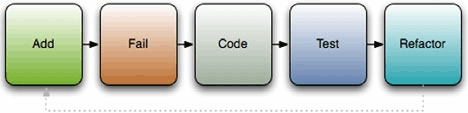

In the first step, you add tests for any new code you want to write
*before you write the code*. You write a test that tests for the right
behavior of the method; if the method takes a string and returns its
length, write a test that calls the method with "hello" and test for a
return value of 5; if it should raise an exception when you pass it a
nil, test for that. As tests are added, you create a specification of
the behavior that your code should conform to.

Once the specification is laid out, you move on to the fail step. In
this step you run the tests and ensure they fail. And for a reason. We
use tests to deal with errors we make in the code, but we can make
errors while writing test cases. We can set up an object with all the
right values, but forget to call the method we’re supposed to test, or
call a method but forget to check its result, and such a test will
always pass. Until you can make the test fail at least once, you have no
certainty it’s actually testing your code.

Next, you write code to make the tests pass: you implement the
specification you’ve created with the tests. Write the method, module,
or class, and if the tests pass, great! If the tests fail, go back and
debug your code to make them pass. When they all pass, go back and
refactor your tests and code so they’re more effective (shorter but
accomplish just as much or more).

But why bother with all this business?

### 2.2. Test-driven development with Ruby

The built-in Ruby testing library is similar to the libraries of other
languages, such as Java and Python. The general architecture consists of
test suites, built from methods, which make assertions about your code.
These test suites are run by test runners, which invoke the tests and
report the results. As shown in [figure
2.2](https://github.com/fenago/ruby-programming/blob/master/lab_guides/Lab_2.md),
a single runner may invoke a number of suites, which may hold a whole
lot of tests (the ActiveRecord tests for mySQL have 1,035 tests with
3,940 assertions!).

##### Figure 2.2. Test suites are composed of a collection of unit tests that are run one by one by a test runner.

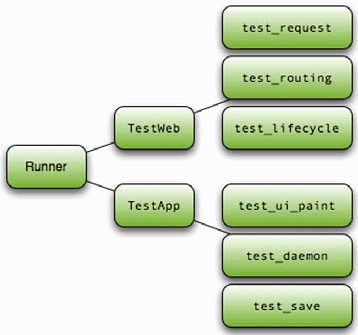

So, let’s get going on writing some tests. We’ll start with a basic
test: testing the length of a string. First, we’ll need to create a test
harness, which in Ruby is a class that inherits from
Test::Unit::TestCase. [Listing
2.1](https://github.com/fenago/ruby-programming/blob/master/lab_guides/Lab_2.md)
shows our test case.

##### Listing 2.1. A simple test using Test::Unit

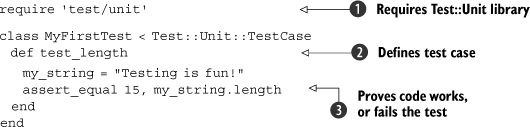

First, we need to require the Test::Unit library
 and create a class that inherits from
Test::Unit::TestCase. We can then create methods that test the code
. Within these methods, we will make
assertions  about the code. Save this code to
a file (for example, my\_first\_test.rb) and run it. You should see
output that looks something like this:

``` {.code-area}
Loaded suite my_first_testStarted.Finished in 0.00058 seconds.1 tests, 1 assertions, 0 failures, 0 errors
```

[copy **](javascript:void(0))

You can see that we had one test (one method that contained tests), one
assertion, and no failures. We had one assert\_equal statement that
evaluated to true, so we had no failures. The assert\_equal method isn’t
the only assertion available; there are a number of assert methods,
which are listed in [table
2.1](https://github.com/fenago/ruby-programming/blob/master/lab_guides/Lab_2.md).

##### Ruby’s built-in testing library offers a large number of assertions baked right in.

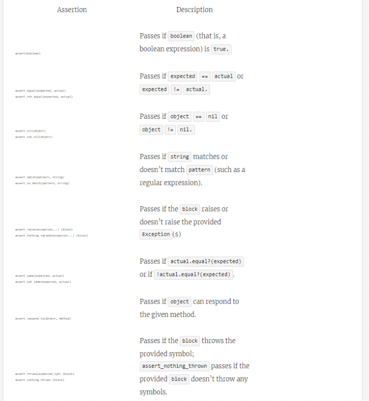

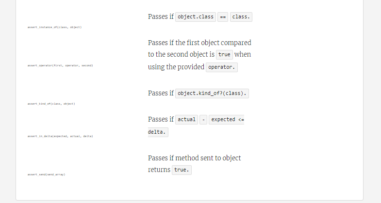

Using these assertions, you can build sets of tests that check your code
effectively, but, like your code, tests don’t run in a vacuum. Often you
need a little bit of setup before execution, or some teardown
afterwards, such as reading in files or creating objects. Test::Unit
provides a way to do that using the xUnit architecture. For example, if
we wanted to test our string for length, emptiness, and hash value, it
wouldn’t make sense to instantiate the string in each method; instead we
would use the setup method. Take a look at [listing
2.2](https://github.com/fenago/ruby-programming/blob/master/lab_guides/Lab_2.md)
to see what we mean.

##### Listing 2.2. Using setup and teardown to prepare tests

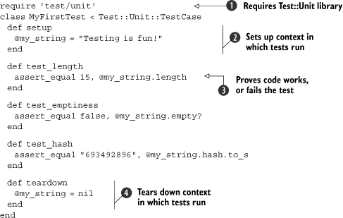

We start out the same way as last time: require the library and create a
class that inherits from TestCase . But this
time, we do something a little different. We create a setup method that
creates an instance variable to hold our string
. Now we refer to my\_string as an instance
variable throughout our tests ( and other
places). Finally, we (superfluously) set my\_string to nil in teardown
. The teardown method is special, like setup,
and it’s run after tests. Yes, this example is a little contrived
(especially because we didn’t do the whole testing cycle), but it’s
important to understand the concept before we take it into practice. Now
that you have the concept, let’s move on to an example that’s a little
more real world.

Let’s say you’re building an application to grab some XML reports from a
remote server, pull some data out, then process the data you pull out.
The reports, which are output from your payroll server, are catalogs of
employees and hours worked; they are used by the application you’re
building to generate departmental expense reports. One of these reports
might look something like this:

``` {.code-area}
<payroll-report>  <department name="Graphics">    <employee name="Janice Partridge">     <week id="1">40</week>     <week id="2">38</week>     <week id="3">30</week>     <week id="4">40</week>    </employee>    <employee name="James Jones">     <week id="1">33</week>     <week id="2">23</week>     <week id="3">30</week>     <week id="4">25</week>    </employee>  </department>  <department name="IT">    <employee name="Andrea Lantz">     <week id="1">40</week>     <week id="2">41</week>     <week id="3">45</week>     <week id="4">39</week>    </employee>  </department></payroll-report>
```

[copy **](javascript:void(0))

Fairly simple, right? Departments have employees, which have weeks and
hours. That’s simple enough to implement, and we’ll get to it soon, but
first let’s write the test cases. Take a look at [listing
2.3](https://github.com/fenago/ruby-programming/blob/master/lab_guides/Lab_2.md).

##### Listing 2.3. Tests for our to-be-implemented XML reporter

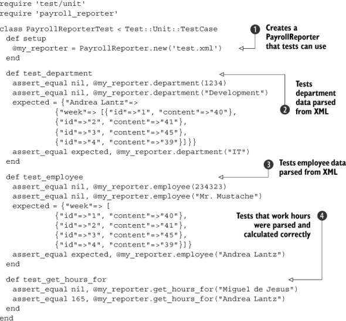

First, we create an instance of the PayrollReporter class
 in the setup method. The constructor takes a
path to an XML file (we’ll feed it a test file here). Next, we create a
test for a method named department, which will retrieve the details
(employees, for example) of a department . We
follow this with a test for a method named employee, which will do the
same thing but for employees (it will retrieve a hash of their work
hours) . The last test we create is for a
method named get\_hours\_for, which retrieves the total hours worked by
an employee . Then we run the tests and get a
load of errors. If we create a stub file (a file that has all classes
and methods defined but with no method bodies), we should see failures
rather than errors.

We’ve added some tests and they are properly failing, so let’s implement
the code (which you can see in [listing
2.4](https://github.com/fenago/ruby-programming/blob/master/lab_guides/Lab_2.md).

##### Listing 2.4. Our PayrollReporter implemented

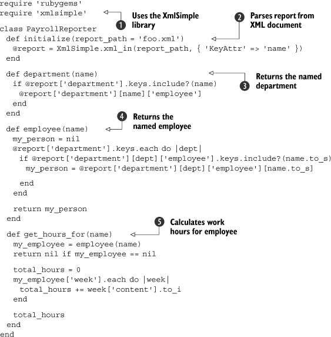

We’ll talk more about using and manipulating XML data later in this
book, but for now we’ll use a library named XmlSimple to do basic data
extraction . We implement each piece of the
code individually. First the constructor, which takes a file path and
opens it for parsing . Then a department
method to get the employees in a department ,
and an employee method to get the work hours of an employee
. Last, a get\_hours\_for method to get the
total work hours of an employee . Now we need
to run the tests to ensure they pass.

``` {.code-area}
Loaded suite payroll_reporter_testStarted...Finished in 0.028279 seconds.3 tests, 8 assertions, 0 failures, 0 errors
```

[copy **](javascript:void(0))

Excellent! Now that all of our tests pass, we can move on and refactor
the current code and add new code (maybe a method to get an employee’s
work hours for a certain week or a whole department’s work hours). As we
add this code, we’ll use the tests to ensure that the application’s
behavior is consistent. If the language of assertions and tests doesn’t
appeal to you, there is an alternative testing method.

### 2.3. Behavior-driven development with RSpec

Test cases help you ensure the code behaves as it should, but how do you
know what it should behave like? We like to base our development on a
written specification, which tells us what the code should do. The tests
measure whether the code behaves according to the specification, and the
code itself implements the expected behavior. A written specification
makes it easier to work as a team, to work against in-development
libraries and services, to communicate to stakeholders what the software
does, and to track progress as the features are implemented.

In this section we’ll talk about behavior-driven development, an
approach that focuses on specifying, testing and implementing behavior
(in that order), and we’ll show you how to do that using RSpec.

#### 2.3.1. What is behavior-driven development?

Specifications take many forms, from high-level architecture diagrams
through storyboards and screen mocks, all the way down to capturing the
behavior of each functional unit. The high-level specification is most
likely to remain accurate because it doesn’t capture a lot of details,
and wholesale changes to the architecture and major components don’t
happen frequently. It’s much harder to keep a functional specification
synchronized with the code. If you have ever developed against a
specification written as a Word document, you’ll know what we’re talking
about. The specification starts out as the best ideas about the software
to be written, and it’s only during development that you find it
contains wrong assumptions, which must be fixed in code. In a matter of
days, the code starts to diverge from the document, and the document
turns into a work of fiction.

Behavior-driven development (BDD) was conceived by Dan North to address
this issue. To do BDD right, you start by writing a specification of the
code, but instead of creating a static document, you create it in the
same repository that holds the source code. The specification forms a
template that describes the expected behavior, which you then fill up
with test cases. As you make changes, you reflect those back into the
specification and tests, changing them alongside the code. The process
is illustrated in [figure
2.3](https://github.com/fenago/ruby-programming/blob/master/lab_guides/Lab_2.md).

##### Figure 2.3. The behavior-driven development process starts with specification, adds tests, and builds an implementation that matches the specification and passes the tests.

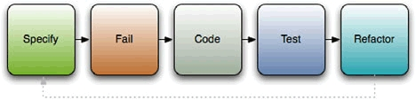

If this sounds a bit conceptual, don’t worry. In practice, it’s easy to
do. A specification document may initially look something like this:

``` {.code-area}
describe "A new string" do it "should have a length of zero." it "should be empty."end
```

[copy **](javascript:void(0))

This is Ruby code, and we’ll explain what it does in just a moment. It’s
also a specification that’s easy to read and understand. The behavior
stands out, so we don’t have to guess it from the code. When we run it
through a tool, we get a report that looks the one shown in [Figure
2.4](https://github.com/fenago/ruby-programming/blob/master/lab_guides/Lab_2.md).
The report we generate has three colors: green for test cases that pass,
identifying behaviors we implemented correctly; red for failing tests;
and yellow for anything we specified but haven’t implemented yet. It
tells us where we stand so we can track progress on our project.

##### Figure 2.4. An HTML report showing successful, failing, and pending specifications

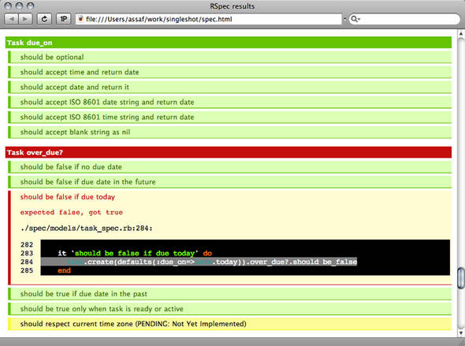

To go from the specification to working code, we’ll start by adding test
cases (see [listing
2.6](https://github.com/fenago/ruby-programming/blob/master/lab_guides/Lab_2.md).
From here on, we’re following TDD practices: write a test that fails,
then write the implementation to make the test pass.

We’ll encounter the difference between BDD and TDD again when we decide
to make a change to our specification. Perhaps we will realize we need
to use a different message format, present a task to the end user in a
different way, or simplify a set of methods that are part of the public
API. Whatever the reason, we’re going to return to this file, change the
specification to describe the new behavior, fill it up with a test case
to check the new behavior, and work out the implementation to conform to
both. BDD gives us a way to manage change, keeping the code and
specification synchronized.

Now that we have covered the basics of BDD, let’s look at a particular
framework—one that’s used extensively in the Ruby world and that also
influenced BDD frameworks for languages as diverse as Java and FORTRAN.
We’re talking about RSpec.

#### 2.3.2. Testing with RSpec

Let’s build a suite of BDD tests using RSpec as we look at a simple spec
for a class we’ll create. We’ll start by installing RSpec (gem install
rspec), which provides us with the spec library we need to require in
our code and the spec command-line tool we’ll use to run these
specification files. You can also use the command-line tool to generate
reports like the one in [figure
2.4](https://github.com/fenago/ruby-programming/blob/master/lab_guides/Lab_2.md)
and to repeatedly run only failing tests. In [lab
3](https://github.com/fenago/ruby-programming/blob/master/lab_guides/Lab_3.md)
we’ll talk about Rake, and we’ll show you how to set up your environment
to automate these tasks.

Let’s return to our previous string-testing example to get a grasp on
BDD; [listing
2.5](https://github.com/fenago/ruby-programming/blob/master/lab_guides/Lab_2.md)
shows a basic spec for a new string object.

* * * * *

##### The role of specification in agile development

Agile development practices put emphasis on progress through small,
incremental iterations, with a close feedback loop between developer and
end users. Agile development is the antithesis of BDUF (Big Design Up
Front) and the waterfall model. What agile practitioners discovered is
that having one stage to cement the specification, followed by a
marathon to implement it, led to disaster. No matter how good your
intentions, it’s impossible to predict everything up front. Business
needs may change as you’re building the software, technical difficulties
require adjustments, and your customer may realize he needs something
different when he sees the working code. To create software
successfully, you need the ability to evolve its design as you’re
building it, working closely with end users to make sure it meets their
expectations.

To make agile practices work, you still need a specification. What you
don’t need is a specification that’s cast in stone before the first day
of development. It has to be a living, changing document that can adapt
to evolving requirements. It’s even better when it documents not what
the software should have looked like, but what the delivered software
actually does, and when it can be used to track progress. That makes BDD
an important tool for agile development.

* * * * *

##### Listing 2.5. A context for an empty queue string

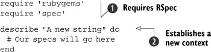

First, we require the needed libraries ,
which make available the methods that we must have. Then we create a
context  for our string object: “A new
string.” This context will describe the expected behavior of a new
string. We can list those behaviors without writing any code to test
them yet, or we can go straight ahead and start adding code that will
test these behaviors. Because this is a trivial example, we’ll go ahead
and add some real test cases, which you can see in [listing
2.6](https://github.com/fenago/ruby-programming/blob/master/lab_guides/Lab_2.md).

##### Listing 2.6. A few specs for a string object

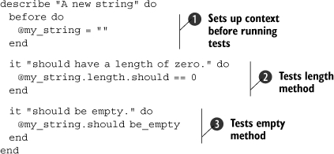

The general setup of the contexts and specifications may look familiar
to you, because they are somewhat similar to those in the TDD library.
First, we specify a before block , which will
create an instance variable for us to use in our specifications
(cleaning up after a test is done using an after block). Next, we create
a specification that a new string should have a length of 0
.

Note the use of the method should; the should and should\_not methods
are the primary verbs used in RSpec. These methods, combined with
predicates (like empty ), allow you to
specify various conditions. You use these predicates to describe how the
object being tested should behave (should throw\_symbol), exist (should
be\_instance\_of), respond (should respond\_to), and so on. Check out
[table
2.2](https://github.com/fenago/ruby-programming/blob/master/lab_guides/Lab_2.md)
to see a list of the specification predicates that are available. You
can find more details on the RSpec website (rspec.info).

##### Table 2.2. RSpec has numerous specifications you can use to verify the behavior of your application.

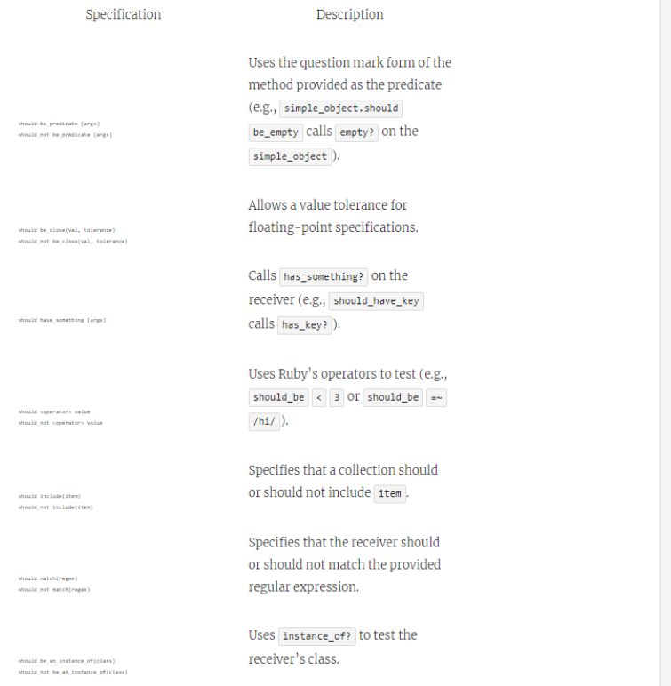

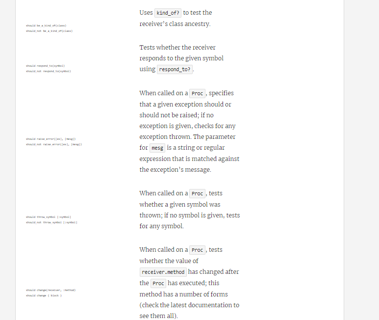

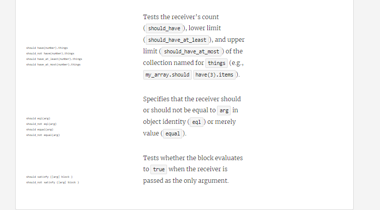

Getting back to our example, you can run the specs and make sure they
pass (which they should!).

Now let’s look at BDD with something a little more realistic. Let’s say
you want to test an IntranetReader object, which is a wrapper for your
intranet’s RSS feed. We’ll create a spec for all the behaviors of the
library. Remember, because we’re using behavior-driven development, we
want to start with a spec, and we need to specify behavior for whether
or not the object has stories in it, whether it properly connected,
whether the RSS is parsed correctly, and so on, rather than asserting
values and conditions. Let’s start with the most basic spec, which you
can see in [listing
2.7](https://github.com/fenago/ruby-programming/blob/master/lab_guides/Lab_2.md).

##### Listing 2.7. A basic spec for our IntranetReader class

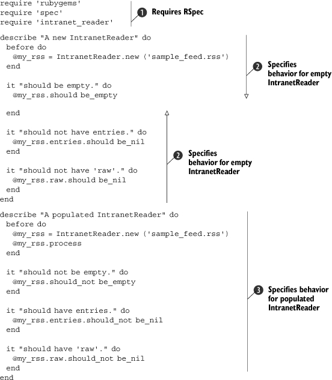

This is similar to our specification in [listing
2.6](https://github.com/fenago/ruby-programming/blob/master/lab_guides/Lab_2.md),
except this time we’ve specified two contexts. First, we require our
essential libraries , and then we proceed to
create a context for an empty IntranetReader
. Inside the context, we have specifications
to check for the emptiness of the new object we’ve created. A second
context holds specifications for a populated IntranetReader
. These specifications ensure that the object
was populated properly.

If you run these specifications now (using the spec command like this:
spec intranet\_reader\_spec.rb), you will get some errors (especially if
you don’t create an intranet\_reader.rb file to require). It should look
something like the following when they’re failing “correctly.” (The
actual output includes stack traces of all failing tests, which we
haven’t included here.)

``` {.code-area}
FFFFFF...Finished in 0.002936 seconds4 specifications, 4 failures
```

[copy **](javascript:void(0))

Once you’ve reached this point, all you have to do is go back and
implement code to make the tests pass, just like in test-driven
development. [Listing
2.8](https://github.com/fenago/ruby-programming/blob/master/lab_guides/Lab_2.md)
shows our implementation using the SimpleRSS gem, but yours may look
somewhat different.

##### Listing 2.8. Our implementation of IntranetReader

``` {.code-area}
require 'rubygems' require 'simple-rss' require 'open-uri' class IntranetReader  def initialize(url)   @feed_url = url  end  def process   @raw = open(@feed_url).read   @rss = SimpleRSS.parse @raw  end  def entries   @rss.items if @rss  end  def empty?   @rss.nil? ? true : @rss.items.empty?  end  def raw   @raw  end end
```

[copy **](javascript:void(0))

If you run the specifications and there are no failures, it’s time to
add and refactor tests, code, or both. Perhaps you’d like to implement a
method to validate the RSS input before it’s processed, or maybe you’d
like to allow the user to search the RSS feed. Whatever you add, just
remember: specify, code, test, refactor.

But what if your testing environment doesn’t have access to the RSS
feed? How do you mimic your production environment for testing? The next
section will discuss a few strategies for dealing with this problem and
a few techniques for setting up an environment for your tests.

### 2.4. A testing environment

As you read This lab and start playing with tests, you may be
wondering, “What if my test environment doesn’t have access to certain
parts of my application, like networked components or third-party
services?” Fortunately for us, the pioneers of software testing devised
a number of techniques to handle this sort of thing. In this section,
we’ll take a look at three of these techniques: fixtures, stubs, and
mocks.

#### 2.4.1. Setting up a baseline with fixture data

One of the earliest difficulties you’ll encounter with testing is
replicating the environment in which your code will run. Often the
problem is not so much replicating the relationship among your code, but
the external environment from the OS or network. Many developers use
*fixtures* as a first crutch to get this sort of environment up and
going. Fixture data (or fixtures) create a fixed, baseline environment
for your tests to run in. For example, as with Ruby on Rails, you might
use a YAML file to set up the database with an initial set of products
so you can test your inventory management code against known data. Or,
you might create a few data files that are prepopulated with data that
would normally be generated by another application so you can test how
your code reacts to existing data.

* * * * *

##### Note

In the Ruby development realm, you will probably most often hear the
term “fixture” applied to Rails and its testing fixtures for databases.
Don’t be confused: the concept of a fixture existed before Rails was
around and is useful outside of Rails.

* * * * *

There is no special technique necessary to use fixtures because you are
simply constructing a baseline environment for testing. For example,
let’s say you were testing a component of your application that received
the output from ps to check for the existence of a process. [Listing
2.9](https://github.com/fenago/ruby-programming/blob/master/lab_guides/Lab_2.md)
shows the original class and test.

##### Listing 2.9. A process checker class and test

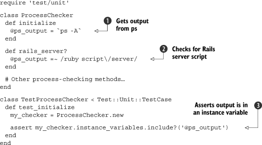

As you can see, we have a ProcessChecker class that grabs the output
from ps, stores it in an instance variable ,
and checks that variable for various processes (in this case, we just
check that the Rails server script is running)
. We then create a test that ensures that
variable is actually set when the object is instantiated
. But now we’re at a testing impasse. How do
you test the results of the ps call? Will you have to start the Rails
server script every time this test is run? What if the deployment
environment doesn’t even have Rails installed?

This is one situation where implementing a fixture makes sense. If you
create standard data for the object to use instead of making a call to
ps every time, you can ensure your tests will run the same everywhere
(even on Windows!). Take a look at the revised version of the test in
[listing
2.10](https://github.com/fenago/ruby-programming/blob/master/lab_guides/Lab_2.md).

##### Listing 2.10. A revised test with fixture data

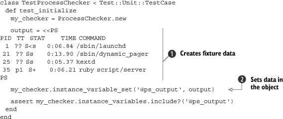

In this instance, we fill in some fixture data, which has static output
from a run of the ps command . This data is
then fed into the object via instance\_variable\_set
. Now we can run this test on any platform
(even though Windows will complain that it can’t find ps) and it should
behave the same way, because we now have a set of fixture data to work
from.

* * * * *

##### Note

We are injecting the data in a way that makes our test case fragile
. We recommend adding methods to your classes
and modules that will assist in testing. We wanted to show what’s
possible when you don’t have full control of the objects you’re testing.

* * * * *

You could then go back to your tests to refactor or add to them, as in
[listing
2.11](https://github.com/fenago/ruby-programming/blob/master/lab_guides/Lab_2.md).

##### Listing 2.11. Our refactored and expanded tests

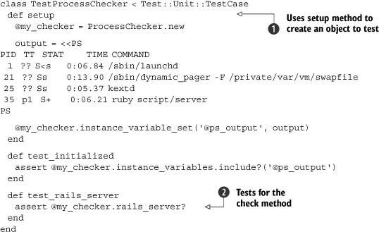

Now that we’ve refactored to use the setup method
, it’s trivial to add tests for the methods
on the class .

Fixtures make it easy to set a baseline environment for your tests, but
they can’t cover everything. For example, if you’re using a database,
fixtures often don’t scale easily and become a hassle to maintain (you
can find plenty of blog posts about the subject on Google). If you plan
on running your software on multiple platforms, you may have to maintain
a fixture for each platform in cases like the preceding example. There
are alternative methods to get around these problems, and with a little
work and abstraction we can take advantage of them. We can use fixtures
to rake data, as discussed earlier, and we can use stubs and mocks to
fake methods and components. Let’s start with stubs.

#### 2.4.2. Faking components with stubs

Stubs are “fake” objects or methods that mimic the behavior of “real”
objects. A stubbed object creates a facade of a real object, seemingly
behaving like the real object, but in actuality faking the real object’s
logic. This technique is useful for mimicking parts of your application
that may not be available or that are performance intensive.

For example, let’s say you have an application that orders products from
one of your suppliers, but you don’t want to order a room full of
products while running your tests. In that case, you would create
stubbed objects to fake the supplier service so your tests can still be
run without buying anything. These objects would act like, expose the
same API as, and return the same values as the real objects that
interact with the remote service, except they wouldn’t be interacting
with the remote service. For a visual of the concept, see [figure
2.5](https://github.com/fenago/ruby-programming/blob/master/lab_guides/Lab_2.md).

##### Figure 2.5. A stubbed class will seem to act like the real object but won’t actually behave like it. In this case, the stub doesn’t grab data from a remote service, but to the code consuming the API, it appears to.

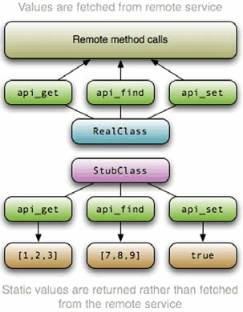

Let’s look at this example in code. Let’s say the supplier exposes a web
service API to you and has included a natural Ruby wrapper for this
service. The API exposes a search method for finding products, an
add\_to\_cart method for adding products to your cart, and a purchase
method for finishing your order. Your application receives the
purchasing data in XML form, which is parsed and then given to the
supplier object to execute the purchase. The supplier class has an
execute\_purchase method, which takes an array of product names and
quantities from the XML purchasing data. Our test for a simple purchase
is shown in [listing
2.12](https://github.com/fenago/ruby-programming/blob/master/lab_guides/Lab_2.md).

##### Listing 2.12. Building tests for our supplier class

``` {.code-area}
class TestSupplierInterface < Test::Unit::TestCase  def test_execute_purchase   data = [    {:item_name => 'Red Rug', :quantity => 2},    {:item_name => 'Set of Pens', :quantity => 17}   ]   my_supplier = MaterialSupplier.new   assert my_supplier.execute_purchase(data)  end end
```

[copy **](javascript:void(0))

As you can see, we instantiate our class, call the execute\_purchase
method, and assert returns the truth value. If you run the tests, it
should fail, so we’re ready to implement the class. The class
implementation for this particular supplier is shown in [listing
2.13](https://github.com/fenago/ruby-programming/blob/master/lab_guides/Lab_2.md).

##### Listing 2.13. A class for handling purchasing from a supplier

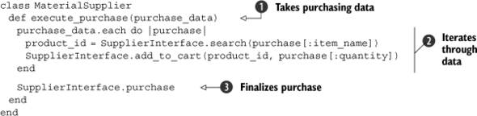

As we mentioned, the execute\_purchase method takes purchasing data from
another part of your application . The data
is then iterated, the product name is searched for, its id is found, and
it is added to the cart . After the cart has
been populated, we finalize the purchase .

Now that we have a test and a class, how do we reliably test this? We
can use the remote system to implement it, but we shouldn’t depend on
that all the time, especially if we want our tests to be consistent and
reliable in every environment. Even if it is available, you probably
don’t want to (or shouldn’t) send real requests to the remote server.
So, we need to stub it.

To stub the SupplierInterface class, we need to create a class of the
same name with input methods that return the right results (without
making any requests to the remote service). Because we only use this
class for testing, we’ll include it in the same file as our test case
([listing
2.12](https://github.com/fenago/ruby-programming/blob/master/lab_guides/Lab_2.md).
[Listing
2.14](https://github.com/fenago/ruby-programming/blob/master/lab_guides/Lab_2.md)
shows the stubbed SupplierInterface.

##### Listing 2.14. A stubbed SupplierInterface

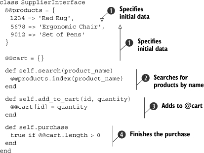

We’ve created a stubbed version of SupplierInterface that works from
data that we’ve statically created . We use
class-level hashes to implement searching (using the index method)
 and adding to a cart
. Because all we are testing at this point is
whether we can add items to the cart and purchase them, we can just have
the purchase method mimic the remote system and return true if the order
is successful (if there are items in the cart)
. Now our tests should execute in the same
manner, except using our local stubbed class instead of the remote
service interface.

Stubbing is a useful technique for getting your tests up and running,
but at the end of the day, stubs are still dumb objects. They pass back
the value you ask for, but they don’t verify that the right method calls
are being made to them. This deficiency can make your tests weaker than
they would be if you were to test those calls to the objects you’re
stubbing, because you could be missing out on a missed method call or a
wrong parameter. Now let’s take a look at another technique: mocks.

#### 2.4.3. Setting behavior expectations with mock objects

*Mock objects* are similar to stubs, except they set expectations about
your code’s interactions with them. In our previous example, a mock
object wouldn’t have just stupidly taken the input for the search or
add\_to\_cart methods—it would have verified that it received the right
parameters or that the method was called in the first place. In doing
this, it not only tests your code’s actions on the returned values, it
also tests your code’s interactions with these objects: parameters
passed, methods called, exceptions raised, and so on.

In this section, we’ll look at a couple of ways to create mock objects.
The first method we’ll discuss is creating your own mock object
patterns, no library required. We’ll then take a look at using libraries
such as Mocha to create mock objects.

##### Creating custom mocks

Before there were fancy mocking libraries, developers had to get their
hands dirty and build their own mock objects. Unlike programming on
punch cards, creating your own custom mock objects is still a valid
practice. Sometimes there is a specific order or logic to how your
application runs, and trying to shoehorn that into some mocking
libraries’ interfaces can sometimes be awkward. Building your own mock
objects is simply easier.

Let’s continue with our previous example. If we take our stubbed class
and add expectations for each method, we can make it into a mock object.
[Listing
2.15](https://github.com/fenago/ruby-programming/blob/master/lab_guides/Lab_2.md)
shows a revised version of the SupplierInterface stubbed class from
[listing
2.14](https://github.com/fenago/ruby-programming/blob/master/lab_guides/Lab_2.md).

##### Listing 2.15. Tests for shipping components

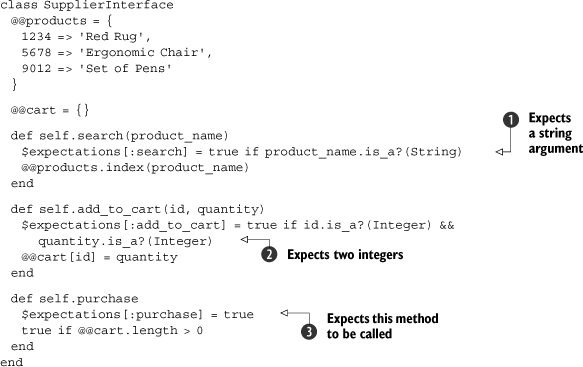

Here we have created expectations about parameters
( and ) and an
expectation that the purchase method will be called
, setting global variables appropriately.
(This is not the best practice, but for the sake of brevity we’ll keep
it simple.) These expectations can then be evaluated in an updated test,
as shown in [listing
2.16](https://github.com/fenago/ruby-programming/blob/master/lab_guides/Lab_2.md).

##### Listing 2.16. An updated test to use our custom mock

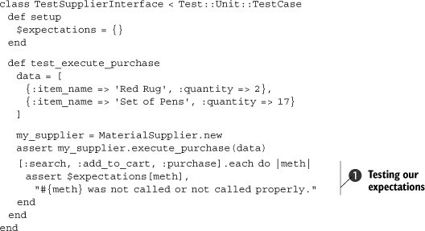

As you can see, we have added a small piece of code
 to the end of the method that iterates over
our known expectations (one for each method we expected to be called) to
make sure they were set. If they weren’t, the test fails. This technique
makes our tests more robust, and, if used consistently, can make full
test coverage a lot quicker than using simple stubs or nothing at all.

The only problem with custom mocks is they aren’t formal, and, as a
result, they are time-consuming to maintain. Fortunately there are a few
libraries to formalize your mocks and speed up the development of your
tests.

##### Creating mocks with Mocha

As mocking has become more popular, a number of libraries has been
created that make the process much easier. In this section, we’re going
to discuss Mocha, one of the newer mocking libraries. Its mocking
interface is much more intuitive and powerful than those of some other
mocking libraries, so it’s the one we’d recommend.


##### Tip

If you find that Mocha doesn’t work with your testing practices, or that
it is “too magical,” you may want to look into FlexMock, Jim Weirich’s
mocking library, or RSpec’s mocking capabilities.

Mocha works via a mechanism it calls expectations (which is why we
called our hash \$expectations in the earlier examples). Mocha sets
expectations on object behavior; so, for example, you might set an
expectation that an object will have its process method called or that
an object’s save method will be called and it should return true. This
is just like what we did before, except that Mocha makes the process
much cleaner. Mocha expectations are defined by a single method,
expects, and they can be attached to any object. When an expectation is
attached to an object, a stub is automatically created and an
expectation is set up. [Listing
2.17](https://github.com/fenago/ruby-programming/blob/master/lab_guides/Lab_2.md)
shows our example (from [listing
2.16](https://github.com/fenago/ruby-programming/blob/master/lab_guides/Lab_2.md)
refactored to use Mocha.

##### Listing 2.17. The previous mocking example, rewritten using Mocha

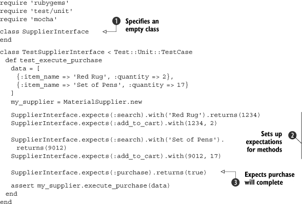

In this version of the code, we still verify behavior, but we don’t have
to spend the time to implement an entire class, and we get the benefit
of being able to verify specific calls to a method. We first create a
blank class, because all we’re doing is attaching stubs to a dummy class
; in a real-world setting, this would be
unnecessary, because there would be a real class to attach the stubs to.
Next, we define expectations for each method and for calls to that
method . The final expectation is then set
and the method tested . When this test suite
is executed, you should see something like the following:

``` {.code-area}
Loaded suite purchasingStarted.Finished in 0.001637 seconds.1 tests, 6 assertions, 0 failures, 0 errors
```

[copy **](javascript:void(0))

As you can see, assertions are created for each expectation that we set.
These assertions verify the behavior of your code when calling the
stubbed methods.

Ruby offers a number of utilities to take all sorts of measurements of
your testing code. Now that we’ve taken a look at testing, specifying,
stubbing, and mocking, we need to look at a few techniques that test
your tests.

### 2.5. Testing your tests

No one is perfect. If testing helps to smoke out your imperfections,
who’s to say you won’t create some in the process of writing test code?
In other words, “Who’s testing the testers?” In this section, we’ll look
two metrics for evaluating your testing code’s coverage and quality.

#### 2.5.1. Testing code coverage

As your applications grow in size, so will your test suites, and as your
test suites grow in size, so will the chances that you’ll miss testing a
method or class here or there.

Typically, there isn’t an issue with skipping a test here or there
unless it’s an important method that you forgot to test or a class that
is used quite often. But Ruby offers a couple of tools that can help you
ensure your code is covered with good quality tests 100%, and we’ll look
at them next.

* * * * *

##### Tip

The ZenTest tool from Ryan Davis is another way to avoid skipping tests.
If you run it over your code, it will generate stubs for code that
you’ve written tests for or generate tests for code that doesn’t have
any. It’s excellent if you’re writing tests for the existing code or if
you’re doing TDD and want to exert less effort.

* * * * *

##### Testing coverage with rcov

The rcov utility from Mauricio Fernandez allows you to test the C0
coverage of your code (coverage of method and statements, but statements
with conditions will not test fully). It can be installed using RubyGems
(for example: gem install rcov) and executed using the rcov command.
When executed with a test file as a parameter, it will crawl through the
code and look at the test coverage for each class. Rcov collects this
data and produces HTML/XHTML (or, optionally, text).

* * * * *

##### Tip

Rcov can show your results in a simple text format if you feed it the -T
option on the command line.

* * * * *

Rcov works by running over test suites and checking the line coverage of
the code. You run it by invoking the rcov command followed by the list
of files to test. As an example, we’ll run rcov on a portion of Rails
using the command rcov test/\*.rb -o coverage/ (the -o option allows you
to specify an output directory). [Figure
2.6](https://github.com/fenago/ruby-programming/blob/master/lab_guides/Lab_2.md)
shows the generated HTML page.

##### Figure 2.6. The rcov tool presents its results as HTML or text; the HTML view has nice graphs that illustrate code coverage and individual pages for each file tested.

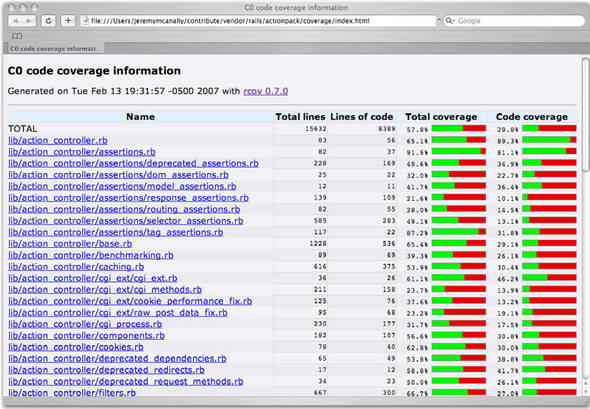

As you can see, a percentage is given for each code file, along with a
small bar graph. Running this on a smaller codebase will yield less
spectacular results, but it’s still a useful tool for making sure your
code is completely covered.

Once you’ve mastered code coverage, it may beneficial to ensure your
tests are of good quality and coverage; Heckle is a tool for testing
just that.

#### 2.5.2. Testing quality with Heckle

Heckle, from Ryan Davis, is a different kind of tool. Think of Heckle as
your tests’ worst nightmare. It tests the *quality* of your tests using
a technique called fuzz testing. The problem with test cases is that
merely passing doesn’t guarantee you’re putting the code to the test.
Perhaps you’re calling one method, but not testing for the changes it
makes to the object. These kinds of errors happen on occasion, and
you’ll notice them when you change the test code slightly and the test
still passes. Heckle takes your tests, messes with the test code, then
runs them again to ensure that they fail when they should. If your tests
don’t notice crazy changes to your code, then either that code isn’t
covered or it isn’t covered well.

* * * * *

##### Tip

Heckle also supports RSpec. All you have to do is invoke RSpec with the
--heckle option.

* * * * *

Think of Heckle as a way of testing your tests—checking them for
coverage and quality. Let’s say you have the class in [listing
2.18](https://github.com/fenago/ruby-programming/blob/master/lab_guides/Lab_2.md).

##### Listing 2.18. A simple class to Heckle

``` {.code-area}
class Customer  def initialize(name = nil)   @name = name  end  def tag   tag = "Customer: "   tag += @name.nil? ? "<unknown>" : @name   tag  end end
```

[copy **](javascript:void(0))

This class will create a pretty simple object to represent customers and
hold their names. [Listing
2.19](https://github.com/fenago/ruby-programming/blob/master/lab_guides/Lab_2.md)
shows a test for this class.

##### Listing 2.19. Our tests to Heckle

``` {.code-area}
require 'test/unit' require 'customer' class TestCustomer < Test::Unit::TestCase  def test_tag   @customer = Customer.new('Mike Stevens')   assert_equal 'Customer: Mike Stevens', @customer.tag  end end
```

[copy **](javascript:void(0))

For an example’s sake, we have one test that tests the value returned by
the tag method. If we were to run rcov on this, it would tell you that
we have 100 percent coverage, but if we run Heckle, we’ll see a
different story:

``` {.code-area}
Initial tests pass. Let's rumble.*************************************************************************  Customer#tag loaded with 3 possible mutations**********************************************************************3 mutations remaining...2 mutations remaining...1 mutations remaining...The following mutations didn't cause test failures:def tag tag = "Customer: " tag = (tag + if @name.nil? then  "\037B\e|H\020B\027\022W3_q\027\025G\f?bZHJ&p/P&\nP\016\036-#\031" else  @name end) tagend
```

[copy **](javascript:void(0))

One mutation that Heckle ran didn’t cause a test failure when it should
have. Note that it changed the value that is returned from tag from
\<unknown\> to a long string of text. Because we didn’t test for this,
it didn’t fail. So now we need to go back and add or refactor tests to
catch the mutation. [Listing
2.20](https://github.com/fenago/ruby-programming/blob/master/lab_guides/Lab_2.md)
shows how we did it.

##### Listing 2.20. Our updated tests that can stand up to even a strong Heckling!

``` {.code-area}
class TestCustomer < Test::Unit::TestCase  def test_tag   @customer = Customer.new('James Litton')   assert_equal 'Customer: James Litton', @customer.tag  end  def test_tag_empty   @customer = Customer.new   assert_equal 'Customer: <unknown>', @customer.tag  end end
```

[copy **](javascript:void(0))

We added a test to test for an empty name attribute, and if we run
Heckle again, we should see a different result:

``` {.code-area}
Initial tests pass. Let's rumble.*************************************************************************  Customer#tag loaded with 3 possible mutations**********************************************************************3 mutations remaining...2 mutations remaining...1 mutations remaining...No mutants survived. Cool!
```

[copy **](javascript:void(0))

No mutants survived! Great! So we’ve fixed our tests to stand up even to
fuzz testing. Now it’s time to go back and create more tests, more code,
and heckle again and again. Even though Ruby makes this cycle easier, it
can get annoying to make a change, run the tests, make a change, run the
tests, and so on ad nauseum.

### 2.6. Summary

Ruby’s testing facilities almost make it too hard not to test! In this
lab, you’ve been exposed to TDD and how to do it with Ruby. You
should be able to build test suites for new and old code and expand
those tests over time. You were also shown how to do BDD using the RSpec
library, starting with the specification and working your way through to
implementation.

We also discussed how to mimic a production environment while testing,
using techniques like fixtures and fake objects. You learned how to
build stubs and mocks (both from scratch and using Mocha) in order to
mimic code functionality. In the last stretch, we looked at a couple of
secondary tools that can help you out when writing tests. The rcov tool
will ensure your code is covered, and the Heckle tool will help you
ensure your code is covered well.

In the next lab, we’ll start looking at using Ruby with other
technologies. The rest of this book is about practical techniques, many
of them using other technologies, but before we dig into that content,
we need to take a look at the basics of integration and automation with
Ruby.