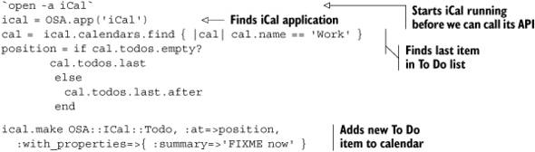

Lab 3. Scripting with Ruby
==============================

### This lab covers

-   Reading and writing CSV data
-   Generating daily reports
-   Producing a comparison report
-   Generating customized printable reports

One of the greatest assets of Ruby is its ability to scale small. As a
software developer, you have learned about the difficulties of scaling
large: applications with millions of lines of code, handling terabytes
of data and serving billions of hits a day, taking advantage of
multicore architectures and server farms. The rest of this course is about
working with big services: messaging, web services, databases, and so
on. Scaling up and scaling out are tough challenges that excite the
imagination, but they’re not all that software can do for you. We
thought it would be prudent to take a lab and show you how Ruby can
help you out doing everyday “stuff.”

In our daily lives, there are a lot of small problems waiting to be
solved. Some solutions take a minute to develop and may fit in a single
line, yet are just as important as much larger, attention-grabbing
problems. Consider a commit hook that runs the test suite before
allowing a commit, attaches the commit message to an open ticket, and
sends a notification to the development team. It’s not rocket science,
nor an opportunity for the next billion-dollar company, but it makes
life easier. Simple solutions like that automate repetitive tasks,
double-check what we’re doing, and smooth our workflow so we can get
more done without spending the night at the office.

#### Pre-reqs:
- Google Chrome (Recommended)

#### Lab Environment
Al labs are ready to run. All packages have been installed. There is no requirement for any setup.

All exercises are present in `~/work/ruby-programming/` folder.


### 3.1. Scripting with Ruby

If you talk to developers proficient with scripting
languages—command-line languages like bash, or programming languages
like Ruby, Perl, and Python—you’ll learn that their environment is full
of little scripts. Each script on its own does very little, but in
combination they cut down on unnecessary workload and help us
concentrate on the truly creative tasks.

In practice, scripts come in all shapes and forms. You can write a
trivial Greasemonkey script to change the color scheme of a website or
remove intrusive ads and annoying sidebar widgets. A lot of build
systems use fairly complex scripts to build complex applications
targeting multiple platforms. System administrators rely on an arsenal
of scripts that run in the background, on a schedule or from the command
line, doing everything from deploying to monitoring to controlling and
alerting.

In This lab, we’ll show you some simple, even throw-away, scripts.
Not because we have limited space, but because we think writing such
scripts is a good habit to pick up. There’s always room in your life for
little scripts that do dumb work so you don’t have to.

To illustrate, we’re going to pick a fun project for our very first
solution. We’re going to inflict our recent travel photos on all our
friends. Instead of inviting them over to watch a slide show (we know
they’d have an “emergency” at home that night), we’ll serve those photos
one by one using Twitter.

#### Problem

You need to take a collection of high-resolution images, and scale them
down to show fully in the browser, looking like Polaroid pictures. Next,
you’ll make them available on the web for everyone to see (using our
Amazon S3 account), and announce each image to the world using your
Twitter account.

#### Solution

We’re going to write two different scripts:

-   The first will scale down and add a Polaroid effect to our images,
    upload them to our Amazon S3 account, and write list of URLs (one
    for each image) so we can check the images before unleashing them on
    the world.
-   The second will pick one image and post a link for that image to our
    Twitter account. We’re going to schedule this script to run once an
    hour, Twittering a different image each time it runs.

We’re going to need two Ruby gems for that, so let’s start by installing
them:

``` {.code-area}
$ gem install aws-s3$ gem install twitter
```

[copy **](javascript:void(0))

We’ll start with the first script, shown in [listing
3.1](https://github.com/fenago/ruby-programming/blob/master/lab_guides/Lab_3.md).

##### Listing 3.1. Turn our photos into smaller, Polaroid-like images, and upload to Amazon S3


First, we need images that are just big enough to show fully in a web
browser. Our photos are high resolution, so we need to scale them down
to 800 pixels wide. We also want to make them look like Polaroid
pictures, with a white border, and tilt them randomly between -10 and 10
degrees. We’re going to use the convert program to do that
transformation .

We connect to our Amazon S3 account , and
since Amazon S3 stores files in buckets, we start by making sure we have
a bucket ready . Next, we upload these images
one by one (for simplicity, the originals are JPEG and the Polaroids are
PNG), and tell Amazon to make them publicly readable
. We get the URL for each of these images
 and store them in a file called images
.

To use the script, we first need to supply our Amazon Web Services
account credentials. We’ll put those in a separate file, so we can reuse
them with different scripts, and so we can share this script without
sharing our account information. You’ll need a file called .amazonws in
your home directory that looks like this:

``` {.code-area}
key_id: <your AWS access key id>key_secret: <your AWS secret access key>
```

[copy **](javascript:void(0))

This is the command to run the script and tell it which bucket to use:

``` {.code-area}
$ ruby upload_images.rb ruby_in_practice
```

[copy **](javascript:void(0))

Now let’s turn to the second script, shown in [listing
3.2](https://github.com/fenago/ruby-programming/blob/master/lab_guides/Lab_3.md).

##### Listing 3.2. Twitter a link to an image


We start by reading all the URLs from the images file
, but we’re only going to Twitter the first
image, so we’ll create a message for only one image
. Next, we connect to our Twitter account
 and post that message
. Finally, we’ll write the remaining URLs
back to the file , so we can process the next
URL when the script runs again.

As before, we’re going to use a configuration file that lives in the
home directory. The .twitter file looks like this:

``` {.code-area}
email: <email>password: <password>
```

[copy **](javascript:void(0))

We’re not going to run this script from the command line. Instead, we’ll
schedule it to run once an hour using cron:

``` {.code-area}
$ echo "0 * * * * $(pwd)/twitter_image.rb \"Check out this photo \"" > jobs$ crontab jobs
```

[copy **](javascript:void(0))

#### Discussion

There are several libraries we could use to resize images and apply
interesting transformations. The first that comes to mind is RMagick.
RMagick is a Ruby wrapper around the excellent ImageMagick processing
library. It has everything we need to create fun images for our project,
yet we decided not to use it. The trick to scaling down is always
looking for the simplest, shortest solution to the problem.

A true script ninja will get the job done with the minimum amount of
effort. Not that RMagick is all that complicated, but we decided to do
something else instead. We typed convert --help on the command line,
scanned the help page for the three settings we wanted to use, tested
them (again, from the command line) against a couple of images, and
pasted the command into our Ruby script. The convert program is a
command-line interface to ImageMagick, and for our case it was simpler
and faster to use than opening up the RMagick API documentation.

We didn’t build any sophisticated error handling into either script. The
first one we’re going to run from the command line, and if it fails,
we’ll just run it again. The second script runs as a background job, and
because we don’t want to miss posting any image, we made sure it only
discards an image’s URL after posting a message about that image. If it
fails, it will pick up where it left off the next time it runs.

Eventually, it will run out of images to post and start failing. We’re
going to notice that no new images appear on our Twitter stream, check
that the images file is empty, and remove the cron job. If we wanted to
be smarter, we could also build an auto-remove feature into the script
itself.

You probably noticed that we took other shortcuts as well. We placed the
original photos, the PNG Polaroids, the list of URLs, and the two
scripts all in the same directory. We mixed code with data, original
content with temporary files. That’s not modular or organized as you’d
expect a large-scale application to be. Then again, this is not a
large-scale application that will keep on running into the next
millennium. It’s the simplest script we could write in the least amount
of time; we’re going to use it once and discard it.

If this is your first foray into scripting, we do hope you’ll think this
example is inelegant, maybe downright ugly. Like we said, scripts come
in all shapes and forms. Some scripts manage critical systems and others
are integral parts of larger applications—you’ll want to use your best
development skills to write those. There’s a place for writing scripts
that are well thought out, easy to maintain, thoroughly documented,
tested, and tested some more.

But we also wanted to introduce you to a different world of scripting.
One that’s more focused on getting mundane tasks out of the way by
automating them. There are times when investing less is the best course
of action, and simple is the best way to start.

We also showed you how easy it is to glue things together with Ruby. We
kept things simple by using an image-transformation program instead of
diving headfirst into an API, and by keeping our authentication
credentials in a text file. Instead of using a database server, we
stored state in a text file, and we used cron to schedule our tasks
instead of using a scheduling component. Of course, we benefited from
the simplicity of AWS-S3 and the Twitter gem.

In the next section, we’re going to take another look at scripting, this
time scripting Windows applications using OLE Automation and Mac OS X
applications using OSA.

### 3.2. Automating with OLE and OSA

Scripting languages are easier to program with than low-level
programming languages. If you’ve ever written an Excel macro, created a
workflow using Word and Outlook, or programmed with AppleScript, you
know what we’re talking about. Application scripting—desktop and server
applications alike—is done through APIs designed specifically for the
task at hand, and is simplified to work from any programming language.
In this section, we’re going to take a look at automating applications
on the Windows platform using OLE Automation, and Mac OS X applications
using Open Scripting Architecture (OSA).

OLE Automation provides scripting support for Windows applications.
Microsoft Office is a set of desktop applications that use OLE
Automation, typically in combination with the Visual Basic for
Applications (VBA) scripting language. OLE is just as easy to use from
Ruby programs running on the Windows platform, as we’ll demonstrate by
using Ruby and Microsoft Outlook.

OSA provides scripting support for applications running on Mac OS X. It
was designed specifically for AppleScript, so some experience with
AppleScript is helpful, but it is easy enough to use from the more
powerful Ruby language. We’ll use the same example to automate Apple’s
iCal calendar application.

Let’s start with OLE Automation and Microsoft Outlook.

#### 3.2.1. Automating Outlook with Ruby

The example we’ll use is a fairly trivial one, but one that would be
easier to develop in Ruby than either VBA or AppleScript.

During development we often have to take shortcuts to get something
done. Maybe we’re trying to get a demo running, or giving other
developers a piece of code so they can start working again. We mark
those things we haven’t finished with comments that say TODO or FIXME.
And as much as we hate to admit it, we don’t always go back and fix that
code—mostly we forget about it. So we’re going to create a simple script
that will read these comments from the source code and adds tasks in
Outlook or To Do items in iCal to remind us about them.

##### Problem

Given a directory containing Ruby source files, find all the TODO and
FIXME comments buried in the source code, and create a task item for
each one in Outlook.

##### Solution

You can see the entire script in [listing
3.3](https://github.com/fenago/ruby-programming/blob/master/lab_guides/Lab_3.md).

##### Listing 3.3. Turn TODO and FIXME comments into Outlook tasks


We start by obtaining the Outlook Application object using the Ruby-OLE
bridge . We’ll need that object later on, to
create Outlook tasks. Next, we use the Dir.glob method to iterate
through all the Ruby files in the current directory and each
subdirectory and read each file . We need the
line number of each comment, so we use each\_with\_index to iterate
through each line while keeping track of the line number
.

Using a regular expression, we match each line containing a TODO or
FIXME comment . Some people put a colon after
the TODO/FIXME, and some don’t, so our regular expression handles both
cases. For each comment, we create an Outlook task using the comment
text as the task subject . Next, we add the
filename, line number, and a code snippet to the task body
, before saving the task in Outlook
.

Try running this script on your project’s directory and watch as all
TODO and FIXME comments show up in your Outlook tasks list.

##### Discussion

The Ruby-OLE (win32ole) bridge is part of the Ruby standard library when
running Ruby on the Windows platform, so there’s no need to install
anything else. You only need to require win32ole in your code.

The translation between OLE and Ruby objects is straightforward, but it
uses OLE naming conventions. If you read the documentation for Outlook
OLE objects, you’ll notice that we’re using the same methods
(CreateItem, Save) and properties (Subject, Body) documented there.

In this example, and the next one, we use the glob pattern \*\*/\*.rb to
match any Ruby file in the current directory and any of its
subdirectories. You can easily extend this to match other file types;
for example, to search for Ruby and eRuby files, you can write
\*\*/\*.{rb,erb}. To keep the example simple, we wrote it to look only
for Ruby comments based on the hash sign, so you’ll want to change that
if you’re searching for other types of comments.

If you’re familiar with C’s versatile printf function, you’ll be happy
to know Ruby includes both printf and sprintf in the core library (scanf
is also available in the standard library, so you need to require it
explicitly). The percent operator (%) is a shortcut for sprintf; when
the left-side expression is a string, that string is used to format the
arguments provided by the right-side expression. So, for example, the
expression

``` {.code-area}
"%s: %s" % match
```

[copy **](javascript:void(0))

is shorthand for

``` {.code-area}
sprintf("%s: %s", match[0], match[1])
```

[copy **](javascript:void(0))

* * * * *

##### Slash and backslash

You’ll notice throughout this course that our examples use *forward
slashes* as directory separators (/, also known as *slashes*). Most
Windows applications use *backward slashes* by convention (\\, also
known as *backslashes*), although the Windows APIs work equally well
with both slashes and backslashes. The DOS command line is one
application that doesn’t; it only accepts backslashes in command-line
arguments, leading many developers to believe that Windows doesn’t
support slashes at all.

Since slashes are supported on Windows, and are used as path separators
on \*nix operating systems and in URLs, we recommend using slashes as a
matter of practice. The Ruby standard library uses slashes as the
default separator, and some methods, like Dir.glob, only work with
slashes. You can find out if your platform supports an alternative path
separator by looking at the value of File::ALT\_SEPARATOR, but using
File::SEPARATOR or just /, will make your code run on different
operating systems and support more third-party libraries.

* * * * *

The task subject is short and concise. We basically copy the comment
text over, but it’s not all that useful if we can’t tell which line of
what file it comes from, so we use the task body to convey that
information, adding the filename and line number.

If we have to deal with a lot of TODO/FIXME tasks—and we often do—we’d
want some way to prioritize which task to do first, so the more
information we get, the better. You’ll notice we added a snippet of the
source code surrounding the comment to the body of each task:

``` {.code-area}
sel = [num - 5, 0].max .. [num + 5, lines.size].mindetails.push sel.map  { |i| "%5d: %s" % [i + 1, lines[i]] }task.Body = details.join("\n")task.Save
```

[copy **](javascript:void(0))

We used the current line number to create a range of lines, up to five
lines before and five lines after. So if the comment appears on line 7,
our selection would be the range 2..13. All we have to do then is
transform each integer in that range into the text of that line, and
join the lines together.

We’re going to use most of this code in the next section, only changing
it to deal with iCal instead of Outlook.

#### 3.2.2. Automating iCal with Ruby

Now let’s turn our attention to Mac OS X and write the same example to
automate iCal.

##### Problem

Given a directory containing Ruby source files, find all the TODO and
FIXME comments buried in the source code, and create a To Do entry for
each one in iCal.

##### Solution

For this solution, we decided to access iCal’s scripting objects using
the Appscript library. We explain why in the discussion, so for now,
let’s get Appscript installed. The gem name is actually rb-appscript:

``` {.code-area}
$ sudo gem install rb-appscript
```

[copy **](javascript:void(0))

You can see the entire script in [listing
3.4](https://github.com/fenago/ruby-programming/blob/master/lab_guides/Lab_3.md).
You’ll notice it’s similar to the Outlook script in [listing
3.3](https://github.com/fenago/ruby-programming/blob/master/lab_guides/Lab_3.md).
The main difference is using a method call to create the To Do item and
set all the relevant properties.

##### Listing 3.4. Turn TODO and FIXME comments into iCal To Dos


We start by obtaining the iCal application object
. There are several calendars, and we want to
add To Dos to the Work calendar, so we look it up
.

We use the Dir.glob method to iterate through all the Ruby files in the
current directory and each subdirectory and read each file
, matching lines that contain a TODO or FIXME
comment . For each comment, we create a
summary from the comment text . We collect
the filename, line number, and a code snippet to provide more details
. Then it’s just a matter of creating a new
todo item at the end of the calendar with these two properties
.

##### Discussion

To understand this example in full, you need to understand a bit about
how AppleScript works, so let’s start with a simple AppleScript example
in [listing
3.5](https://github.com/fenago/ruby-programming/blob/master/lab_guides/Lab_3.md).

##### Listing 3.5. AppleScript example for adding a To Do item to iCal

``` {.code-area}
tell application "iCal" to  make new todo at end of calendar "Work"   with properties  {summary:"FIXME now"}
```

[copy **](javascript:void(0))

AppleScript was designed to simplify scripting by using an English-like
syntax. Some of that syntax comes directly from the API, so
understanding the syntax helps in understanding how to use the relevant
APIs.

The example in [listing
3.5](https://github.com/fenago/ruby-programming/blob/master/lab_guides/Lab_3.md)
loosely translates into a method call (make) with one anonymous argument
(todo) and two named arguments (at end and with properties). The value
of the first named argument is an object reference; it doesn’t point to
an actual object but denotes a location—the end of a list. Since we’re
adding a To Do item, iCal will use that reference to plant the new item
at the end of the To Do list. The second named argument is similar to a
Ruby hash. These arguments are then used to call the make method on the
iCal application.

The Ruby equivalent, using the Appscript library, would look like
[listing
3.6](https://github.com/fenago/ruby-programming/blob/master/lab_guides/Lab_3.md).

##### Listing 3.6. Ruby example for adding a To Do item to iCal using Appscript


There are two libraries you can use to automate Mac OS X applications.
Appscript (from
[appscript.sourceforge.net](http://appscript.sourceforge.net/)) is based
on the AppleScript model and so supports all the flexibility and
capabilities of scripting OSA (Open Scripting Architecture)
applications. The other one is RubyOSA (from
[rubyosa.rubyforge.org](http://rubyosa.rubyforge.org/)), which makes OSA
feel more Ruby-ish. If you want to get a feeling for RubyOSA, check out
[listing
3.7](https://github.com/fenago/ruby-programming/blob/master/lab_guides/Lab_3.md).

##### Listing 3.7. Ruby example for adding a To Do item to iCal using RubyOSA



Unfortunately, some things get lost in translation, and a few automation
tasks we worked on could not be done in RubyOSA. If you want to master a
single library, we recommend picking up Appscript.

Another way of adding To Do items to your calendar is by using the Cocoa
API to create them in the calendar store. You can do a lot more things
using the Cocoa APIs than is possible with the OSA APIs; in fact, you
can build an entire native application using the Ruby/Cocoa bridge. For
our example, this would be overkill, and we don’t have room in this course
to cover Ruby/Cocoa in full. But to whet your appetite, we’ll look at a
simple example. [Listing
3.8](https://github.com/fenago/ruby-programming/blob/master/lab_guides/Lab_3.md)
uses the Cocoa API to talk to Growl. Add it to the end of [listing
3.5](https://github.com/fenago/ruby-programming/blob/master/lab_guides/Lab_3.md),
and the script will show a Growl notification when it completes.

##### Listing 3.8. Growl notification using Cocoa API

``` {.code-area}
require 'osx/cocoa' dnc = OSX::NSDistributedNotificationCenter.defaultCenter dnc.postNotificationName_object_userInfo_deliverImmediately(  :GrowlApplicationRegistrationNotification, nil,  { :ApplicationName=>'TODO/FIXME', :AllNotifications=>['Completed'] },  true) dnc.postNotificationName_object_userInfo_deliverImmediately(  :GrowlNotification, nil,  { :ApplicationName=>'TODO/FIXME', :NotificationName=>'Completed',    :NotificationTitle=>'TODO/FIXME comments added to iCal' }, true)
```

[copy **](javascript:void(0))

Next, we’re going to look at a different kind of automation, using Rake
to automate multiple tasks and their dependencies.

### 3.3. Using Rake

Rake is a build tool similar in principle to Make. Briefly, it allows
you to define tasks, establish dependencies between tasks, and execute
those tasks (and their dependencies) from the command line. In [lab
8](https://github.com/fenago/ruby-programming/blob/master/lab_guides/Lab_8.md),
we’ll look at Ruby Gems and show you how to use Rake to build and
package your gems.

Since Rake tasks are written in Ruby, Rake is flexible enough that you
can use it to automate different types of tasks. Rails and Merb are two
web application frameworks that use Rake for development tasks; Vlad the
Deployer, which we also cover in [lab
8](https://github.com/fenago/ruby-programming/blob/master/lab_guides/Lab_8.md),
uses Rake for deployment tasks. In fact, Rake has become such an
indispensable tool that it’s now included in most distributions of Ruby
1.8 (such as One-Click Installer, for Mac OS X) and it’s available as
part of Ruby 1.9. You can read more about Rake at
[rubyrake.org](http://rubyrake.org/).

In this section, we’re going to cover the basics of Rake, and we’ll do
that through two examples that build on each other, to create a template
Rakefile that you can easily apply to your own applications.

If you don’t already have Rake installed, start by installing it:

``` {.code-area}
$ gem install rake
```

[copy **](javascript:void(0))

Now let’s get started.

#### 3.3.1. Using tasks

Rake is all about tasks, so we’ll start by looking at the very basics of
working with tasks: how to use Rakefile to define tasks, how to invoke
tasks from the command line, and how to use tasks as prerequisites of
other tasks. Rake’s dependency mechanism takes care of executing all the
necessary tasks, and only those. If you don’t get it on the first read,
don’t despair; use Rake a few times in your own projects, and you’ll
quickly pick it up.

##### Problem

You’re starting a new project, and you plan to use RDoc to generate
documentation and RSpec for behavior-driven development. These commands
require specific command-line options, which are not the same for every
project and can be run in different ways. How can you make it less
painful by automating these tasks?

##### Solution

Rake will look for a file called Rakefile (or rakefile). It’s a regular
Ruby file, but it has a specific name and is loaded by Rake so Rakefile
can make use of methods like task and file that are part of the Rake
API. We’ll create it in the root directory of our project and add all
the necessary tasks to use RDoc and RSpec effectively. [Listing
3.9](https://github.com/fenago/ruby-programming/blob/master/lab_guides/Lab_3.md)
shows what our Rakefile looks like.

##### Listing 3.9. Rakefile for creating RDoc documentation and running RSpec tests


We start out by using Rake::RDocTask to configure the documentation
tasks . There are three—rdoc, rerdoc, and
clobber\_rdoc—all created together using the same configuration. Next,
we define two tasks for running specs (we’ll explain more about them in
the discussion that follows). The first task (spec) runs all our specs
, while the second task (failed) runs only
those examples that failed in the previous run
. We’re strong believers in behavior-driven
development, so we run spec as part of the default task
. Last, we use the clobber task to clean up
 all the temporary files and directories
created by the other tasks.

##### Discussion

Let’s start by finding out which tasks we just defined:

``` {.code-area}
$ rake --tasksrake clobber     # Clean temporary directories and filesrake clobber_rdoc  # Remove rdoc productsrake failing     # Run all failing examplesrake rdoc       # Build the rdoc HTML Filesrake rerdoc      # Force a rebuild of the RDOC filesrake spec       # Run all specs
```

[copy **](javascript:void(0))

RDoc is a tool for generating API documentation from comments found in
Ruby source files. You can run it from the command line using the rdoc
command. It’s a simple command to use, but when working with multiple
projects, it’s easy to forget which options to use with what project. Do
we include the license file on this project? Which file is the main
documentation page? What else should we include besides the lib
directory?

That’s the first thing we’re going to automate. Instead of having to
remember which command-line options to use, we’ll create one task to
take care of all that. We’ll use Rake::RDocTask for that, so to generate
documentation for the current project, all we need to do is run rake
rdoc.

We do the same for RSpec (we covered RSpec in [lab
2](https://github.com/fenago/ruby-programming/blob/master/lab_guides/Lab_2.md).
We use Spec::Rake::SpecTask to define a task that runs all the
specification files it finds in the spec directory, and we set it up to
use our preferred options. In fact, we have two tasks for RSpec. The
first, called spec, runs all the specs and uses two formatters. One
formatter, progress, shows a progress bar so we get an indication of its
location. You can also pick other options, such as --format specdoc to
have all the specifications listed to the console, --colour to add a
touch of color, --format html:specs.html to generate an HTML report.

Specifications are collections of examples, and examples are much like
tests in that they either fail or pass. The second formatter,
failing\_examples, logs all the failed examples into the failed file. If
there are any failures after running rake spec, they’re all collected in
that file. Now we can go and fix the code, but instead of running all
the specifications over again (which is time-consuming!) we’re going to
run the few examples that failed in the previous run, using rake failed.
We fix anything that’s still broken and keep repeating until there are
no more failing examples left to run.

If you run the rake command without giving it a task name, Rake will
attempt to run the default task. And by default, there is no default
task, so we created one. We like the practice of testing the code as
often as possible, so we made the default task run the spec task. We did
that by adding it as a prerequisite.

Rake allows you to invoke a given task any number of times, but it will
only attempt to execute the task once—the first time it’s invoked. That
makes tasks different from, say, Ruby methods. You can reference the
rdoc task from as many places in the Rakefile as you want, and all of
these can trigger it, but it will only execute once. This is fine,
because we only need to generate the documentation once. This feature is
particularly useful for complex Rakefiles, where the same task may be
referenced from multiple places. For example, we might want to generate
the documentation on its own, so we can access it during development,
but also as part of a task that creates a zip package of our project,
and as part of another task that generates the documentation and uploads
it to a website. We may also have a fourth task that goes through the
whole release process, directly depending on the package and site update
tasks; effectively depending on the rdoc task twice (once in the
documentation task and once in the release task). Since Rake will invoke
the rdoc task once, on first use, we can use these transitive
dependencies liberally.

Some tasks never execute. Tasks have prerequisites and actions, so when
Rake invokes a task, it starts by first invoking all the task’s
prerequisites, which must come before any of the task’s own actions. It
then asks the task whether or not it should execute, and if the task
responds positively, Rake goes and executes all the actions in sequence.

When would a task not execute? Let’s see what happens when we run the
rdoc task twice in a row. We’re going to use the --trace flag, so Rake
will report every task invoked and executed. You can see the result of
running rake rdoc --trace twice in [listing
3.10](https://github.com/fenago/ruby-programming/blob/master/lab_guides/Lab_3.md).

##### Listing 3.10. Running rake rdoc twice with --trace

``` {.code-area}
$ rake rdoc --trace (in /Users/assaf/Ruby In Practice/CH3/3.3) ** Invoke rdoc (first_time) ** Invoke html/index.html (first_time) ** Invoke README (first_time, not_needed) ** Invoke LICENSE (first_time, not_needed) ** Invoke Rakefile (first_time, not_needed) ** Execute html/index.html                      README:                     LICENSE: Generating HTML... Files:  2 Classes: 0 Modules: 0 Methods: 0 Elapsed: 0.148s ** Execute rdoc $ rake rdoc --trace (in /Users/assaf/Ruby In Practice/CH3/3.3) ** Invoke rdoc (first_time) ** Invoke html/index.html (first_time, not_needed) ** Invoke README (first_time, not_needed) ** Invoke LICENSE (first_time, not_needed) ** Invoke Rakefile (first_time, not_needed) ** Execute rdoc
```

[copy **](javascript:void(0))

Both times, Rake starts by invoking the task rdoc. It then invokes all
its prerequisites (in this case, html/index.html), and finally executes
the task, which by itself doesn’t do anything interesting. All the work
is actually done by the html/index.html task. You can see from [listing
3.10](https://github.com/fenago/ruby-programming/blob/master/lab_guides/Lab_3.md)
that this task executes on the first run, but not on the second one.

Rake invokes the html/index.html task by first invoking all its
prerequisites (README, LICENSE, and rakefile). It then asks the task if
it needs executing. In the first run, there is no html/index.html file
in the current directory, so the task executes, generating all the
documentation into the html directory, and with it the html/index.html
file. In the second run, the file already exists, so the task has
nothing to do. Rake calls the needed? method on the task, and the method
returns false, so Rake doesn’t execute any of its actions.

That works out quite nicely. If the documentation already exists, the
task doesn’t do anything, and the whole process completes quickly by
skipping unnecessary tasks.

Rake allows you to define file tasks (using Rake::FileTask or simply
with the file method). You use file tasks to create or update files, and
the task name is the same as the file it represents. A file task will
execute in two cases: if the file does not already exist, or if any of
its prerequisites are newer than the file itself.

The html/index.html task is a file task. We know it will execute if the
file does not already exist, and it will also execute if any of the
prerequisites are newer than the file. So if we updated the README file,
it would detect that the file is newer and generate the documentation
all over again. What if we change the title option by updating the
Rakefile? The Rakefile is also a prerequisite, and being newer than
html/index.html will force it to regenerate the documentation. So there
you have it. A very simple mechanism for tracking transitive
dependencies that makes sure tasks execute, but only when they’re
needed.

The tasks we have covered so far, documenting and running the specs, all
generate files in our working directory. All these files are generated
by tasks, so we don’t have to keep them around. If you like to keep your
desk clean and tidy, you’ll want to do the same with your working
directory. We’re going to use the clobber task for that.

You can see, at the end of [listing
3.9](https://github.com/fenago/ruby-programming/blob/master/lab_guides/Lab_3.md),
that we defined the clobber task to remove the failed file and the tmp
directory, both of which are generated by the spec/failed task. We don’t
have to worry about the html directory, because Rake::RDocTask took care
of that. It defined one task called clobber\_rdoc specifically to remove
the html directory, and you can use that task to clean up after the rdoc
task. Separately, it defined the clobber task to invoke the
clobber\_rdoc task.

Yes, you can define the same task multiple times. In fact, when you call
methods like task or file, Rake first looks to see if a task exists, and
if not, creates it. Then it tasks any prerequisites or actions, and adds
those to the existing task. So one thing we can do is write different
tasks that create temporary files in the working directory, and next to
each of these tasks, enhance the clobber task to clean up only those
files and directories. Rake also allows us to create composite tasks,
like Rake::RDocTask, without regard for the order in which tasks are
defined.

You might be asking how we know clobber uses clobber\_rdoc? We used the
--prereqs option to list all the tasks and their dependencies, as shown
in [listing
3.11](https://github.com/fenago/ruby-programming/blob/master/lab_guides/Lab_3.md).

##### Listing 3.11. Listing all the tasks and their prerequisites

``` {.code-area}
$ rake --prereqs (in /Users/assaf/Ruby In Practice/CH3/3.3.1) rake clobber    clobber_rdoc rake clobber_rdoc rake default    spec rake failed rake html rake html/index.html    README    LICENSE    Rakefile rake rdoc    html/index.html rake rerdoc    clobber_rdoc    rdoc rake spec
```

[copy **](javascript:void(0))

Check out the rerdoc task, which always recreates the documentation: it
first cleans up the documentation directory, then runs the rdoc task.

We’re almost done with our introduction to Rake. Before we move on, we
want to add one more useful tip. Notice how we cleaned up an entire
directory by calling rm\_rf? This method is defined by FileUtils, a
standard library that’s part of Ruby and provides a lot of convenience
methods for copying, removing, linking, and otherwise working with
files. Usually you would have to require 'fileutils', but Rake makes
these methods directly accessible in your Rakefile.

#### 3.3.2. File tasks

In this section, we’re going to expand on file tasks and show you how to
use three features of Rake that will help you automate tasks that deal
with and process files. We’re going to use the file task to create first
a file and later a directory from a list of prerequisites. We’ll use
FileList to manage lists of files and show you how it’s easier to use
and more powerful than a simple array. And we’ll use rules to tell Rake
how to convert a file of one type into another.

##### Problem

To get your code ready for release, you need to perform two additional
tasks. You kept your code modular by writing several JavaScript files,
but for performance reasons you want to serve a single JavaScript file
to your users. You want to automate a task that will merge these
JavaScript files into a single file. You also wrote your documentation
using Textile, a lovely markup language, but you’re going to serve HTML
pages to your users. You want to automate a task that will convert your
Textile files into HTML.

##### Solution

We started building our Rakefile in the previous section (see [listing
3.9](https://github.com/fenago/ruby-programming/blob/master/lab_guides/Lab_3.md),
and in this section we’re going to add tasks to it. You can see those
additional tasks in [listing
3.12](https://github.com/fenago/ruby-programming/blob/master/lab_guides/Lab_3.md).

##### Listing 3.12. Tasks to merge JavaScript files and create HTML from Textile documents


We start by defining one task, prepare, that will invoke all the tasks
we want to automate . Some of these were
defined before (see [listing
3.9](https://github.com/fenago/ruby-programming/blob/master/lab_guides/Lab_3.md),
and the other two we define now. We start with a task to create the
js/all.js file by merging all the JavaScript files found in the js
directory . We also enhance the clobber task
to clean up by discarding js/all.js . Next,
we teach Rake how to convert any Textile file it finds in the docs
directory into an HTML file, using the RedCloth library
. This is just a rule, it doesn’t process any
specific file, but it sets the stage for the next task that will find
all the Textile files in the docs directory and use them to generate
HTML files in the html directory .

To run this Rakefile, first install the RedCloth gem (gem install
redcloth) and invoke the prepare task:

``` {.code-area}
$ rake prepare
```

[copy **](javascript:void(0))

##### Discussion

Let’s start with the file task that creates the combined js/all.js. A
naïve implementation would just iterate over a list of files, read the
contents of each one, merge them, and create a file from the result. We
could write it like this:

``` {.code-area}
file 'js/all.js' do |task| combined = ['js/utils.js', 'js/effects.js'].  map { |prereq| File.read(prereq.to_s) }.join("\n") File.open task.name, 'w' do |file|  file.write combined endend
```

[copy **](javascript:void(0))

As we learned in [section
3.3.1](https://github.com/fenago/ruby-programming/blob/master/lab_guides/Lab_3.md),
this task will create the scripts/all.js file when it executes, but it
will not execute if the file already exists. We can make it execute each
time, but what we’re really interested in is making it execute whenever
one of the source files (utils.js or effects.js) changes. We do that by
specifying these two files as prerequisites, so that our task executes
whenever one of the prerequisites is more recent than the file created
by the task.

We want to keep our Rakefile DRY, so in addition to specifying the
prerequisites once, we’re going to use the prerequisite list from within
the task definition. Our revised task looks like this:

``` {.code-area}
file 'scripts/all.js'=>['js/utils.js', 'js/effects.js'] do |task| combined = task.prerequisites.  map { |prereq| File.read(prereq.to_s) }.join("\n") File.open task.name, 'w' do |file|  file.write combined endend
```

[copy **](javascript:void(0))

Now all we have to do is add new prerequisites to the task definition
whenever we add new files in the js directory. Simple, and so easy to
forget, so let’s instead ask the task to pick up all the files in the js
directory and process them.

Rake has a powerful tool for dealing with lists of files called, not
surprisingly, FileList. It’s very similar to Ruby’s Array, and it
implements all the same methods, so you can use a file list just like an
array. We can list each file individually, but FileList can also use
file patterns (aka glob patterns). Instead of listing each individual
file, we’ll use FileList['js/\*.js'] to pick up all the JavaScript files
in the js directory.

Can you spot the bug? Once we create the js/all.js file, the glob
pattern will pick it up as well, and our task will merge all the files
including js/all.js itself, doubling its size. It will keep doubling
each time we run the task. Oops! Fortunately, we can also tell FileList
to exclude files that match a certain pattern, so we’ll change our
definition to use FileList['js/\*.js'].exclude('js/all.js'). You can see
the final version in [listing
3.12](https://github.com/fenago/ruby-programming/blob/master/lab_guides/Lab_3.md).

We’ll explore another way to use FileList in a moment, but first, let’s
talk about rules. We decided to write our documentation using Textile
([http://www.textism.com/tools/textile/](http://www.textism.com/tools/textile/)),
a very simple markup language. Textile documents are very easy to write
with a text editor, and they easily convert into HTML. A Textile
document would look something like [listing
3.13](https://github.com/fenago/ruby-programming/blob/master/lab_guides/Lab_3.md).

##### Listing 3.13. Example Textile document that we’ll convert to HTML

``` {.code-area}
h1. Welcome Myapp is *the best* something something. New features in Myapp 2.0: * Super fast * Never breaks * Saves kittens Hear what other people have to say: bq. Myapp has totally changed my life! -- Anonymous Developed for: "Ruby in Practice":http://www.manning.com/mcanally/
```

[copy **](javascript:void(0))

To turn Textile documents into HTML, we’re going to use RedCloth (for
documentation, see [http://redcloth.org](http://redcloth.org/)). We can
tell Rake how to convert any Textile file into any HTML file by writing
a rule. Let’s say we use rule '.html'=\>'.textile'. We don’t have a task
to create the welcome.html file, but we’re still going to ask Rake to
invoke that task. Rake will look for a matching rule that can pair the
target file (the file we want to create) with an existing source file,
and if it finds a match, it will use the rule to create a new file task.

Because our rule applies to any file with the .html extension, it will
match against the target file. The rule also tells Rake how to convert
the target filename into a source filename, which, in this example,
involves a simple substitution of filename extension. Since the source
file exists, Rake will create a new file task with the name
welcome.html, the source welcome.textile, and the action specified by
the rule.

The example we gave in [listing
3.12](https://github.com/fenago/ruby-programming/blob/master/lab_guides/Lab_3.md)
is a bit more complicated. It uses a pathmap to convert one filename to
another: docs/%n.textile replaces the filename extension with .textile
and prefixes it with the docs directory. That way, we can use our rule
to convert the docs/welcome.textile file into html/welcome.html.

But first, we need to know all the HTML files we want to create.
Remember that at this point, we only have Textile files to work with, so
we’ll use FileList to list all the Textile files in the docs directory,
and pathmap to convert that to a list of the HTML files we want to
create:

``` {.code-area}
file 'html'=>FileList['docs/*.textile'].pathmap('html/%n.html')
```

[copy **](javascript:void(0))

This one line is responsible for generating the html directory and all
its files, only when necessary, while still updating the generated files
when we modify the corresponding Textile documents. It’s this
combination of simplicity and power that makes Rake what it is.

### 3.4. Summary

In This lab, we took a look at Ruby from a slightly different
perspective: from that of a scripting language. We showed how to use
Ruby to automate everyday tasks and drive other applications and
services. In our first solution, we looked at simply using Ruby to
interact with Twitter. Then we turned to platform-specific scripting
with OSA and OLE and showed you how to drive applications using each of
these technologies. Finally, we showed you how to use Rake to automate
everyday tasks cleanly.

This foray into “scaling small” was fun, wasn’t it? In the next part of
the course, we’ll turn our attention to working with “bigger”
technologies: databases, web applications, and so on. The next two
labs will take a look at working with the Web and Ruby, specifically
advancing your Rails knowledge and then applying that to creating Web
services.
