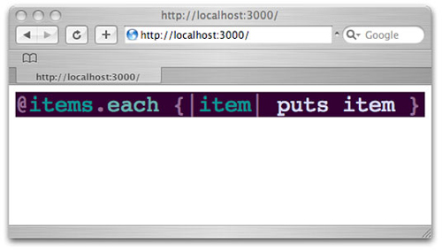
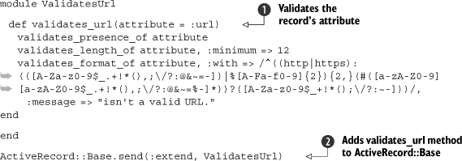

Lab 4. Ruby on Rails techniques
===================================

### This lab covers

-   Using third-party libraries with helpers
-   Keeping code DRY using metaprogramming
-   Sharing code using plugins and gems
-   Benchmarking and profiling Rails applications

“Another Ruby course that teaches Rails?” No, we’re not going that far!
This lab is not an introduction or tutorial on Rails; rather, it is
a discussion of techniques related to Ruby on Rails. There’s a
middle-documentation problem that’s arisen in the Rails community, and
This lab is meant to fill a few of the gaps that many other courses
and documentation sources leave open. We’ll cover extending the Rails
framework, through library code, plugins, and more, and we’ll finish by
talking about profiling your Rails code. Let’s start by looking at
Rails’ helper mechanism.

#### Pre-reqs:
- Google Chrome (Recommended)

#### Lab Environment
Al labs are ready to run. All packages have been installed. There is no requirement for any setup.

All exercises are present in `~/work/ruby-programming/` folder.


### 4.1. Extending Rails

A lot of Rails developers see the magic going on in Rails and wonder how
to capture that same simplicity in their own helpers or other Ruby
scripts. As we’ve found out, using metaprogramming (remember that from
[lab
1](https://github.com/fenago/ruby-programming/blob/master/lab_guides/Lab_1.md)
along with a few of Rails’ built-in mechanisms will give you maximum
syntactic sugar while also making it easy to develop.

There are three essential types of extensions to Rails: helpers,
libraries, and plugins. Helpers are view-specific extensions that expose
new functionality to views or expose deeper functionality from
controllers or models to views. Libraries are just that: they are part
of your overall application, but separate from its models, views, and
controllers. Plugins are essentially libraries that are in a
redistributable format.

#### 4.1.1. Using helpers to expose Ruby libraries

Surprisingly, many new Rails developers misunderstand the relationship
between Ruby and Rails. Rails is written in Ruby, and as such can take
advantage of any library that Ruby can. Some libraries are written
specifically for, or with support for, Rails applications. Most
libraries are general-purpose—they’re still fully functional inside
Rails, but we wish they would be as easy to use as the rest of Rails:
using convention over configuration, keeping code simple and DRY, and so
forth. In this section, we’ll take one such general-purpose library and
make it more Rails-friendly using helpers.

##### Problem

You have an existing Ruby library that you would like to expose to a
Rails application in a natural way.

##### Solution

There are three main types of libraries or components we can create for
Rails: a helper that lives in app/helpers, a library that lives in lib/,
and plugins. In this instance, let’s say we want to build a source-code
browser and employ syntax highlighting. We’ll create a helper to expose
the Ultraviolet syntax highlighting library to a Rails application.

Ultraviolet’s syntax is pretty nice, but we don’t want to put something
like the following in our views or controllers if we can help it:

``` {.code-area}
1result = Uv.parse(code, "xhtml", "ruby", false, "amy")
```

[copy **](javascript:void(0))

The first parameter is the code we want to parse, followed by the format
to output, followed by the syntax file to use (Ultraviolet lets you use
TextMate syntax and theme files), followed by true or false to indicate
whether we need line numbers, followed, finally, by the name of the
theme we want to use. Putting all that through an application will not
only junk up the code, it will also cause a lot of duplication. (Most
likely, three of these arguments are always the same in a given
application, and repeating them all through the codebase makes it hard
to change the code when you decide to switch themes, or maybe to turn
line numbers off throughout your application.) We need to figure out a
way to make it friendlier.

To get started, we’ll first install Ultraviolet using RubyGems with a
command something like the following:

``` {.code-area}
1gem install ultraviolet
```

[copy **](javascript:void(0))

Now we need to consider what a call to Ultraviolet would ideally look
like when we call it from a view. We want to simplify as much as
possible; perhaps it would be best to require only the code and make the
other parameters optional. Of course, we’ll want it to be semantically
correct, so the Uv.parse call has to go in lieu of a better-named
method, like highlighted\_code or simply code. Perhaps it should look
something like the following:

``` {.code-area}
1code("puts 'hello!' if code.ruby?")
```

[copy **](javascript:void(0))

* * * * *

##### Using Gems With Rails 2.1 or later

Rails 2.1 adds support for using Ruby gems as plugins and libraries. If
you upgraded to Rails 2.1 or later, or you are starting a new project,
we recommend using this feature to manage your gems. Your
config/environment.rb file will look like this:

``` {.code-area}
1Rails::Initializer.run do |config| config.gem 'ultraviolet', :lib=>'uv' ...end
```

[copy **](javascript:void(0))

Most times, Rails can infer which file to require by default. For some
gems, we have to specify the library’s main file explicitly, as we do
here. If you’re using configuration to load gems, you don’t need to use
require in your source code.

Now you can ask Rails to install the application’s gem dependencies by
running Rake:

``` {.code-area}
1rake gems:install
```

[copy **](javascript:void(0))

This task installs system-wide gems that all your applications can use
when running on the current machine. When deploying, it’s easier to
deploy the application along with all its dependencies. You can do that
by unpacking the gem dependencies into the application’s vendor/gems
directory, using this command:

``` {.code-area}
1rake gems:unpack
```

[copy **](javascript:void(0))

* * * * *

So how do we do it? First, we need to either create a helper by creating
a new file (we recommend something like uv\_helper.rb or edit
application\_helper.rb in the app/helpers directory). Inside we need to
define a code method (shown in Application-Helper here):

``` {.code-area}
1require 'uv'module UvHelper def code(code) endend
```

[copy **](javascript:void(0))

Next we need to look at putting the call to Ultraviolet in place. We
could take the code as the sole argument and hard-code the other values,
but it would be pretty nice to be able to specify a different theme or
syntax if we ever needed to (and it’s trivial to add).

Let’s create a method that requires just the code argument, but accepts
all the remaining optional arguments:

``` {.code-area}
1def code(code, format='xhtml', syntax='ruby',      line_numbers=false, theme='amy') Uv.parse(code, format, syntax, line_numbers, theme)end
```

[copy **](javascript:void(0))

As you can see, we give default values to the parameters that won’t
change often, so when it’s called in a view, the only required argument
will be the code we want to highlight.

Now we need to create a controller, an action, and a view and place the
following code inside the view.

``` {.code-area}
1<html> <head><title>Syntax highlighting!</title></head> <body>  <%= code('@items.each {|item| puts item }') %> </body></html>
```

[copy **](javascript:void(0))

If you view the action in a browser, you should see that the code is
monospaced, but it doesn’t have any color! That’s because we didn’t tell
Ultraviolet to copy its CSS and other related files to the right place,
or tell our view to include that CSS file.

To do that, we’ll add a method to copy the CSS files from Ultraviolet to
our application’s public/stylesheet directory:

``` {.code-area}
1def copy_files Uv.copy_files 'xhtml', "#{RAILS_ROOT}/public/stylesheets" File.rename "#{RAILS_ROOT}/public/stylesheets/css/",         "#{RAILS_ROOT}/public/stylesheets/syntax/"end
```

[copy **](javascript:void(0))

Here, we first tell Ultraviolet to copy the files to our stylesheets
directory, and we then rename the directory it creates to something more
sensible.

Now we need to go back and add a few lines to our code method. It should
look something like the following:

``` {.code-area}
1def code(code, format='xhtml', syntax='ruby',      line_numbers=false, theme='amy') unless File.exist?("#{RAILS_ROOT}/public/stylesheets/syntax")  copy_files end Uv.parse(code, format, syntax, line_numbers, theme)end
```

[copy **](javascript:void(0))

Now the helper checks for the existence of the theme CSS files, and if
they aren’t there it copies them. This may not be necessary if you don’t
plan on sharing this helper at all, but if you do, this copy should
happen only once, so the performance hit is negligible.

* * * * *

##### Tip

If you develop this code into a full plugin, you can use the plugin’s
install.rb file to copy over the CSS files during installation.

* * * * *

Now we need to create a method to include the stylesheet in our view. We
could use stylesheet\_link\_tag directly, but then we’d have to worry
about which theme we were using. In the interest of abstraction and
making our lives easier, we’ll create a custom method:

``` {.code-area}
1def theme_stylesheet(theme='amy') stylesheet_link_tag "syntax/#{theme}"end
```

[copy **](javascript:void(0))

Now, if we add that to the \<head\> of our view, the code in the view
should be properly highlighted, and look something like what you see in
[figure
4.1](https://github.com/fenago/ruby-programming/blob/master/lab_guides/Lab_4.md).

##### Figure 4.1. The output from our syntax highlighting library



The final version of our syntax highlighting helper is shown in [listing
4.1](https://github.com/fenago/ruby-programming/blob/master/lab_guides/Lab_4.md).

##### Listing 4.1. The whole Ultraviolet helper

``` {.code-area}
1require 'uv' module UvHelper  def code(code, format='xhtml', syntax='ruby',        line_numbers=false, theme='amy')   unless File.exist?("#{RAILS_ROOT}/public/stylesheets/syntax")    copy_files   end   Uv.parse(code, format, syntax, line_numbers, theme)  end private  def copy_files   Uv.copy_files 'xhtml', "#{RAILS_ROOT}/public/stylesheets"   File.rename "#{RAILS_ROOT}/public/stylesheets/css/",           "#{RAILS_ROOT}/public/stylesheets/syntax/"  end  def theme_stylesheet(theme='amy')   stylesheet_link_tag "syntax/#{theme}"  end end
```

[copy **](javascript:void(0))

Our helper should be complete and ready to use in our application. No
syntax is safe from our highlighting now!

##### Discussion

Helpers are a great way to expose third-party functionality to your
application or to abstract your own logic to avoid duplication or a lot
of unnecessary code. In this instance, we could potentially be saving
ourselves a lot of keystrokes while also preserving the flexibility of
the original API from Ultraviolet. We built in the most common use case
for our needs, and left the rest to be explicitly specified. This
“operation by common convention” is how Rails manages to stay so simple
and useful: the most common usage is dead simple. Think about how easy
it is to map a database to a class or to create really nice AJAX
effects.

Of course, this isn’t the only Ruby library you could expose to Rails,
nor are helpers only useful for exposing Ruby libraries to Rails. There
are a great number of Ruby gems that would be (or are) very helpful to a
Rails application when exposed properly: RedCloth, which parses Textile
into HTML; any of the loads of time-handling libraries such as Chronic;
and the list goes on. Helpers are also useful for abstracting away parts
of your views that are common: setting a special page title on each
page, building your navigation menu, common layouts and widgets, and so
on.

But helpers are only really useful to your views; what about the rest of
your application? This is where other options, such as library code that
lives in lib/ and plugins come in. These mechanisms can help deal with
duplication in a number of other places in your application.

#### 4.1.2. Metaprogramming away duplication

A big part of the Rails design philosophy is DRY—Don’t Repeat
Yourself—but it’s very easy to repeat yourself in a Rails application:
putting the same validation in a number of models, repeating that bit of
markup on nearly every page, using that same idiom over and over in your
controllers. It takes a keen eye to see when to extract pieces of code
into reusable elements, but once you see what needs to be extracted, you
need to know what to do with it.

##### Problem

You have a lot of code that is very similar in structure and function
that you would like to consolidate as much as possible.

##### Solution

When you are building more complex models, validations and other related
calls can become quite large. One of Jeremy’s recent projects sported
some models whose validations, plugin calls, and callbacks added up to
over 30 lines at times. One way to shorten a lot of the code that builds
up in models is to enact metaprogramming and abstract it away.

For example, let’s say you were working on a project that had a lot of
URL fields: links for feeds, links for web pages, links for product
pages. Your models just have a lot of fields that are URLs, and you need
to validate the fields, so you write something like this:

``` {.code-area}
1validates_presence_of :urlvalidates_length_of :url, :minimum => 12validates_format_of :url, :with => /^((http|https): (([A-Za-z0-9$_.+!*(),;\/?:@&~=-])|%[A-Fa-f0-9]{2}){2,}(#([a-zA-Z0-9] [a-zA-Z0-9$_.+!*(),;\/?:@&~=%-]*))?([A-Za-z0-9$_+!*();\/?:~-]))/, :message => "isn't a valid URL."
```

[copy **](javascript:void(0))

As you can see, there are only a few simple validations for the field.
This doesn’t seem major, until you take a step back and realize that
you’re doing these validations 25 to 30 times in your application on
differently named attributes, sometimes two or three times per model. If
you decide to add to one of them or remove one of them, that’s a lot of
unnecessary work.

The better way is to metaprogram a little library to help you clean them
up. [Listing
4.2](https://github.com/fenago/ruby-programming/blob/master/lab_guides/Lab_4.md)
shows one such library. Place the code in a file (ours is named
validates\_url.rb) in the lib/ folder.

##### Listing 4.2. A URL validation library



Basically, what we’ve done in [listing
4.2](https://github.com/fenago/ruby-programming/blob/master/lab_guides/Lab_4.md)
is to wrap the validations in a method, so we can simplify our code and
call validates\_url on each attribute  we
want to validate. And since most often we’ll want to validate an
attribute called url, we made that the default attribute name.

Finally, we extend ActiveRecord::Base with our method so it’s available
to all of our models . We extended the class,
adding a new method we can call on the class itself. Specifying
validation rules in Rails is done by calling methods on the class during
its definition.

Extending classes is one of the metaprogramming techniques that makes
Rails so easy and powerful to use. This is different from adding methods
to a class, methods we can then call on objects of that class: we can do
that as well, but we would use include instead of extend.

So, the validates\_url method is now available to our models. Of course,
we’ll remove the older validations so they don’t look like the model in
[listing
4.3](https://github.com/fenago/ruby-programming/blob/master/lab_guides/Lab_4.md).

##### Listing 4.3. Our model, pre-metaprogramming

``` {.code-area}
1class Blog < ActiveRecord::Base  validates_presence_of :url  validates_length_of :url, :minimum => 12  validates_format_of :url, :with => /^((http|https):  (([A-Za-z0-9$_.+!*(),;\/?:@&~=-])|%[A-Fa-f0-9]{2}){2,}(#([a-zA-Z0-9]  [a-zA-Z0-9$_.+!*(),;\/?:@&~=%-]*))?([A-Za-z0-9$_+!*();\/?:~-]))/,    :message => "isn't a valid URL."   validates_presence_of :feed_url   validates_length_of :feed_url, :minimum => 12   validates_format_of :feed_url, :with => /^((http|https):  (([A-Za-z0-9$_.+!*(),;\/?:@&~=-])|%[A-Fa-f0-9]{2}){2,}(#([a-zA-Z0-9]  [a-zA-Z0-9$_.+!*(),;\/?:@&~=%-]*))?([A-Za-z0-9$_+!*();\/?:~-]))/,    :message => "isn't a valid URL." end
```

[copy **](javascript:void(0))

Instead, they’re cleaner and read much better, as you can see in
[listing
4.4](https://github.com/fenago/ruby-programming/blob/master/lab_guides/Lab_4.md).

##### Listing 4.4. Our metaprogrammed model

``` {.code-area}
1class Post < ActiveRecord::Base  validates_url  validates_url :feed_url end
```

[copy **](javascript:void(0))

Using this sort of metaprogramming can shear off tons of code cruft
that’s floating around in your applications.

##### Discussion

Metaprogramming in Ruby is a powerful concept, and it’s metaprogramming
that gives Rails its real power. Methods like acts\_as\_list,
ActiveRecord’s attribute mapping, and nearly every model-related plugin,
depend on metaprogramming to function. In this example, we’ve only shown
one side of metaprogramming. There are many more techniques we can use,
some of which we’ll show later in this course.

Now let’s look at taking this sort of code and making it reusable.

#### 4.1.3. Turning your code into reusable components

After a while, you will build a considerable toolkit of helpers and
libraries, but what if you want to share those with your friends,
family, fleeting acquaintances, and business colleagues? The easiest way
to do that is to extract the code into a plugin.

##### Problem

You’d like to share your recently metaprogrammed code with others as a
plugin.

##### Solution

In this section, we’ll extract the URL validation library into a plugin
that we can distribute.

First, generate a plugin using script/generate.

``` {.code-area}
1$ script/generate plugin validates_url  create vendor/plugins/validates_url/lib  create vendor/plugins/validates_url/tasks  create vendor/plugins/validates_url/test  create vendor/plugins/validates_url/README  create vendor/plugins/validates_url/Rakefile  create vendor/plugins/validates_url/init.rb  .  .  .  create vendor/plugins/validates_url/test/validates_url_test.rb
```

[copy **](javascript:void(0))

It should have generated a number of files for you, including a Rake
file, a code file, and a few installation necessities. Next, copy the
code from your library in lib/ to the validates\_url.rb file in the
plugin’s directory.

Now that the code is basically in the right place, we need to move some
of the pieces around. Pull the call to extend out from the bottom of the
main code file and place it in init.rb. The code in your init.rb file is
executed in order to initialize the plugin and execute any code hooks
(such as extending a class) that your plugin needs to work. Then fill
out the README with some basic information, and you’ve just written your
first Rails plugin!

* * * * *

##### Using gems to distribute Rails plugins

You can also use gems to distribute Rails plugins ([Rails 2.1 or
later](https://github.com/fenago/ruby-programming/blob/master/lab_guides/Lab_4.md).
We’ll discuss gem packaging and distribution in [lab
8](https://github.com/fenago/ruby-programming/blob/master/lab_guides/Lab_8.md),
but let’s look at the difference between gems and non-gem plugins.

You can install gems system-wide and use them across all your
applications, or unpack gems into the application directory and
distribute them alongside the application. You’ll find unpacking easier
to use when deploying Rails applications. Gems unpack into the
vendor/gems directory, and if you want to develop the gem alongside your
application, you can start by creating it in a directory under
vendor/gems.

By convention, you use the lib directory to hold the Ruby files that
make up your gem. Any Rails-specific initialization goes in the
rails/init.rb file.

Configuring your Rails application to use a system-wide gem is done in
the config/ environment.rb file. Rails uses that information to list
(rake gems), install (rake gems:install), and unpack (rake gems:unpack)
gems.

Each environment has a separate configuration file, and you can use
these files to specify gems that are only used in a specific
environment, such as gems used for development or testing but not in
production.

* * * * *

##### Discussion

As you can probably tell, Rails plugins are basically libraries and
helpers that have explicit places for code hooks, an install/uninstall
script, and a README. Their simplicity, though, makes them very easy to
write while still being useful. This example covers the core of writing
a plugin, but there are a few little pieces that it doesn’t cover.

First, plugins are given install and uninstall scripts, which should be
used for any sort of setup/teardown that your plugin needs to do. For
example, if we were to port our Ultraviolet helper to a plugin, we would
probably want to call copy\_files in the install task and delete the
copied files in the uninstall task rather than doing it on the first
request. This would not only knock down the small performance hit that
you take from doing it on the first request, but you can also deal with
any errors that might arise before your application is running rather
than after. Many plugins use the install hook to show further
instructions for installation, like the restful\_authentication plugin
that shows you the README file with further installation and generation
instructions.

Plugins also have their own sets of Rake tasks, which can be used to do
repeated tasks related to the plugin. For example, if you had a plugin
that worked with Amazon’s S3, and you wanted to clear off your testing
bucket, you might have a rake:bucket:clear task. These tasks sit right
alongside Rails’ tasks in the rake -T listing, so they’re easily
accessible to developers using your plugin.

Now let’s turn our attention to Rails performance.

### 4.2. Rails performance

One of the sticking points for some developers, when it comes to Rails,
is the performance. Of course, performance is a rather relative term
when you have so many moving parts in a framework: database performance,
rendering performance, dispatch performance, and so on. Any or all of
these can play a part in your performance problems, but you can’t fix
the problem until you know what it is. In this section, we’ll look at
how to profile a Rails application and find your problem spots.

The simplest way to do it is to take a look in your log files. When you
see something like the following, you can pretty much guarantee it’s a
problem area:

``` {.code-area}
1Processing HomeController#home (for 127.0.0.1 at 2007-08-31 10:15:30) [GET] Session ID: 39ba59dc6b7a6eb672cf3a0e89bdc75d Parameters: {"action"=>"home", "controller"=>"home"}Rendering home/homeCompleted in 26.39205 (1 reqs/sec) | Rendering: 0.09310 (1%) | 200 OK[http://localhost/home/home]
```

[copy **](javascript:void(0))

If you don’t see anything that apparent, or if there are a lot of code
branches in that method, you’ll have to dig a little deeper into the
workings of your code. Rails provides a benchmarking helper just for
this purpose, which is a really handy tool for simple analysis of pain
points in your code.

#### 4.2.1. Benchmarking a Rails application

Benchmarking is a really easy way of getting a lot of data about the
performance of your Rails applications. Rails offers two ways of getting
benchmark data. The first is to use script/performance/benchmarker,
which takes a line of code on the command line, benchmarks it, and
report back.

Let’s say you thought your Order model’s cancel! method was getting out
of hand. You could do something like this to find out:

``` {.code-area}
1$ script/performance/benchmarker 'Order.find(:first).cancel!'
```

[copy **](javascript:void(0))

As a result, the script will give you a simple report of the
measurements it took.

``` {.code-area}
1user  system   total   real#1  0.000000  0.000000  0.000000 ( 0.017904)
```

[copy **](javascript:void(0))

Of course, if you actually had problematic code, it would return much
larger numbers. This is great for testing things outside the context of
your application, but Rails also offers a simple helper for benchmarking
inside your application.

##### Problem

You need to benchmark your Rails inside your application.

##### Solution

Rails offers a single method named benchmark that allows us to benchmark
blocks of code throughout an application. Let’s say we have a model
method that looks like this:

``` {.code-area}
1def create_council_members(members) members.each do |member|  new_member = Member.create(member[:attributes])  new_member.association = Club.find_by_associate(member[:friend])  new_member.unverified! if new_member.association.unverified? endend
```

[copy **](javascript:void(0))

We’re having trouble telling which part of the code is causing the
problem, but we know it’s in this method because of the log files. If we
were to wrap that segment of code into a benchmark block, we could get a
better idea of what’s going on:

``` {.code-area}
1def create_council_members(members) members.each do |member|  Member.benchmark("Creating a member") do   new_member = Member.create(member[:attributes])  end  Club.benchmark("Associating a member") do   new_member.association = Club.find_by_associate(member[:friend])   new_member.unverified! if new_member.association.unverified?  end endend
```

[copy **](javascript:void(0))

If we make a few requests and look inside the log file, we will see
something like the following snippet:

``` {.code-area}
1Creating a member (0.34019)Associating a member (0.90927)[...]Creating a member (0.29010)Associating a member (0.90902)[...]Creating a member (0.35069)Associating a member (1.0937)
```

[copy **](javascript:void(0))

The time measurements are in parentheses and are usually quite telling.
In this case, associating a member takes a lot longer!

##### Discussion

Benchmarking models is great, but if you find yourself seeing high
render times in your logs, you can benchmark blocks of code in views in
a similar manner. Views also have a benchmark method, as you can see in
the following code.

``` {.code-area}
1<% benchmark "Content tree menu" do %>  <%= build_content_tree %><% end %>
```

[copy **](javascript:void(0))

This helper is great if you’re rendering a menu or complex trees of
content and can’t seem to nail down the performance problem. If you find
you need more data than either of these provides, perhaps you need to
look into profiling.

#### 4.2.2. Profiling a Rails application

Profiling offers runtime analysis of your Rails applications, breaking
down each method call and showing its share of the execution time.
Profiling is a very useful way to get in-depth information on your Ruby
code in general, but it’s usually a little less friendly than the way
Rails provides.

##### Problem

You are having performance issues with a Rails application and would
like to find your application’s trouble spots.

##### Solution

Rails offers a script that lives in performance/ named profiler, which
will use the Ruby profiler to profile your Rails application. You invoke
it in basically the same manner as you invoke the benchmarker.

For example, let’s say you wanted to profile the confirmation of
reservations in your hotel-courseing application. The following line would
invoke the profiler with your confirm! method:

``` {.code-area}
1$ script/performance/profiler 'Reservation.confirm!'
```

[copy **](javascript:void(0))

Rails then produces a report to the console that includes *a lot* of
information, some of which is actually useful:

``` {.code-area}
1Loading Rails...Using the standard Ruby profiler.  %  cumulative   self         self    total time  seconds  seconds   calls  ms/call  ms/call name 12.20   0.10     0.10    188    0.53    0.64 Array#select... 5.12    0.82     0.04     1    1.00    0.98  Reservation#done!... 0.00    0.82     0.00    17     0.00   0.00  Proc#new 0.00    0.82     0.00     1    0.00  820.00  #toplevel
```

[copy **](javascript:void(0))

We’ll say it again: the profiler produces *a lot* of data. Some of it is
interesting (who knew Array\#select was the worst offender?), some of it
is useless (of course \#toplevel doesn’t have a performance hit!), and
some of it is useful (the done! method appears to be what’s killing the
performance in this case). The important thing to analyze here is not
only the percentages and times, but the calls (in the fourth column). We
would worry about Array\#select if the 12 percent it takes up weren’t
spread across 188 calls; on the other hand, the done! method on our
model eats up 5 percent in *one* call. That’s where a performance
problem lies.

##### Discussion

If you’d like to get more information and fancier reporting on your
Rails application, a library called ruby-prof can help you out. It’s
written in C, it’s much faster, and it integrates directly with the
Rails profiler script (which will automatically use ruby-prof if it’s
available). For example, if you want to generate an HTML report for a
graph profile, you can do this:

``` {.code-area}
1$ script/performance/profiler 'Reservation.confirm!' graph_html
```

[copy **](javascript:void(0))

The ruby-prof library is available as a Ruby gem and you can check out
its RDoc at
[http://ruby-prof.rubyforge.org/](http://ruby-prof.rubyforge.org/).

### 4.3. Summary

In This lab, we looked at a number of techniques that Rails
developers should be employing. First, we looked at adding your own
extensions to Rails and building reusable components from your own code.
We then looked at gauging the performance of your Rails application, and
suggested a few practical tools and tips to get you started. In the next
lab, we’ll take a deeper look at Ruby and web services, including an
in-depth look at REST and REST clients.
