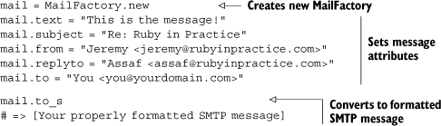

Lab 6. Automating communication
===================================

### This lab covers

-   Sending email
-   Processing email
-   Exchanging messages with AIM
-   Exchanging messages with Jabber/XMPP

With the proliferation of communication technologies like the telephone,
the internet, and cell phones, people are more connected than ever
before, and recent software advances have allowed us to automate these
communications: electronic call center menus, widespread email, instant
messaging (IM) bots, and so on. This sort of communications automation
software can make your life much easier when it comes to handling
interactions with coworkers, employees, and customers. For example, you
might want to send out an email to 500 customers when their product has
shipped. As invisible and minor as this software seems, it is a very big
piece of the infrastructure of modern businesses.

In This lab, we’ll look at techniques for creating this sort of
software, looking at code examples extracted from real systems doing
this sort of work every day. We’ll start by looking at email, discussing
how to send, receive, and process it. Then we’ll take a look at some
instant communication mediums, such as AOL Instant Messenger (AIM) and
Jabber.


#### Pre-reqs:
- Google Chrome (Recommended)

#### Lab Environment
Al labs are ready to run. All packages have been installed. There is no requirement for any setup.

All exercises are present in `~/work/ruby-programming/` folder.


### 6.1. Automating email

Email is one of the most popular technologies on the web today, but,
thanks to spammers, the concept of “automated email dispersion” has bad
connotations, even though this sort of mechanism is probably one of the
most common internet applications. It’s often used in consumer
applications. Purchased a product from an online shop? Chances are
you’ve received an automatically generated email message. Signed up for
a new service lately? You’ve probably received an activation notice via
email.

But these are all business-to-consumer use cases. What about automating
email for things like your continuous integration server or
process-monitoring software? You can use email as a powerful way to
alert or update people about the state of a system. You could also use
automated email reception for tasks like creating new tickets in your
development ticketing system or setting up autoresponders for email
addresses (for example, a user sends an email to
autoresponse@yourdomain.com, and then emails are automatically responded
to with the message in the body for that address). Email’s ubiquity
makes it a powerful tool for communication in your Ruby applications,
and in this section we’ll show you how to harness email to do your
(Ruby-powered) bidding. We’ll cover the basics, like sending and
receiving, and then look at processing email with Ruby.

Let’s first take a look at your options for sending email messages with
Ruby.

#### 6.1.1. Automating sending email

Ruby has a few options for sending email messages. First, there’s a
built-in library, Net::SMTP, which is very flexible but also very
difficult to use compared with others. There are also other high-level
solutions such as TMail or Action Mailer (built on top of TMail), which
work just fine, but we’ve found that a gem named MailFactory works the
best. MailFactory gives you nice facilities for creating email messages
while requiring very little in the way of dependencies.

* * * * *

##### Testing SMTP

If you don’t have an SMTP server like Sendmail handy, then Mailtrap is
for you. Written by Matt Mowers, Mailtrap is a “fake” SMTP server that
will write (or “trap”) the messages to a text file rather than sending
them. You can grab Mailtrap via RubyGems (gem install mailtrap) or
download it and find out more at
[rubyforge.org/projects/rubymatt/](http://rubyforge.org/projects/rubymatt/).

* * * * *

##### Problem

You need to automate sending email from your Ruby application to alert
your system administrators when Apache crashes.

##### Solution

Ruby’s built-in SMTP library is fairly low-level, at least in the sense
that it makes you feed it a properly formatted SMTP message rather than
building it for you. MailFactory is a library (available via RubyGems)
that helps you generate a properly formatted message, which you can then
send via the built-in SMTP library.

Creating a message with MailFactory is as simple as creating a
MailFactory object, setting the proper attributes, and then getting the
object’s string value, a properly formatted SMTP message. [Listing
6.1](https://github.com/fenago/ruby-programming/blob/master/lab_guides/Lab_6.md)
shows a short example.

##### Listing 6.1. Constructing a basic MailFactory object, attribute by attribute



As you can see, setting up a MailFactory object is fairly
straightforward: instantiate, populate, and output the message to a
string.

Now, all you need to do is feed the message to Net::SMTP to send it. To
send an email to your system administration team every time your Apache
web server process crashes, you just need to build a MailFactory object,
giving it a string of recipients, and then send it via Net::SMTP.
[Listing
6.2](https://github.com/fenago/ruby-programming/blob/master/lab_guides/Lab_6.md)
shows our implementation.

##### Listing 6.2. Sending email to administrators


First, we build an array of administrator email addresses
. Then we use this and other information to
build the MailFactory object . Next, we
constantly loop like a daemon  (we could also
take this out and run the script in a cron job or something like that),
grabbing the output of ps  and checking it
for the term “apache.” If it’s not found, we send a mail to the
administrators using Net::SMTP . The start
method takes parameters for the SMTP server address and port, the “from”
domain, your username and password, and the authentication scheme (could
be :plain, :login, or :cram\_md5). An SMTP object is then yielded to the
block, which we can call methods on to send email messages (e.g.,
send\_message).

##### Discussion

We like to use MailFactory to build the SMTP message like this, but it’s
not required. If you’re comfortable building properly formatted messages
or are grabbing the messages from another source, MailFactory isn’t
required. There are also alternatives to MailFactory, like TMail, which
both generates and parses email messages. You don’t even have to use the
built-in library for sending messages; if you’re really masochistic, you
could just use a TCPSocket and talk SMTP directly!

* * * * *

##### SMS messages

A lot of cell phone carriers let you send SMS messages via email. This
is a cheap and efficient way to reach people instantly when one of the
options discussed later isn’t available.

* * * * *

One thing to note about our example is that it likely won’t work on
Windows. The ps utility is a \*nix-specific utility, which means that if
you’re on Linux, Solaris, or Mac OS X, you should be fine, but if you’re
on Windows, you’re out of luck. If you really want to implement
something like this on Windows, you can take a few other routes. One is
to use one of the many WMI facilities available, either through the
win32 library or one of the other WMI-specific packages. You could also
seek out a ps alternative on Windows, many of which are available if you
just do a web search for them.

If these approaches strike you as too low-level, then Action Mailer
might be for you. Action Mailer is Ruby on Rails’ email library, and it
offers a lot of niceties that other approaches don’t.

Now that you’re familiar with sending email with Ruby, let’s take a look
at receiving it.

#### 6.1.2. Receiving email

Ruby has built-in libraries for both POP3 and IMAP reception of
messages, but unfortunately they’re not API-compatible with one another.
In this section, we’re only interested in processing incoming emails
quickly. We don’t intend to keep them around, so we don’t need the more
advanced IMAP.

We’re going to concentrate on the POP3 library (Net::POP3), but if
you’re interested, the example is available for the IMAP library in the
downloadable source code for this book.

##### Problem

You need to perform actions at a distance, like being able to restart
the MySQL server when away from the office. You don’t always have SSH
access, but you can always email from a cell phone.

##### Solution

Ruby’s POP3 library, Net::POP3, is fairly simple to operate. To grab the
messages from your inbox, you simply use the start method on the
Net::POP3 class and manipulate the object given to its block. Check out
the example in [listing
6.3](https://github.com/fenago/ruby-programming/blob/master/lab_guides/Lab_6.md).

##### Listing 6.3. Fetching email using POP3


Net::POP3, like Net::SMTP and all other Net modules, is part of the Ruby
standard library, which ships with every Ruby implementation. Unlike
core library modules (like String, Array, and File) you have to require
standard library modules in order to use them
. Once you’ve gotten the library properly in
place, you can take a few approaches to getting your mail. You could
instantiate an object and work with it, but we think our approach here
(using the class method and a block) is cleaner and more concise
. The parameters for the start method are the
connection’s credentials: host, port, login, and password. Next, we
interact with the object yielded to the block to see how many messages
are present in the current fetch. If there are no email messages, we
output a message indicating as much , but
otherwise we output how many messages were found
.

For this problem, we need to set up a system that will restart a MySQL
server when a message is sent to a specific email address with the
subject “Restart MySQL.” To build a system like that, we need to grab
the emails from the address’s inbox, iterate through them, and check
each message for “Restart MySQL” in the subject. You can see our
implementation in [listing
6.4](https://github.com/fenago/ruby-programming/blob/master/lab_guides/Lab_6.md).

##### Listing 6.4. Restarting MySQL via email


First, we set up a couple of constants: one for the email addresses that
are authorized to restart MySQL , and one for
the command we’ll use to restart MySQL .
Next, we output a message telling how many messages we’ve received
. We then iterate through the messages
, checking for the proper subject
 and From address
. If the sender is authorized and the subject
contains “Restart MySQL,” we run RESTART and MySQL is restarted. Having
read the message, we discard it and sleep for 30 seconds before checking
to see if another message is waiting for us.

##### Discussion

The production system that this solution is based on had a few more
things that administrators could do via email, such as managing indexes
and creating databases. It also allowed administrators to send multiple
commands per email. But we decided to strip this solution down to give
you a base to work from that you can expand or completely change to suit
your whim. You could change this to manage other long-running processes,
execute one-off jobs, or even send other emails out.

You’re probably wondering about security. We wanted to make it possible
to send an email from any device, specifically from cell phones. Even
the simplest of cell phones lets you send short emails, usually by
sending a text message (SMS) to that address instead of a phone number.
You can try it out yourself if you have any email addresses in your
phone book.

Unfortunately, cell phones won’t allow you to digitally sign emails, so
we can’t rely on public/private key authentication. We can’t rely on the
sender’s address either, because those are too easy to guess and forge.
Instead, we used a unique inbox address that can survive a brute force
attack and gave it only to our administrators. We kept this example
short, but in a real application we’d expect better access control by
giving each administrator his own private inbox address and an easy way
to change it, should he lose his phone.

In spite of that, it’s always a good idea to double-check the sender’s
address. We’ll want our task to send back an email response, letting the
administrator know it completed successfully. And sometimes these
responses come bouncing back, so we’ll need a simple way to detect
administrator requests and ignore bouncing messages, or we’ll end up
with a loop that keeps restarting the server over and over.

POP3 is usually good enough for most instances, but on some networks
APOP (Authenticated POP) is required. If your host uses APOP
authentication, you can give the start command a fifth Boolean parameter
to indicate that Net::POP3 should use APOP. If we wanted to enable APOP
on our previous example, the call to the start method would look
something like this:

``` {.code-area}
Net::POP3.start('pop.yourhost.com', 110,             'cly6ruct1yit2d@yourco.com', 'dbMASTER', true)
```

[copy **](javascript:void(0))

In this example, we extracted information from the raw POP message using
regular expressions. This works for simple cases, like what we’ve done
here, but as your needs get more complicated, the viability of this
approach breaks down. In the next section, we’ll take a look at a much
more robust solution to email processing: the TMail library.

#### 6.1.3. Processing email

Now that you know how to send and receive email, you can start thinking
about how to leverage these techniques to solve bigger problems. In this
section, we’ll combine these two techniques and take a look at one
subsystem in a production ticketing system.

##### Problem

You have a ticketing system built with Rails. It’s running great, but
creating tickets is a bit laborious, so you want to allow users to open
tickets via email. You need to process and respond to ticket-creation
email messages in your Ruby application.

##### Solution

The smartest flow for the new ticket-creation system seems to be to
receive an email, process its contents, put the relevant data in an
instance of your model, and delete the mail. Then, pull the model on the
front end with a web interface. So, we’ll assume you have a Ticket model
like the following:

``` {.code-area}
class Ticket < ActiveRecord::Base has_many :responsesend
```

[copy **](javascript:void(0))

[Listing
6.5](https://github.com/fenago/ruby-programming/blob/master/lab_guides/Lab_6.md)
shows our implementation of the mail-handling script. We’ll analyze it
piece by piece.

##### Listing 6.5. Creating tickets via email


In this implementation, we first receive our email messages using
Net::POP3 . Then we iterate through the
messages  and use TMail’s message-parsing
abilities to get a usable object with attributes
. We then create a new instance of our
ActiveRecord model, Ticket , and populate it
with the data from the email. Finally, we use TMail to build a new email
object (notice the API similarities to MailFactory)
, and send that email using Net::SMTP.

##### Discussion

TMail is available as a standalone gem (gem install tmail), but you’ll
also find it as part of the standard Rails distribution, included in the
Action Mailer module. Action Mailer itself is a wrapper around TMail and
Net::SMTP that uses the Rails framework for configuration and
template-based email generation. You can learn more about Action Mailer
from the Rails documentation. In this particular example, the email
message was simple enough that we didn’t need to generate it from a
template, and we chose to use TMail directly.

* * * * *

##### Note

*Astrotrain* Jeremy’s coworkers at entp have written a great tool named
Astrotrain, which turns emails into HTTP posts or Jabber messages for
further processing. You can send an email to
*my\_token\_1234@yourhost.com* and get a post to something like
[http://yourhost.com/update/?token=my\_token&hash=1234](http://yourhost.com/update/?token=my_token&hash=1234).
You can find out more and get the source at
[http://hithub.com/entp/astrotrain/tree/master](http://hithub.com/entp/astrotrain/tree/master).

* * * * *

Now that you have a solid grasp of automating email, let’s take a look
at another problem domain in communication automation: instant
messaging.

### 6.2. Automating instant communication

Sometimes, email just isn’t quick enough. Thanks to technologies like
online chat and instant messaging, we can now be connected directly with
one another, chatting instantly. And the ubiquity of technologies like
AIM, Jabber, and others finally make them a viable solution for business
communication. Automating these sorts of communications opens up
interesting possibilities: customer service bots, instant notification
from your continuous integration system, and so on.

This section will concentrate on using two of the most popular options
for instant communication: AIM and Jabber.

#### 6.2.1. Sending messages with AIM

Once released independently of the America Online dial-up client, the IM
component of the AOL system quickly became one of the most popular
systems for private messaging. It might not have the same tech appeal as
Jabber or GTalk, but it’s an instant messaging workhorse that commands
half the market share and is used for both personal and business
accounts. Contacting users or employees through AIM is a good way to
make sure your communication is heard as quickly as possible.

##### Problem

You need to send server information via instant messages using AIM.

##### Solution

The Net::TOC library (gem install net-toc) provides a very flexible API
for interacting with the AIM service. The first approach you can take to
using it is a simple, procedural connect/send/disconnect approach.
[Listing
6.6](https://github.com/fenago/ruby-programming/blob/master/lab_guides/Lab_6.md)
shows an example of sending an IM.

##### Listing 6.6. Sending an IM with Net::TOC


First, we create an object and connect to the AIM service
. Then we find a user (in this case,
“youraimuser”), send a simple message , and
disconnect from AIM. This approach works well when you’re simply sending
messages, but it gets awkward when you want to deal with incoming
messages.

Fortunately, Net::TOC has a nice callback mechanism that allows you to
respond to events pretty easily. These events range from an IM being
received to a user becoming available. See [table
6.1](https://github.com/fenago/ruby-programming/blob/master/lab_guides/Lab_6.md)
for a full listing.

##### A full listing of the Net::TOC callbacks


These callbacks make interactions with users much cleaner than if you
tried to shoehorn them into the sequential method. Let’s say you wanted
to get information from a server simply by sending an IM to an AIM bot.
[Listing
6.7](https://github.com/fenago/ruby-programming/blob/master/lab_guides/Lab_6.md)
shows an implementation using Net::TOC’s callbacks.

##### Listing 6.7. Sending the results of uptime over AIM


To get the server information, we create a get\_server\_information
method . Next, we use the on\_im callback to
respond to any IMs we receive . The callbacks
basically function as a declarative way to define behavior when
something happens, and, as you can see here, the block we provide will
be called when an IM is received. When this happens, the buddy is found
(to get a Net::TOC::Buddy object) and an IM is sent via the send\_im
method. Finally, once the callback is set up, we connect and wait for
IMs to come in to fire the callback .

##### Discussion

Little bots and automations like this are becoming more and more
popular. Developers are beginning to realize the potential uses for
them: information lookups, customer management, workflows, and so on.
Many IRC channels for open source packages (including Ruby on Rails) now
have IRC bots that will give you access to a project’s API by simply
sending a message like “api ActionController\#render.” Developers
looking for a solution to handle peer and management approval in code
reviews or to alert their coworkers of Subversion activity could use an
AIM bot like this one.

If you’re interested in embedding AIM chat features in a Rails
application, your options are slim and aren’t very slick, but it is
possible. We’re not aware of any Rails plugins that currently handle AIM
communications dependably. The best way we’ve found to handle this is to
build an external daemon that you integrate with your Rails application.
For example, you could use the daemons gem to generate a daemon script,
give it full access to the Rails environment by including
environment.rb, and then run it along with your Rails application. This
will allow your daemon to have access to your application’s models,
making integration a snap.

If you find that the people you need to communicate with don’t like AIM,
you can use libpurpl, the library that powers Pidgin, a multiprotocol
chat client. There is a Ruby gem named ruburple that hooks into
libpurpl, but many people seem to experience sporadic success with
building it. If you’re able to build it, it’s a great way to access a
number of chat protocols easily. If that doesn’t work for you, you can
also use XMPP and Jabber to access other chat protocols. We’ll talk
about Jabber next.

#### 6.2.2. Automating Jabber

Jabber is an open source IM platform. The great thing about Jabber is
that you can have your own private Jabber server, which you can keep
private or link with other Jabber servers. So, you can have your own
private IM network or be part of the public Jabbersphere. In addition,
XMPP (the Extensible Messaging and Presence Protocol that Jabber runs
on) offers a nice set of security features (via SASL and TLS). XMPP
servers can also bridge to other transports like AIM and Yahoo! IM. You
can learn more about setting up and maintaining your own Jabber server
from the Jabber website at
[http://www.jabber.org/](http://www.jabber.org/).

##### Problem

You want your administrators to be able to manage MySQL via Jabber
messages sent from your Ruby application.

##### Solution

Ruby has a number of Jabber libraries, but the most advanced and best
maintained is xmpp4r. In this section, we’ll look at using a library
built on top of xmpp4r named Jabber::Simple, which simplifies the
development of Jabber clients in Ruby. You’ll need to install both gems
(xmpp4r and xmpp4r-simple) to use these examples.

* * * * *

##### Jabber and Rails

If you’re interested in using Jabber with Rails, take a look at Action
Messenger, which is a framework like Action Mailer but for IM rather
than email. The Action Messenger home page is
[http://trypticon.org/software/actionmessenger/](http://trypticon.org/software/actionmessenger/).

* * * * *

The process for interacting with Jabber is very similar to the process
for interacting with AIM, but the API exposed in Jabber::Simple is
slightly, well, simpler. Take a look at [listing
6.8](https://github.com/fenago/ruby-programming/blob/master/lab_guides/Lab_6.md)
for an example.

##### Listing 6.8. Building a simple Jabber::Simple object


First, we create a new Jabber::Simple object. When creating this object,
you must provide your login credentials, and the account will be logged
in. The new object is essentially an XMPP session with a nice API on top
of it. The roster attribute provides an API to the logged-in account’s
contact list, which allows you to add and remove people. Finally, we use
the deliver method to send a message to the person we added to this
account’s contact list.

* * * * *

##### Contact list authorization

When you add someone to an account’s contact list, the person being
added will have to authorize the addition of her account to your contact
list. You can use the subscript\_requests method to authorize requests
for adding your bot. See the Jabber::Simple documentation for more
information.

* * * * *

Jabber::Simple doesn’t implement anything akin to the callbacks in
Net::TOC, but the mechanism for receiving messages is fairly
straightforward. As an example, let’s say you wanted to expand on our
earlier MySQL control service (from [listing
6.4](https://github.com/fenago/ruby-programming/blob/master/lab_guides/Lab_6.md)
to allow your administrators to stop, start, or restart the server over
IM. [Listing
6.9](https://github.com/fenago/ruby-programming/blob/master/lab_guides/Lab_6.md)
shows one implementation of this script.

##### Listing 6.9. Managing MySQL via Jabber rather than email


We start off by defining a few constants :
AUTHORIZED is an Array of Jabber users that we permit to issue commands,
and COMMANDS is a Hash of command sequences we’ll use to control the
MySQL server. Next, we create our Jabber::Simple object
 and call the received\_messages method
. This method gives us an iterator that will
yield each message received since the last received\_messages call.

Now we need to figure out who sent us the message. The message.from
attribute is actually a Jabber::JID object that gives us access to some
of the internal Jabber data. Earlier in the lab, we used email to
administer MySQL, and we had to worry about spoofing the sender’s
address. XMPP uses server-to-server authentication to eliminate address
spoofing, so we can trust the sender’s identity. Since we need to know
only the username and domain, we extract that and build a usable string
. Next, we check to see if the user who sent
us the message (now in from) is authorized to be doing so, and if so, we
try to issue the command . If they sent a bad
command (i.e., not “start,” “stop,” or “restart”), we tell them so.
Otherwise, we go to the next message or begin listening for new messages
again.

##### Discussion

The Jabber::Simple library is nice, but if you like to get down to the
bare metal, you could use xmpp4r directly. It offers a higher level API
(not quite as high as Jabber::Simple, but tolerable), but it also gives
you access to much of the underlying mechanics. This access could be
useful if you’re building custom extensions to XMPP or you want to do
some sort of filtering on the traffic.

### 6.3. Summary

We’ve taken a look at a few approaches to communication automation in
This lab. Email automation has been in use for years in certain
arenas, but we are seeing it expand out into more business applications
(some of which were discussed here) and into the consumer world (with
things like Highrise from 37signals and Twitter). AIM bots have been
around for years (Jeremy can remember writing one in 1997!), but they’re
no longer exclusively in the territory of 13-year-olds and
spammers—they’ve moved into the business-tool arena. Voice over IP
(VOIP) seems to be moving in that same direction, with technologies like
Asterisk and tools like Adhearsion.

All this is to say that we are beginning to see people use existing
methods of communication in new and different ways. Fortunately, the
Ruby community is constantly building new tools to work with these
technologies, and many of them, like Adhearsion, are pioneers in their
field. Another area where Ruby has pioneered is databases, where
ActiveRecord and some of the new ORM libraries are pushing the
boundaries of DSL usage in database programming.

Now that we have covered the use of email and instant messaging for
automation, we’ll turn our attention to technologies designed
specifically for exchanging messages between applications, and we’ll
talk about asynchronous messaging using the open source ActiveMQ,
big-iron WMQ, and Ruby’s own reliable-msg.
