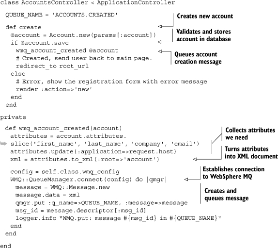

Lab 7. Asynchronous messaging
=================================

### This lab covers

-   Using ActiveMQ and Stomp
-   Using reliable-msg
-   Using WebSphere MQ

Asynchronous messaging is one of the most effective ways of building a
loosely coupled system while maintaining a sense of coherence in the
system. Coupling the publish/subscribe architecture with a reliable
delivery broker gives you a solid architecture for integration with
heterogeneous (or homogeneous) systems. In This lab, we’ll look at a
few options for asynchronous messaging in Ruby, including how to
integrate these solutions with Rails. We’ll start with two open source
messaging servers, ActiveMQ and Ruby-native reliable-msg, before moving
on to WMQ, the granddaddy of message-oriented middleware.

#### Pre-reqs:
- Google Chrome (Recommended)

#### Lab Environment
Al labs are ready to run. All packages have been installed. There is no requirement for any setup.

All exercises are present in `~/work/ruby-programming/` folder.


### 7.1. Open source messaging servers

When building an application that requires asynchronous messaging, open
source messaging servers are a compelling option. In this section, we’ll
take a look at two such options. The first, ActiveMQ (available from
[http://activemq.apache.org](http://activemq.apache.org/)) is a
Java-based messaging middleware developed by the Apache Software
Foundation. It’s a popular mid-size solution attractive not only for its
price tag (free!) but also for packing the right combination of features
and performance while requiring minimal setup and administration. The
second, reliable-msg, is a pure-Ruby implementation suitable for
small-scale deployments.

You can connect to ActiveMQ in a variety of ways, including REST and
XMPP, both of which we covered in previous labs, or through the JMS
API, an option that’s available when deploying on JRuby (see [appendix
B](https://livebook.manning.com/book/ruby-in-practice/appendix-b/app02)).
In This lab, we’re going to use Stomp, the Streaming Text Orientated
Messaging Protocol. It’s an open protocol that supports a variety of
messaging brokers and programming languages, and, in combination with
StompConnect, any messaging broker that supports the Java Message
Service (JMS) API.

#### 7.1.1. Using ActiveMQ

In this section, we’ll look at using ActiveMQ with the stomp gem, a
library that gives you the ability to interface with services over the
Stomp protocol. Stomp offers a lightweight format for compatible clients
to interact with message brokers. This means that although we’re talking
to ActiveMQ in this section, you could just as easily use the stomp gem
with any Stomp-compatible message broker (a list of which is on the
Stomp website at
[http://stomp.codehaus.org](http://stomp.codehaus.org/)).

You first need to get your ActiveMQ instance installed and configured
(see the ActiveMQ and Stomp websites for information on how to do that).
You’ll want to use RubyGems to install the stomp library:

``` {.code-area}
1$ gem install stomp
```

[copy **](javascript:void(0))

##### Problem

Your Ruby application needs to integrate with a monitoring service that
uses a message broker to get information from the services it’s
monitoring.

##### Solution

The service we’re integrating with processes error messages from the
/queue/errors queue. It receives XML messages in a simple format:

``` {.code-area}
1<?xml version="1.0" encoding="UTF-8"?><error> <type>StandardError</type> <message>Something is broken.</message> <backtrace>  NameError: uninitialized constant X   from (irb):1 </backtrace></error>
```

[copy **](javascript:void(0))

We’re going to generate this XML document using Builder, which is the
same library we used in [lab
5](https://github.com/fenago/ruby-programming/blob/master/lab_guides/Lab_5.md) to
generate Atom feeds from a Rails application. Builder is available as a
separate gem (gem install builder). You can see the method generating
this XML document in [listing
7.1](https://github.com/fenago/ruby-programming/blob/master/lab_guides/Lab_7.md).

``` {.code-area}
1def generate_xml(error_object)
```

[copy **](javascript:void(0))

##### Listing 7.1. A method that takes a Ruby error object and generates XML from it


Our generate\_xml method takes an error\_object as a parameter, from
which we’ll grab information to generate the XML. First, we start a new
Builder document by creating an instance of Builder::XmlMarkup and
telling it to generate the XML declaration .
Then we build our document using methods on the builder object
.

Now, what’s the best architecture for our error reporter? Since we’ll be
catching exceptions and reporting them to the error-reporting service,
it seems like a good idea to avoid creating an instance every time.
We’ll probably want to build a class and use class methods to handle the
functionality. [Listing
7.2](https://github.com/fenago/ruby-programming/blob/master/lab_guides/Lab_7.md)
shows our implementation of this class.

##### Listing 7.2. Implementing our error reporter


Here you can see that we define a method called report!
, which takes an error\_object as a
parameter, along with the name of the queue you want to push the
messages to (defaulting to /queue/errors). Next, we create our
Stomp::Client object  and tell it to send a
message to the queue identified in the parameters with a payload
containing XML from the generate\_xml method we created earlier
([listing
7.1](https://github.com/fenago/ruby-programming/blob/master/lab_guides/Lab_7.md).

Now, we just have to implement this in some code:

``` {.code-area}
1def error_method FakeConstant.non_existent_method!rescue StandardError => error_obj ErrorReport.report! error_objend
```

[copy **](javascript:void(0))

When running that code, an error will be raised and reported via our
ErrorReporter. If you check the queues in your message broker’s web
interface, you should see a message that has XML for the error object.
That works great, but let’s build a message consumer so we can test it
more easily.

To consume messages with a Stomp::Client object, you use the subscribe
method, which allows you to define behavior for responding to messages
being pushed to a queue. The behavior is defined by providing a block to
the subscribe method; you can see a primitive example of this in
[listing
7.3](https://github.com/fenago/ruby-programming/blob/master/lab_guides/Lab_7.md).

##### Listing 7.3. Processing all messages from the queue


Running the code in [listing
7.3](https://github.com/fenago/ruby-programming/blob/master/lab_guides/Lab_7.md),
then pushing messages into the /queue/testing queue will cause the
payload of those messages to be printed to the console. The resulting
message object is actually a Stomp::Message object, which also contains
a little bit more information about the frame if you need it
(specifically, the frame headers and command). We also join the thread;
otherwise, the script would exit and the listener thread would be killed
off.

So, to make a consumer for our error reporter, we’ll need to pop the
messages off the queue and process the XML inside of our subscribe call.
We’ll use REXML to parse the XML document and work with the elements
tree. Our implementation is in [listing
7.4](https://github.com/fenago/ruby-programming/blob/master/lab_guides/Lab_7.md).

##### Listing 7.4. Our testing consumer for the error reporter


We create a Stomp::Client object and invoke subscribe. When a message is
received, we push the message body over to REXML
 and pull attributes out to print them to the
console . If you run this script and throw a
few errors to the error reporter, your console should look something
like the following:

``` {.code-area}
1Error: NameErroruninitialized constant NonExistentConstantmy_script.rb:3:in `test_call'my_script.rb:12Error: NameErroruninitialized constant IDontExistapplication.rb:9:in `invoke!'application.rb:20
```

[copy **](javascript:void(0))

##### Discussion

In these examples, we’ve only shown you a few features of the stomp gem.
To keep the examples short, we left many features out, but the library
is actually quite full-featured.

For example, it supports authentication in the message broker, so if we
wanted to log in as a user on the broker listening on the localhost at
port 13333, we’d simply do something like the following when creating
the Stomp::Client object:

``` {.code-area}
1client = Stomp::Client.new('username', 'pass', 'localhost', 13333)
```

[copy **](javascript:void(0))

The library also supports reliable messaging using client-side
acknowledgement. For example, let’s say you wanted to make sure that
your authorization messages were being received. Your code, at its base
level, might look something like the following:

``` {.code-area}
1message = nilclient = Stomp::Client.newclient.send '/queue/rb', "Hi, Ruby!"client.subscribe('/queue/rb', :ack => 'client') { |msg| message = msg }client.acknowledge message
```

[copy **](javascript:void(0))

To learn more about these and other features (like transactional
sending), you can check out the Stomp home page or generate the RDocs
for stomp on your local machine.

If Java and ActiveMQ aren’t available to you, or you don’t want to go
through the effort of setting them up, there is also a pure Ruby Stomp
server. It’s available as a gem named stompserver, which you can install
by executing the following:

``` {.code-area}
1$ gem install stompserver
```

[copy **](javascript:void(0))

* * * * *

##### Stomp documentation

The stomp gem doesn’t actually generate its documentation when it
installs itself, so you’ll need to navigate to its directory and run
rdoc to generate it yourself. RDocs aside, we found that the test suite
was one of the best locations for information on how to use the library.
The same goes for RubyWMQ and other libraries we cover in this book.
Chalk it up to a developer community devoted to test-driven development.

* * * * *

While it’s not production quality, it’s great for testing your
application locally without creating a lot of overhead on your system.
Although it is useful, stompserver isn’t the best pure-Ruby asynchronous
messaging solution available. In the next section, we’ll take a look at
the best pure-Ruby option we’ve found: Ruby Reliable Messaging.

#### 7.1.2. Using reliable-msg

If your preference is to stay in Ruby rather than using a tool from
another language, or if your requirements don’t allow for extraneous
software installation, perhaps a pure Ruby solution is in order. Assaf
wrote a pure Ruby reliable-messaging library named Ruby Reliable
Messaging. In this section, we’ll take a look at using this library to
fulfill your asynchronous messaging needs in a small setting where no
heavy lifting is required.

To get started, you’ll want to install the Ruby Reliable Messaging gem,
which is named reliable-msg:

``` {.code-area}
1$ gem install reliable-msg
```

[copy **](javascript:void(0))

Next, you’ll want to start the Reliable Messaging library’s message
broker, which is a daemon that exposes brokering over DRb:

``` {.code-area}
1$ queues manager start
```

[copy **](javascript:void(0))

* * * * *

##### DRb

DRb (Distributed Ruby) is a standard library that you can use to write
distributed applications. Using DRb, client applications can call Ruby
objects that exist on a remote server using a fast binary protocol over
TCP/IP. Similar in nature to RMI and DCOM, DRb was designed to make RPC
calls between objects running on different machines and for interprocess
communication. Because it was only designed to support Ruby clients and
servers, its main benefits are speed and simplicity.

* * * * *

##### Problem

You want to utilize asynchronous messaging, but you need to stay in the
Ruby language.

##### Solution

The Reliable Messaging library functions primarily through the
ReliableMsg::Queue class and its put and get methods. These obviously
named methods will put messages into the queue and get them out.
[Listing
7.5](https://github.com/fenago/ruby-programming/blob/master/lab_guides/Lab_7.md)
shows an example.

##### Listing 7.5. Demonstrating the Reliable Messaging library’s core functionality


You can see the simple API here. We create a ReliableMsg::Queue object
and use the put method to place an object in the queue
. Next, we use the get method to pop the
first object (the string we just created) off the queue
. Then we use the object method to get the
object from the message and output it to the console (in this case, we
just had a string). This simple API makes it very easy to focus more on
the business logic around your messaging rather than the messaging
itself.

While reliable-msg isn’t meant for heavy-traffic messaging, it does
offer one unique advantage over the other solutions that aren’t Ruby
from top to bottom: native object handling. When you place a message in
the queue, the reliable-msg library does this:

``` {.code-area}
1message = Marshal::dump(message)
```

[copy **](javascript:void(0))

What does that mean for you? It means that you can put any type of
object into the queue and have it serialized natively in Ruby. No more
XML serialization, no tiptoeing around serialization limitations, and no
more worrying about serialization problems. Of course, this means that
you can only integrate with Ruby clients, but this section is all about
pure Ruby messaging.

Let’s say you want to use a queue to pass work-order information from
your Rails application to your Ruby application on a different host that
processes and dispatches work orders. Your WorkOrderMessage class might
look something like [listing
7.6](https://github.com/fenago/ruby-programming/blob/master/lab_guides/Lab_7.md).

##### Listing 7.6. Passing data from a Rails application to a Ruby application

``` {.code-area}
1class WorkOrderMessage  attr_accessor :requester, :requested_work, :date_due  def initialize(params)   raise "Invalid arguments provided." unless params.is_a?(Hash)   @requester = params[:requester]   @requested_work = params[:requested_work]   @date_due = params[:date_due]  end  def unique_id   "#{@requester.slice(0,5).strip.upcase}-" +   "#{@date_due.strftime('%m%d%y')}-#{@requested_work.hash}"  end  def report!   puts "Order #{unique_id} received."   puts "from #{@requester}, due #{@date_due.strftime('%D')}"   puts "Work requested:"   puts @requested_work   puts  end end
```

[copy **](javascript:void(0))

In the class, we have attr\_accessors for various attributes, a couple
of methods to format the information in a variety of ways, and a
constructor that takes a Hash as its single parameter so we can pass
from a request action to a create action and to the constructor
directly.

In our Rails application, we then would have a create action like the
one in [listing
7.7](https://github.com/fenago/ruby-programming/blob/master/lab_guides/Lab_7.md).

##### Listing 7.7. Creating a work order in the database and passing a message


First, we create an ActiveRecord object (WorkOrder) and save it to the
database . If that’s successful, we proceed
to create our WorkOrderMessage object and place it in the queue
. The rest of the method will place a
confirmation message in the flash and redirect the user to the index of
the work\_orders controller.

* * * * *

##### Blocking your Rails application

The only downside to this approach is that it blocks your Rails
application when placing the message in the queue, which means that if
you’re moving around big objects or have a slow or busy queue, your
users will have to wait until it’s done (or worse, the request may time
out). See the following discussion section for a few tips on how to
avoid this.

* * * * *

Now we need to create a message consumer for our Ruby application.
Again, we’ll use the get method to grab the message from the queue and
process it. See [listing
7.8](https://github.com/fenago/ruby-programming/blob/master/lab_guides/Lab_7.md)
for our implementation of a simple consumer.

##### Listing 7.8. Consuming messages from the queue


First we create our Queue object , and then
we start looping so that the consumer is always available
. When we get a message
, we call its report! method to give us a
report of what its work order contains, then we tell our Processor class
(assuming we have one) to process it.

##### Discussion

We said that the method we showed for Rails integration may cause
problems if you have high traffic or big message objects. There are two
popular options for Rails integrated messaging: AP4R and
ActiveMessaging.

AP4R builds on reliable-msg and offers a number of Rails-specific
features that will make your life much easier when trying to handle
messaging. If you’re interested in the minimal setup and configuration
of reliable-msg and want to use it in combination with Rails
applications, we recommend checking out AP4R.

ActiveMessaging is another alternative for integrating messaging
providers into Rails applications. Its strength is in supporting WMQ,
Stomp, JMS, Amazon Simple Queue Service, and reliable-msg, letting you
switch between providers as your project needs change. It requires more
setup than AP4R, but it has the clear advantage of supporting more
messaging services.

If these libraries strike you as too much to set up or too much code to
add to your applications, you could also use something like Spawn or
BackgrounDRb to handle the sending (and optionally consuming) of
messages. These options are simpler and possibly cleaner, but they
aren’t as integrated or powerful.

In our examples, we didn’t cover some of the more advanced features of
reliable-msg. For example, you can specify the delivery method. By
default, it’s “best effort” (:best\_effort), which means it will try to
deliver the message once, and if it fails, the message will be
discarded. Let’s say you wanted a little more resilience. You decide to
change the delivery behavior to repeat delivery six times, and if it
fails, to place the message in the dead-letter queue:

``` {.code-area}
1queue.put message, :delivery => :repeated
```

[copy **](javascript:void(0))

You can also set the :delivery argument to be :once, which will try to
deliver the message once, and if it fails, the message will be placed in
the dead-letter queue. These parameters can also be set on Queue objects
so that the behavior becomes the default for any message object passed
to it:

``` {.code-area}
1queue = Queue.new("my_queue", :delivery => :repeated)
```

[copy **](javascript:void(0))

This will cause any message put in that queue to be delivered using the
repeated method rather than the default. The reliable-msg library also
has a very flexible consumption API and a number of options for
persistence. You can read more about these in RDocs, which are generated
when you install the gem.

* * * * *

##### Viewing gem documentation

If you want to view the documentation for gems on your system, run gem
server from your favorite command line. This script will start a web
server on port 8808; you can navigate to it and browse a list of the
gems you have installed and their accompanying documentation.

* * * * *

### 7.2. WebSphere MQ

What happens when you combine powerful message-oriented middleware with
a powerful programming language? In the next two sections, we’re going
to look at RubyWMQ, a library for using WMQ from Ruby.

The best thing about RubyWMQ is how it’s implemented. It’s essentially a
thin wrapper around the WMQ client API, which means you get access to
all the WMQ options and flags, and full control over message descriptors
and headers. The get and put methods work exactly like you expect them
to, as do browsing and retrieving related messages, managing queues, and
running WMQ commands. If you know WMQ, there’s little new to learn here,
and you’ll be up and running in a few minutes.

RubyWMQ also brings with it all the useful Ruby idioms, like using
hashed arguments, blocks, and the each method. As you’ll see in the
following example, it’s easy to get productive with RubyWMQ and to write
code that’s simple, readable, and reliable. So let’s get started.

#### 7.2.1. Queuing messages

We’re going to use WMQ for integration, and we’ll start by using Ruby as
the message producer. For the rest of the lab, we’ll be looking at
an environment with several applications that invite people to register
and create new accounts. To capture and handle all that information,
we’re going to use WMQ as a message bus across all these applications.
All our applications will use a common format (using XML) and a queue to
collect all these messages. Now let’s put it to use.

##### Problem

Your web application allows users to register and create new accounts.
Whenever a user creates an account, you need to capture some of that
account information, create an XML message, and push that message into
the ACCOUNTS.CREATED queue.

##### Solution

Since we covered Rails in previous labs, we’re going to use it again
in This lab. We’re doing that so we can focus on RubyWMQ rather than
the details of building a web application. However, what you will learn
here is not specific to Rails or web applications.

* * * * *

##### Installing gems with C extensions

RubyWMQ is Ruby code mixed with a native C library. There are other gems
that mix Ruby code with C extensions, some of which we cover in this
book: MySQL, Mongrel, Hpricot, and RMagick.

On Windows, these C libraries are installed as DLLs, but on other
operating systems they download as source code and need to be compiled
and linked on your machine. If you’re curious what C extensions look
like, check out one of these gems’ ext/ directories. Typically gems that
use C extensions include an extconf.rb file, which uses the mkmf library
to generate the Makefile. The rest is handled by make and gcc.

To run the examples in this section, you will need to have a development
environment that includes these build tools. Some installations include
them by default, but if yours doesn’t, you will have to install them
separately. If, for example, you’re using Ubuntu, you will need to run
this command: apt-get install build-essential ruby1.8-dev. We talk more
about installation and setting up your environment in [appendix
A](https://livebook.manning.com/book/ruby-in-practice/appendix-a/app01).

* * * * *

Let’s first have a look at our existing AccountsController. It has
several actions, but we’re only interested in the create action that
responds to POST requests and creates new accounts. [Listing
7.9](https://github.com/fenago/ruby-programming/blob/master/lab_guides/Lab_7.md)
shows what this action looks like.

##### Listing 7.9. AccountsController create action for creating a new account

``` {.code-area}
1def create  @account = Account.new(params['account'])  if @account.save   # Created, send user back to main page.   redirect_to root_url  else   # Error, show the registration form with error message   render :action=>'new'  end end
```

[copy **](javascript:void(0))

After we create the new account record, and before we respond to the
browser, we’re going to send a new message using RubyWMQ. Let’s keep
that code separate and add a new method called wmq\_account\_created.

To start with, this method will need to create an XML document with the
new account information. The actual account record contains more
information than we want to share, such as the user’s password and the
record’s primary key, so we’ll be selective with the few attributes we
want to share:

``` {.code-area}
1attributes = account.attributes.slice('first_name', 'last_name',                           'company', 'email' }
```

[copy **](javascript:void(0))

There’s another attribute we want to share: the name of the application
that created this account. Since we’re very Web savvy, we always refer
to applications by their domain name, so we’ll use the domain name to
set the value of this attribute:

``` {.code-area}
1attributes.update(:application=>request.host)
```

[copy **](javascript:void(0))

Now, let’s turn these attributes into an XML document with the root
element “account”:

``` {.code-area}
1xml = attributes.to_xml(:root=>'account')
```

[copy **](javascript:void(0))

A typical message will look like this:

``` {.code-area}
1<?xml version="1.0" encoding="UTF-8"?><account> <first-name>John</first-name> <last-name>Smith</last-name> <company>ACME Messaging</company> <email>john@example.com</email> <application>wmq-rails.example.com</application></account>
```

[copy **](javascript:void(0))

Next, we’re going to connect to the queue manager. We want to keep the
connection configuration in a separate file, so we don’t have to dig
through source code whenever we need to change it.

In fact, we want to keep several connection configurations that we can
use in different environments. Typically, we’ll use one queue manager
that we run locally for development, another one for testing, and the
real deal in production. We’ll even configure those differently; for
example, we’ll use nonpersistent queues for development and testing. If
you worked with Rails before, you know that it uses a YAML file to
specify the database connection configuration—one for each environment.
We’ll use a similar structure to configure RubyWMQ. [Listing
7.10](https://github.com/fenago/ruby-programming/blob/master/lab_guides/Lab_7.md)
shows a sample wmq.yml configuration file.

##### Listing 7.10. A config/wmq.yml configuration file


Loading YAML files is a trivial matter (see [lab
11](https://github.com/fenago/ruby-programming/blob/master/lab_guides/Lab_1.md)
for a longer discussion about YAML and configuration). We need to pick
the right configuration based on our current environment:

``` {.code-area}
1config_file = File.expand_path('config/wmq.yml', RAILS_ROOT)config = YAML.load(File.read(config_file))[RAILS_ENV].symbolize_keysWMQ::QueueManager.connect(config) do |qmgr| ...end
```

[copy **](javascript:void(0))

Now that we have an XML document and an open connection, it’s a simple
matter of putting the message in the right queue:

``` {.code-area}
1qmgr.put :q_name=>'ACCOUNTS.CREATED', :data=>xml
```

[copy **](javascript:void(0))

One thing we found helpful during development is keeping a trace of all
the messages created by the application. It helps when we need to
troubleshoot and look for lost messages. So let’s expand this single
line to create a WMQ::Message object. The message identifier is set when
we put the message in the queue, so we can log it afterwards:

``` {.code-area}
1message = WMQ::Message.newmessage.data = xmlqmgr.put :q_name=>'ACCOUNTS.CREATED', :message=>messagelogger.info "WMQ.put: message #{message.descriptor[:msg_id]} in     ACCOUNTS.CREATED"
```

[copy **](javascript:void(0))

Now let’s assemble all these pieces into working code. Since we might
use RubyWMQ elsewhere in our application, we’ll handle the configuration
in a single place that is shared by all controllers. [Listing
7.11](https://github.com/fenago/ruby-programming/blob/master/lab_guides/Lab_7.md)
shows the ApplicationController and the method we added to load the
right configuration.

##### Listing 7.11. The app/controllers/application.rb file modified to read WMQ configuration


[Listing
7.12](https://github.com/fenago/ruby-programming/blob/master/lab_guides/Lab_7.md)
shows AccountsController with an action that creates new messages and
the wmq\_account\_created method. Controllers expose all their public
methods as actions, and since this method is not an action, we’ll make
it private.

##### Listing 7.12. AccountsController queues new accounts in ACCOUNTS.CREATED



And we’re done. We just changed an existing controller to create XML
messages and deliver them to other applications using WMQ.

##### Discussion

Writing the code was easy, but we sometimes make mistakes, and we can’t
tell for sure this will work in production. Not without a test case. So
let’s write a test case to make sure we’re sending the right information
on the right queue. We test the controller in [listing
7.13](https://github.com/fenago/ruby-programming/blob/master/lab_guides/Lab_7.md).

##### Listing 7.13. Test case for putting message in ACCOUNTS.CREATED


The second half of [listing
7.13](https://github.com/fenago/ruby-programming/blob/master/lab_guides/Lab_7.md)
is our test case, and it’s a very simple one. We POST to the create
action with new account information, which pushes a new message to the
queue. We then ask RubyWMQ to retrieve the new message, assert that the
message exists, then yield to the block. In the block, we specify
another assertion, checking the message content against the expected
values.

We may want to use RubyWMQ in more places, so we abstracted the common
features into a separate module, Test::Unit::WMQTest, that we can mix
into other test cases. We have one method to return the queue manager
configuration (wmq\_config), another to check a message on any given
queue (wmq\_check\_message), and a third that we use during teardown to
empty the queue before running the next test (wmq\_empty\_queues).

If test cases fail, we could end up with messages filling the queue,
which would lead to the wrong result the next time we run the test, so
we discard all the messages from the test queue during teardown. That
explains why we need a separate queue manager for running tests.

* * * * *

##### Running WMQ commands

You can also use RubyWMQ to run commands and perform administrative
tasks. For example, if you’re sharing this code with other developers,
they will need the ACCOUNTS.CREATED queue in their development or test
queue manager. You can set it up with a simple script or a Rake task:

``` {.code-area}
1namespace :wmq do desc 'Creates WebSphere MQ queues on development and test environments' task :setup=>:environment do   wmq_configs = YAML.load(File.read(File.expand_path( 'config/wmq.yml', RAILS_ROOT)))   ['development', 'test'].each do |environment|    config = wmq_configs[environment].symbolize_keys    puts "Connecting to #{wmq_config[:q_mgr_name]}"    WMQ::QueueManager.connect(wmq_config) do |qmgr|     puts "Creating ACCOUNTS.CREATED queue"     qmgr.mqsc('define qlocal(ACCOUNTS.CREATED) defpsist(no)')    end  end endend
```

[copy **](javascript:void(0))

* * * * *

So, now that we know the basics of producing messages, let’s look at
another form of integration: consuming and processing messages.

#### 7.2.2. Processing messages

In this section, we’re going to use WMQ for integration by receiving and
processing messages. If you recall from the previous section, we have
several applications that push account-creation messages to a single
queue. In this section, we’re going to turn these messages into sale
leads in a customer-relationship management (CRM) database.

##### Problem

You have several applications through which users can create new
accounts, and each of these applications pushes a message to the
ACCOUNTS.CREATED queue. We want to batch process these messages and use
them to create sale leads in our CRM database.

##### Solution

We’re looking at batch processing messages here, so we’re going to
develop a standalone program that we can schedule to run at night.

We’ll start by reading the connection configuration, using the same YAML
configuration file we specified in [listing
7.10](https://github.com/fenago/ruby-programming/blob/master/lab_guides/Lab_7.md).
This time around, we’re not running inside Rails. Instead, we’ll pass
the environment name using the WMQ\_ENV environment variable:

``` {.code-area}
1ENV = ENV['WMQ_ENV']wmq_config = YAML.load(File.read('config/wmq.yml'))[WMQ_ENV].symbolize_keys
```

[copy **](javascript:void(0))

Next, we’ll open a connection to the queue manager and open the queue
for reading:

``` {.code-area}
1WMQ::QueueManager.connect(wmq_config) do |qmgr| qmgr.open_queue(:q_name=>'ACCOUNTS.CREATED', :mode=>:input) do |queue|  ... endend
```

[copy **](javascript:void(0))

We need to pick up and process each message from the queue. There are a
couple of ways of doing that. We can call get to retrieve each message
and repeat until there are no more messages to receive (when get returns
false). We showed you how to use the get method when we covered test
cases in the previous section. We’re much more fond of using Ruby
idioms, however, so let’s do that instead:

``` {.code-area}
1queue.each(:sync=>true) do |message| ...end
```

[copy **](javascript:void(0))

The each method iterates over every message in the queue and passes it
to the block. It also makes our code more reliable. The :sync=\>true
option tells WMQ to use synch-points. If the block throws an exception
and doesn’t catch it, the message goes back to the queue so we can
process it again. WMQ marks the failed delivery attempt and will decide
how long to wait before redelivery and how many failures to tolerate
before filing the message in the dead-letter queue. Meanwhile, even if
it failed on one message, the loop will continue processing the
remaining messages. As simple as it is, this code is fault tolerant and
can deal with failures like losing the database connection or someone
tripping over the power cord.

This loop terminates once it’s done processing all the messages in the
queue, which is exactly what we wanted it to do. Remember, we’re running
this program on a night schedule to batch process all messages queued
during the day. Of course, we could also run this program continuously
and have it pick up messages as they become available, blocking to wait
for new messages. All we need to do is add option :wait=\>-1.

We’re going to use REXML to parse the XML document in the message:

``` {.code-area}
1xml = REXML::Document.new(message.data)
```

[copy **](javascript:void(0))

There are certain elements whose contents we’re interested in, such as
the person’s name and email address. We want to map those into a Hash
and pass that to the Lead.create method. However, the names don’t
exactly match: Lead uses one convention for naming database columns, and
the XML message has a different naming convention for its elements. Then
there’s the application name (the application XML element) that we want
to store as the lead source (the lead\_source column in the database).
What we need here is a transformation. Let’s define that:

``` {.code-area}
1transform = { :first_name=>'first-name',          :last_name=>'last-name',          :company=>'company',          :email=>'email',          :lead_source=>'application' }
```

[copy **](javascript:void(0))

The convention we’re using here is to name the target on the left and
its source on the right, for example, extracting the value of
lead\_source from application. This makes it easy to iterate over the
transformation and map each value from its XML source to its Hash
target. We’ll use the XML Path Language (XPath) expressions to extract
each value:

``` {.code-area}
1attributes = transform.inject({}) { |hash, (target, source)| nodes = xml.get_text("/account/#{source}") hash.update(target=>nodes.to_s)}# And create the sale lead record in the database...Lead.create!(attributes)
```

[copy **](javascript:void(0))

Where did Lead come from? We’re using ActiveRecord in this example, so
Lead maps to the database table leads, and since ActiveRecord knows how
to extract the class definition from the database schema, all we need to
do is specify the class:

``` {.code-area}
1class Lead < ActiveRecord::Baseend
```

[copy **](javascript:void(0))

So now let’s wrap this example into a single file we can run from the
command line. [Listing
7.14](https://github.com/fenago/ruby-programming/blob/master/lab_guides/Lab_7.md)
shows essentially the same code we developed so far, with the addition
of error logging.

When you look at [listing
7.14](https://github.com/fenago/ruby-programming/blob/master/lab_guides/Lab_7.md),
you may notice This lab’s key lesson. There are a handful of lines
dedicated to setting up the environment and to turning an XML document
into an ActiveRecord. Yet, what we set out to show you in this
lab—how to easily build programs that can reliably retrieve and
process messages—is captured in two lines of code: each and the
following end. It really is that simple.

##### Listing 7.14. Processing messages from WMQ to create new leads


##### Discussion

That’s really all there is to our solution. We wrote a simple program
that can batch process messages and create new records in the database.
It’s simple, yet reliable, and isn’t fazed when the database goes down
or it encounters an invalid message.

* * * * *

##### Integrating with WebSphere MQ and SalesForce

Which database are we going to use? Tough call. How about SalesForce?
Wouldn’t it be interesting if we could turn this example into one that
uses Ruby to integrate all our internal applications with SalesForce’s
SaaS CRM solution?

We can change out our solution to create a new sale lead in SalesForce
with these three simple steps.

**1**.  

install the ActiveSalesForce gem:

`$ gem install activesalesforce`

**2**.  

load the ActiveSalesForce connection adapter by adding this line as the
last require at the top of the file:

`require 'activesalesforce'`

**3**.  

change the database.yml configuration file to use ActiveSalesForce as
the connection adapter. Let’s do that for the development environment:

`development: adapter: activesalesforce url: https://test.salesforce.com username: <your username> password: <your password>`

And we’re done! Now when you run this program, it will process a day’s
worth of messages and turn them into sales leads that will show up in
your SalesForce account.

* * * * *

### 7.3. Summary

Integrating with systems that are totally foreign to your development
environment can be trying, but solutions like asynchronous messaging
make it much easier. Fortunately Ruby has a number of mature libraries
that work with a variety of messaging vendors. In This lab, we
looked at using RubyWMQ to work with WMQ. This solution works well for
large-scale deployments, where WMQ is a requirement.

We also looked at ActiveMQ (open source high-throughput message-oriented
middleware), using the Stomp protocol. What you learned here will also
apply to other messaging services that support the Stomp protocol, and
that includes many of the JMS providers out there. Last, we looked at a
lightweight alternative that requires minimum setup and
configuration—the Ruby Reliable Messaging library.

Now that we have talked about developing web applications and using Web
services and asynchronous messaging, let’s look at some options for
deploying Ruby applications.