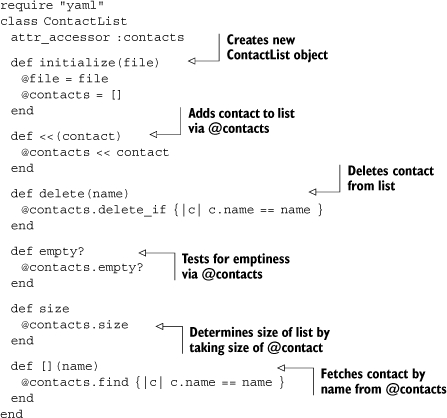
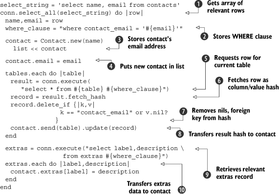

Lab 9. Database facilities and techniques
=============================================

### This lab covers

-   Using plain text data storage
-   Automating contacts in an address book
-   Using Ruby’s API for gdbm
-   Using relational databases

So far we’ve taken a look at a number of technologies and how to use
them with Ruby. This lab will introduce key database tools available
with, and for, Ruby. We’ll take a broad view of what it means for
something to be a database. Our working definition will be that a
database is a storage unit external to your program where data can be
stored. This definition includes highly evolved structures like
relational databases, but also includes, potentially, plain-text files.

We’ll also stipulate that the stored data has to have some intelligence
about itself. A file containing a stream of words—though it may be
loaded into a program as a string or an array—will not count as a
database, because the file itself does not preserve any information
about the structure of the data.

A flat file in YAML format, however, will count as a database, under our
definition. As you’ll see, it’s possible and not even terribly difficult
to wrap a YAML file in a workable API and reap the benefits of
addressing your data structurally while also having access to it in text
form. Text files are not the whole story, of course. Ruby ships with
several flavors of the Berkeley database (DBM) system. We’ll also look
at tools available for creating and manipulating relational databases in
Ruby.

Throughout the lab, we’ll work with a specific example: the
implementation of an API for storing personal contacts—an address book.
We’re not so much concerned here with implementing the whole address
book as with implementing the programming interface to the database
facilities. Examples will include a certain amount of address-book
implementation, but primarily we’ll be looking at how to set up a
database in which contact information can be stored, and how to talk to
such a database in Ruby. We’ll implement the API twice, once for YAML
storage and once for gdbm. We’ll then use the MySQL and database
interface libraries (DBI) to move data from one database format to
another.

We’re going to start with YAML, a data-serialization tool that can, with
a little assistance from Ruby, form the kernel of a simple
data-persistence library.

#### Pre-reqs:
- Google Chrome (Recommended)

#### Lab Environment
Al labs are ready to run. All packages have been installed. There is no requirement for any setup.

All exercises are present in `~/work/ruby-programming/` folder.


### 9.1. Using plain-text files for data persistence

Using YAML as a data-persistence tool is an example of the more general
case of using plain-text files for this purpose. You’ll find other ways
to do this in Ruby, such as the CSV (comma-separated values) facility in
the standard library. XML files fall into this category, too.

None of these are full-fledged database systems. What they have in
common with such systems is that they include information about the
data, together with the data. CSV files don’t contain *much* information
about the data, but they do preserve ordering and, often, something like
column or header information. XML preserves relationships in and among
nested data structures. YAML does something similar with the avowed goal
of being somewhat easier to read than XML, and more suitable for storing
arbitrary Ruby data structures.

In looking at plain-text data-storage techniques, then, we’ll focus on
YAML as the one that offers the richest combination of complexity on the
data end and editability on the text end.

* * * * *

##### Note

This example covers YAML persistence, but we also cover YAML elsewhere
in more depth. See [lab
10](https://github.com/fenago/ruby-programming/blob/master/lab_guides/Lab_1.md)
for in-depth coverage of using YAML as a persistence mechanism.

* * * * *

YAML is a data-serialization format: Ruby objects go in, and a string
representation comes out. The strings generated by YAML conform to the
YAML specification. YAML, itself, is not specific to Ruby; Ruby has an
API for it, but so do numerous other languages. Here’s a Ruby example in
an irb session:

``` {.code-area}
1>> hash = { :one => 1, :two => 2, :colors => ["red","green","blue"] }=> {:colors=>["red", "green", "blue"], :one=>1, :two=>2}>> require 'yaml'    => true>> puts hash.to_yaml    ---:colors:- red- green- blue:one: 1:two: 2
```

[copy **](javascript:void(0))

YAML is part of the Ruby standard library. You just have to load it
, and then your objects can be serialized to
YAML using the to\_yaml method .

Objects serialized to YAML can be read back into memory. Picking up from
the last example:

``` {.code-area}
1>> y_hash = hash.to_yaml=> "--- \n:colors: \n- red\n- green\n- blue\n:one: 1\n:two: 2\n">> new_hash = YAML.load(y_hash)=> {:colors=>["red", "green", "blue"], :one=>1, :two=>2}>> new_hash == hash=> true
```

[copy **](javascript:void(0))

The YAML.load method can take either a string or an I/O read handle as
its argument, and it deserializes the string or stream from YAML format
into actual Ruby objects.

While objects are in serialized string form, you can edit them directly.
In other words, YAML gives you a way to save data and also edit it in
plain-text, human-readable form. Part of the incentive behind the
creation of YAML was to provide a plain-text format for representing
nested data structures that wasn’t quite as visually busy as XML.

#### Problem

You need a way to automate the storage and retrieval of professional and
personal contacts (an address book), but you want it to be in plain text
so that you can edit the entries in a text editor as well as alter them
programmatically.

#### Solution

We’ll write code that uses YAML, together with simple file I/O
operations, to provide a programmatic interface to a plain text file
containing contact entries.

First things first: let’s start with a test suite. Aside from the merits
of writing tests in general, this will allow us to create examples of
how the code should be used before we’ve even written it. There’s no
better way to describe how you want an API to work than to write some
tests that put it to use.

We’ll create two classes: Contact and ContactList. The initializer for
Contact will take the contact’s name as the sole argument and will yield
the new Contact instance back to the block, where it can be used to set
more values. [Listing
9.1](https://github.com/fenago/ruby-programming/blob/master/lab_guides/Lab_9.md)
shows the class declaration and setup method for the test suite—you can
place this code in a file called contacts\_y\_test.rb (the “y” indicates
that this is for the YAML implementation). Our API for the contact code
has already started to take shape.

##### Listing 9.1. Class declaration and setup method for testing the contact code

``` {.code-area}
1require "test/unit" require "contacts_y"     class TestContacts < Test::Unit::TestCase   def setup    @filename = "contacts"    @list = ContactList.new(@filename)       @contact = Contact.new("Joe Smith")       joe.email = "joe@somewhere.abc"        joe.home[:street1] = "123 Main Street"       joe.home[:city] = "Somewhere"    joe.work[:phone] = "(000) 123-4567"    joe.extras[:instrument] = "Cello"    @list << @contact      end end
```

[copy **](javascript:void(0))

In addition to test/unit, we load what will eventually be our
implementation file: contacts\_y.rb . After
the loading preliminaries, we instantiate a contact list along with a
filename , and a contact with a name
. In addition to the name, the contact has an
email address , and several apparently deeper
hash-like data structures: home, work, and extras
. *The* ContactList object itself appears,
not surprisingly, to have an array-like interface, judging by the
appearance of the append operator (\<\<) .

Now it’s time to write some tests for business logic. The setup method
inserts one Contact object into the list. What about retrieving an
object? [Listing
9.2](https://github.com/fenago/ruby-programming/blob/master/lab_guides/Lab_9.md)
shows a method that does exactly that.

##### Listing 9.2. Testing the removal of a Contact object from a ContactList object

``` {.code-area}
1def test_retrieve_contact_from_list       contact = @list["Joe Smith"]   assert_equal("Joe Smith", contact.name)  end  def test_delete_contact_from_list       assert(!@list.empty?)   @list.delete(@contact.name)   assert(@list.empty?)  end end
```

[copy **](javascript:void(0))

[Listing
9.2](https://github.com/fenago/ruby-programming/blob/master/lab_guides/Lab_9.md)
includes a method that retrieves a contact 
and one that removes a contact from the list
. These two methods go in the test file after
the setup method. We’ll also close out the class so that we can write
the implementation and get the test to pass.

Let’s start with the ContactList class. We’ll give each ContactList
instance an array, in which it will store the actual Contact objects.
The business of the ContactList class will consist mostly of deciding
what, and when, to pass along to this array: inserting contacts,
removing contacts, and, of course, persisting contacts to a YAML file
and reading contacts from a file.

The initial implementation of ContactList is shown in [listing
9.3](https://github.com/fenago/ruby-programming/blob/master/lab_guides/Lab_9.md).
We’re not using YAML yet, but we’ll need it, so it’s being loaded.
(We’re also not yet using the contacts accessor methods, but we’ll use
it a little later so it’s best to put it in now.) Most of the action is
in the @contacts array, which is expected to contain Contact objects.
The code in [listing
9.3](https://github.com/fenago/ruby-programming/blob/master/lab_guides/Lab_9.md)
can be saved to contacts\_y.rb.

##### Listing 9.3. Initial implementation of the ContactList class



The @contacts array fields requests for array-like operations. Some of
these operations work the way they do out of the box for any Ruby array
(such as empty?, size, and \<\<). Others require special implementation
to make sure they do the right thing for a list of Contact objects. Note
that delete and [] use a name lookup to figure out which contact you
want to operate on.

Next comes the implementation of the Contact class, which will be
responsible for storing the contact information itself. We want to be
able to store separate contact info for home and work. Each of these
sets of data will be stored as a hash and accessed as an attribute of
the Contact object. The name and email properties will be separate,
stored as individual attributes rather than parts of any of the hashes,
as shown in [listing
9.4](https://github.com/fenago/ruby-programming/blob/master/lab_guides/Lab_9.md).

##### Listing 9.4. The Contact class we use to store contact records

``` {.code-area}
1class Contact  attr_reader :name, :email, :home, :work, :extras  attr_writer :name, :email  def initialize(name)   @name = name   @home = {}   @work = {}   @extras = {}  end end
```

[copy **](javascript:void(0))

Now, we can run the tests:

``` {.code-area}
1$ ruby contacts_y_test.rbLoaded suite contacts_y_testStarted..Finished in 0.000594 seconds.2 tests, 3 assertions, 0 failures, 0 errors
```

[copy **](javascript:void(0))

Success: no failures, no errors.

Now let’s get to the YAML side of things. We want a ContactList object
to know how to save itself, in YAML format, to a file, and we want the
ContactList *class* to know how to load a YAML file into a new
ContactList instance. [Listing
9.5](https://github.com/fenago/ruby-programming/blob/master/lab_guides/Lab_9.md)
shows a test for these functions; you can paste this test into the
existing test class.

##### Listing 9.5. Saving and loading a ContactList object

``` {.code-area}
1def test_save_and_load_list  @list.save  relist = ContactList.load(@filename)  assert_equal(1,relist.size)  contact = relist["Joe Smith"]  assert_equal("Joe Smith", contact.name) end
```

[copy **](javascript:void(0))

To get these new assertions to succeed, we have to add save and load
methods to the ContactList class, as shown in [listing
9.6](https://github.com/fenago/ruby-programming/blob/master/lab_guides/Lab_9.md).

##### Listing 9.6. Second set of methods for the ContactList class

``` {.code-area}
1def save  File.open(@file, "w") do |fh|   fh.puts(@contacts.to_yaml)     end end def self.load(file)     list = new(file)  list.contacts = YAML.load(File.read(file))     list end
```

[copy **](javascript:void(0))

These two methods can be pasted into the class definition for
ContactList. Note that load is a class method, so it’s defined directly
on the ContactList class object (represented in context by self
).

It’s in the load and save methods that you can see the use of YAML, and
it’s very simple. When you want to save the list, you convert its
@contacts array to YAML and print the resulting string to the file
. When you want to read the list in, you use
the load class method of YAML, passing it a string consisting of the
contents of the file . (You can also pass an
open File object to YAML.load.)

The new tests pass. And so, with rather little fanfare, we have data
persistence. Running the tests will create a file called “contacts”,
containing the YAML representation of the Joe Smith contact. This brings
us to the other side of the YAML coin: the ability to edit the YAML file
itself. You do have to be a bit careful, because the YAML specification
has rules you have to follow. But as long as you follow the YAML rules,
you can make as many changes as you want to the file between reads.

[Listing
9.7](https://github.com/fenago/ruby-programming/blob/master/lab_guides/Lab_9.md)
shows the contacts file resulting from running the tests for the contact
classes.

##### Listing 9.7. The contacts output file, in YAML format

``` {.code-area}
1--- - !ruby/object:Contact  email: joe@somewhere.abc  extras:   :instrument: Cello  home:   :city: Somewhere   :street1: 123 Main Street  name: Joe Smith  work:   :phone: (000) 123-4567
```

[copy **](javascript:void(0))

You don’t want to touch the first two lines, which are YAML’s business.
But you can change the values of the strings, or add more data, and all
your changes will be happily absorbed into the in-memory Contact objects
next time you use the Contact class.

#### Discussion

YAML provides easy serialization of objects to strings, and it’s not
much harder to save those strings to a file. Whether or not you decide
it’s technically correct to call this a database, it certainly has
database-like properties. You don’t *have* to edit your YAML files by
hand; you can treat them as a black box. But it’s nice to know that
they’re easy to edit.

Still, plain-text files are far from the only game in town. We’ll look
next at Ruby’s API for gdbm, the GNU version of the Berkeley DB database
system.

### 9.2. Using the (g)dbm API

Ruby ships with wrappers for the DBM, gdbm, and sdbm database libraries.
These libraries are a family, of which the original member is DBM. The
GNU Database Manager version is gdbm, and sdbm (Substitute DBM) is a
public-domain version based on the earlier ndbm (New Database Manager, a
successor to DBM). We’ll focus on gdbm here, though the examples should
work with any of the three \*dbm libraries included with Ruby.

#### Problem

You want a simple contact manager, and you need to share the files with
someone who may not have access to YAML.

#### Solution

Our hypothetical YAML crisis provides a chance to look at a gdbm-based
solution. We’ll aim for something that’s as close as possible to the
YAML version of the contact manager, and the best way to guarantee that
closeness is to use a similar test suite.

The tests are shown in [listing
9.8](https://github.com/fenago/ruby-programming/blob/master/lab_guides/Lab_9.md).
Note that we’re loading contacts\_g, implying that the implementation of
the two classes will be in contacts\_g.rb.

##### Listing 9.8. The contact application tests

``` {.code-area}
1require 'test/unit' require 'contacts_g' Dir.mkdir("gdbm_contacts") unless File.exist?("gdbm_contacts")    class GDBMTest < Test::Unit::TestCase  def setup   @list = ContactList.new("gdbm_contacts")   @contact = Contact.new("Joe Smith")   @list << @contact                      @contact.home["street1"] = "123 Main Street"      @contact.home["city"] = "Somewhere"   @contact.work["phone"] = "(000) 123-4567"   @contact.extras["instrument"] = "Cello"   @contact.email = "joe@somewhere.abc"  end  def test_retrieving_a_contact_from_list   contact = @list["Joe Smith"]   assert_equal("Joe Smith", contact.name)  end  def test_delete_a_contact_from_list   assert(!@list.empty?)   @list.delete("Joe Smith")   assert(@list.empty?)   assert(@list.contact_cache.empty?)  end  def test_home   contact = @list["Joe Smith"]   assert_equal("123 Main Street", contact.home["street1"])  end  def test_email   contact = @list["Joe Smith"]   assert_equal("joe@somewhere.abc", contact.email)  end  def test_non_existent_contact_is_nil   assert_equal(nil, @list["Some Person"])  end  def teardown   @list.delete("Joe Smith") if @list["Joe Smith"]  end end
```

[copy **](javascript:void(0))

The test suite for the gdbm implementation is similar to the one for the
YAML implementation, but there are a few differences. One extra step
here is creating the gdbm\_contacts directory, so that the tests will be
able to find it . Also, some tests have been
replaced to show you some of what you might want to do specifically for
gdbm (though neither test suite is exhaustive). It’s now necessary to
add the contact to the list *before* setting any of the contact’s
properties . The reason is the
hash-to-database magic only works if the contact’s components—home,
work, extras—are gdbm file handles. And that will only happen when the
Contact objects become part of a ContactList; it’s the ContactList
object that knows where the directory of gdbm files is.

Another tweak is that all keys are now strings, instead of symbols
. gdbm doesn’t like symbols; it wants
everything to be strings. Nonetheless, the goal of preserving the API in
the gdbm reimplementation has been largely met, assuming we can get the
tests to pass. On now to the implementation itself.

The way gdbm works is very different from the way YAML works. gdbm is
definitely more of a real database, but it is simpler in terms of the
kinds of data structures it can store. gdbm stores key/value pairs. The
Ruby gdbm extension is programmed almost exactly like a hash.

Here’s a simple example of using gdbm. First, run this code from a
file—it will create a file called movies.db, so make sure you’re not
clobbering one!

``` {.code-area}
1require 'gdbm'movies = GDBM.new("movies.db")movies.update(      { "Vertigo" => "Alfred Hitchcock",        "In a Lonely Place" => "Nicholas Ray",        "Johnny Guitar" => "Nicholas Ray",        "Touch of Evil" => "Orson Welles",        "Psycho"  => "Alfred Hitchcock",         })movies.close
```

[copy **](javascript:void(0))

Notice the use of the update method, which is familiar as a hash
operation. Now, go into irb and do this:

``` {.code-area}
1>> require "gdbm"=> true>> movies = GDBM.new("movies.db")=> #<GDBM:0xb7ef12cc>>> movies.values.uniq
```

[copy **](javascript:void(0))

You’ll get a list of all the directors in your database:

``` {.code-area}
1=> ["Orson Welles", "Nicholas Ray", "Alfred Hitchcock"]
```

[copy **](javascript:void(0))

The gdbm API is designed to be as hash-like as possible, with all the
hash operations automatically writing to, or reading from, the database
file.

The contact data we’re storing isn’t a simple hash, though. A contact
has a name and an email address, which are just strings and could serve
as hash keys, but the additional information, such as the home data,
comes in the form of nested or embedded hashes.

One way to use gdbm in a situation where you need hashes within hashes
is to serialize the inner hashes with YAML, and store them as strings.
There’s nothing terrible about doing that, but we’ve already looked at a
YAML solution, so we’ll do it a different way here. For our gdbm
implementation of the contact list, the entire list will be represented
by a *directory*, and each contact will have its own *subdirectory*.
Inside that subdirectory, there will be individual gdbm files for each
of the inner data structures: home, work, extras.

In the YAML implementation, a ContactList object was a kind of proxy to
the actual array of Contact objects. In the gdbm implementation,
ContactList objects will be proxies to directories. It’s desirable to
keep the API as transparent as possible. As API users, we don’t want to
have to know the details of how the files are being handled, so all of
that can be encapsulated in the ContactList class.

The Contact objects can do their share of the lifting, too. A
ContactList is in charge of a whole directory, and each contact has a
subdirectory. It makes sense, then, for the Contact object to know the
name of its directory.

Let’s start this time with the Contact class. It’s shown in [listing
9.9](https://github.com/fenago/ruby-programming/blob/master/lab_guides/Lab_9.md).

##### Listing 9.9. The Contact class for the gdbm implementation of the contacts library

``` {.code-area}
1class Contact  COMPONENTS = ["home", "extras", "work"]     attr_accessor :name, *COMPONENTS      attr_reader :dirname      def initialize(name)       @name = name   @dirname = @name.gsub(" ", "_")  end  def components      COMPONENTS.map {|comp_name| self.send(comp_name) }  end  def open   COMPONENTS.each do |component|    self.send(component + "=", GDBM.new(component))      end  end  def close   components.each do |component|    component.close unless component.closed?      end  end  def email          extras["email"]  end  def email=(e)   extras["email"] = e  end end
```

[copy **](javascript:void(0))

One addition to the Contact class is the COMPONENTS constant
, which contains an array of strings
corresponding to the nested containers in the Contact objects. The point
of having this constant is to encapsulate these names in one place. That
way, both the Contact and ContactList objects can find all of them
easily, and the names will not have to be hard-coded in specific
methods. Moreover, as you’ll see when we look at the ContactList class,
each component is actually going to be the name of a gdbm database: one
each for home, work, and extras.

We want a read-write attribute for name, and one for each of the
components . Using the unary \* operator on
COMPONENTS has the effect of turning the array into a bare list, so it’s
as if we’d written this:

``` {.code-area}
1attr_accessor :name, :home, :work, :extras
```

[copy **](javascript:void(0))

We also want each Contact object to have a reader attribute in which it
can store the name of its directory , which
will be a subdirectory of the master directory of the contact list to
which the contact belongs.

The initialize method preserves the name (which is the actual name of
the person whose contact information this is), and also stores the
directory name . The creation of the
directory name involves replacing spaces in the name with underscores.
You can adjust this if you prefer a different munging algorithm, as long
as the result is a valid directory name (and preferably a reasonably
cross-platform one).

The components method provides a translation from the component names to
the actual components . This, in turn, allows
the close method to walk efficiently through all the components,
performing a close operation on any that are not already closed.

Speaking of the close method, the Contact class provides both open and
close methods. The open method creates a new gdbm object for each
component , assigning that new object to the
relevant component attribute of the contact. If there’s already a file
with the appropriate name (for example, “extras”), gdbm will open it for
reading and writing; otherwise, it will be created. (There are some
further subtleties to the way gdbm handles read and write access, but
we’ll assume for the purposes of the contact list that it’s private and
only being accessed by one program at a time.)

The close method goes through the components corresponding to the
filenames in which the data is stored, and performs the gdbm close
operation on each one. This terminates the database connection to each
file .

Finally, we include special methods for handling the contact’s email
address . The email address gets stored in,
and retrieved from, the extras["email"] slot. The point of writing these
methods is to enable us to set and retrieve the email address as if it
were a simple attribute, even though storing it is a little bit
involved. (A contact might have separate home and work email addresses,
of course. But we’ll keep it simple, as we did in the YAML
implementation, and assume that each contact has only one email
address.)

Now, let’s look at ContactList. The specifics of implementing this class
derive partly from the way gdbm works, and partly from the way
directories work. We want to be able to get a contact from a contact
list:

``` {.code-area}
1contact = @list["Joe Smith"]
```

[copy **](javascript:void(0))

The list object is going to need to go to the directory, look for a
directory with the right name, and load all the gdbm files into a
Contact object. Fair enough, but not very efficient. It might pay to
keep a cache of Contact objects on hand, so the search doesn’t have to
be repeated if the same contact is requested twice.

With that in mind, look at [listing
9.10](https://github.com/fenago/ruby-programming/blob/master/lab_guides/Lab_9.md),
which shows the first segment of the ContactList class, including the
initialize method, the [] method (which retrieves a Contact object by
name), and a helper method called populate\_contact. You can add this
code to the top of the file containing the Contact class (or the bottom,
though if you do that, it’s best to follow the convention of keeping the
two require lines at the top of the file).

##### Listing 9.10. The ContactList class for storing contact records

``` {.code-area}
1require 'gdbm' require 'fileutils'    class ContactList  attr_reader :contact_cache      def initialize(dir)       @dir = dir   @contact_cache = []  end  def [](name)   contact = @contact_cache.find {|c| c.name == name }      return contact if contact   contact = Contact.new(name)      Dir.chdir(@dir) do    if File.directory?(contact.dirname)        populate_contact(contact)             @contact_cache << contact        else     contact = nil    end   end   contact      end  def populate_contact(contact)   Dir.chdir(contact.dirname) do        contact.open   end  end
```

[copy **](javascript:void(0))

The fileutils extension is loaded for the sake of one or two utility
methods to be used later .

Then, upon initialization , the list stores
its directory and creates an array that will serve to cache Contact
objects. That array is available as a reader attribute
. When you try to retrieve a contact from the
list, the list object first checks the cache
. If the contact is there, it returns it. If
the contact isn’t there, the real fun starts.

First, a new Contact object is created .
Then, the ContactList object switches to its own directory, where it
looks for a subdirectory whose name is the same as the directory name
reported by the Contact object—“Joe\_Smith” for the contact “Joe Smith,”
for example . If such a directory exists, the
contact’s components get initialized to a new gdbm database object,
based on the component name . The contact is
now added to the list’s contact cache , so
that the whole directory-based instantiation won’t have to be repeated
during this session. If, however, the directory corresponding to the
requested component name does not exist, the contact variable is reset
to nil. This indicates a request for a nonexistent contact. (Remember,
you’re just trying to fetch an existing contact, not create one.)

Finally, the value of the contact variable—which is going to be either
nil or a gdbm object—is returned from the method
. If it’s nil, you know that the contact you
requested does not exist on this list. The populate\_contact utility
method navigates from the top directory of the list down to the specific
subdirectory for this contact . It then
calls the open method on the contact—which, as you’ll recall, calls
GDBM.new on each of the contact’s components, creating database handles
on the relevant files.

Now let’s look at adding an object to a list and removing one from the
list. We’re shooting for the same API as the YAML version:

``` {.code-area}
1@list << contact     # add a contact@list.delete(contact)  # delete a contact
```

[copy **](javascript:void(0))

As [listing
9.11](https://github.com/fenago/ruby-programming/blob/master/lab_guides/Lab_9.md)
shows, these operations require attention to the filesystem and
directory structure.

##### Listing 9.11. Adding and removing a contact

``` {.code-area}
1def <<(contact)  Dir.chdir(@dir) do   Dir.mkdir(contact.dirname) unless File.exists?(contact.dirname)      populate_contact(contact)  end @contact_cache << contact    end def delete(name)  contact = self[name]  return false unless contact     contact.close         Dir.chdir(@dir) do   FileUtils.rm_rf(contact.dirname)      end  contact_cache.delete_if {|c| c.name == name }     true    end
```

[copy **](javascript:void(0))

To add a contact, we need to create a new directory, unless one exists
 (which is possible; there could already be a
Contact object corresponding to this directory, even if it’s not part of
a contact list). We also need to go into the directory and populate the
contact’s components based on the gdbm files in the directory, creating
them as necessary or just opening them for reading if they’re already
there. Finally, we add the contact to the list’s contact cache
.

Removing a contact involves several steps. First, we only want to delete
contacts we actually have, so the method returns false if the contact is
unknown . Second, we ask the contact to close
itself, which means walking through the components and closing each gdbm
connection in turn . Then we use the
FileUtils.rm\_rf method to delete the contact’s directory
, remove it from the cache if it’s there
, and return true to indicate a successful
deletion .

Arguably, directory removal is a rather harsh step; it means that the
information is really gone, not just hidden from the list. The
reasoning, though, is that the list is really in charge of the contact,
and that in practice we’ll always access contacts through their lists.
You can, of course, soften the code, if you want to devise a way to keep
the contact but remove it from the list, or a way to copy contacts from
one list to another.

We can now add, remove, and retrieve contacts from the list. We just
need a few query methods: directory\_names (the names of all the list’s
directories, which will be the munged versions of the names of the
contacts), empty?, and size. [Listing
9.12](https://github.com/fenago/ruby-programming/blob/master/lab_guides/Lab_9.md)
shows the remaining code necessary to complete the ContactList class.

##### Listing 9.12. The remaining methods for the ContactList class

``` {.code-area}
1def directory_names   Dir["#{@dir}/*"]  end  def size   directory_names.size  end  def empty?   directory_names.empty?  end end
```

[copy **](javascript:void(0))

This class, along with the Contact class, now gives us all the
functionality we need to make our tests pass.

``` {.code-area}
1$ ruby contacts_g_test.rbLoaded suite contacts_g_testStarted.....Finished in 0.071413 seconds.5 tests, 7 assertions, 0 failures, 0 errors
```

[copy **](javascript:void(0))

The key, again, is the directory structure, which we have to walk
through explicitly, but which adds an extra level of nesting so that a
Contact object can present us with what amounts to a collection of
hashes.

#### Discussion

The gdbm version of the contact manager is a bit more sprawling, in
terms of file space and directory structure, than the YAML version, and
gdbm files, unlike YAML files, are not human-readable. But gdbm is a
real database tool, not a different tool being recruited for
database-like operations (such as a data-serialization tool, in the case
of YAML). In practice, that means gdbm is optimized for database
operations. Furthermore, having the entries spread out over many file
directories means that you don’t have to read them all in at the same
time.

If you’re just dealing with a few contacts or a small amount of data in
whatever domain you’re writing this code for, it’s not going to make any
noticeable difference whether you load in all the data at once or
traverse a directory looking for it. If you’ve got a lot of data, you’ll
probably hit a point where splitting the data out into many gdbm files
will speed things up. Of course, as with all performance questions, you
have to try it out and measure for yourself. If you’re using these tools
for relatively small operations, you’ll likely find any of them
acceptable in terms of performance. That’s part of their merit: they’re
easy to write and usually fast enough in operation.

One interesting programming issue arising in connection with the gdbm
implementation of the contact manager is the issue of how much
functionality should be embodied in the Contact objects, and how much
should be delegated to the ContactList objects. Notice, for example,
that a Contact object does not know how to populate itself, in the sense
of opening connections to all of its gdbm files. The list handles that,
through the populate\_contact method. Would it be better to teach a
contact how to populate itself, and then have the list call

``` {.code-area}
1contact.populate
```

[copy **](javascript:void(0))

instead of calling its own populate\_contact method? You could certainly
make a case for that; it puts the knowledge inside the object that’s
nearest to the operation. On the other hand, the contact list is really
what we’re modeling here. In a sense, the Contact class only exists as a
convenient way to split out some of the list’s functionality. If that’s
true, then how *much* functionality we split out is pretty much
discretionary. And there’s certainly no harm in experimenting with
different ways of doing the same thing.

We’ll turn next to the Ruby MySQL module, which takes us into the realm
of relational databases.

### 9.3. The MySQL driver

We’ve now got enough usable code for manipulating contacts and contact
lists to put it to some use. This will also allow us to delve into the
world of relational databases and the available APIs for Ruby.

Overall, the story is that there are individual (database) drivers for
MySQL, PostgreSQL, SQLite, and others. Any of these can be programmed
individually. On top of these, you can also use the DBI (Database
Interface) package, which provides an abstract API that can serve as a
frontend to any of the DBD packages available.

We’ll look at a use case for the “pure” MySQL driver here, and in
[section
9.4](https://github.com/fenago/ruby-programming/blob/master/lab_guides/Lab_9.md)
we’ll do something with DBI. Unlike the YAML and gdbm examples, these
examples will not involve writing an API for a contact list but, rather,
moving contact list data around: *to* a MySQL database first, and *from*
a MySQL database second. It’s not uncommon to use database tools in
situations where you’re moving data from one storage system to another.
The nice thing about the facilities available in Ruby is that you can do
quite a lot of this at a rather high level of abstraction.

#### Problem

You’ve got a YAML file of contact information, and you want to store it
in a relational database.

#### Solution

Let’s tackle this problem by using the MySQL driver. This driver is
available as a gem or as a non-gem Ruby package. To install it as a gem,
simply run the following command:

``` {.code-area}
1gem install mysql
```

[copy **](javascript:void(0))

To get started, take a look at [listing
9.13](https://github.com/fenago/ruby-programming/blob/master/lab_guides/Lab_9.md),
which shows several Contact objects in the YAML format.

##### Listing 9.13. An example of a YAML file for contact records

``` {.code-area}
1--- !ruby/object:ContactList contacts: - !ruby/object:Contact  extras:    :sport: bowling    :car: Toyota    :pets: armadillo  home:    :postal: "12345"    :state: NJ    :country: USA    :street1: 123 Main    :city: Somewhere  name: David Black  work: {}  email: dblack@somewhere - !ruby/object:Contact  extras: {}  home:    :postal: "23456"    :state: AB    :country: USA    :street1: 234 Main    :city: Somewhere  name: David Smith  email: dsmith@somewhere  work:    :company: The Somewhere Consultants    :street1: 234 Main    :street2: Suite 33943    :city: Somewhere    :postal: "23456"    :state: AB    :country: USA - !ruby/object:Contact  extras:    :instrument: violin    :car: Honda    :pets: cat  home:    :postal: "00000"    :state: US    :country: USA    :street1: 9393 West Main    :city: Nowhere  name: Joe Smith  email: jsmith@somewhere  work: {} - !ruby/object:Contact  extras: {}  home:    :postal: "98765"    :state: HH    :country: USA    :street1: 8 North Main    :street2: Apt. 3    :city: Anywhere  name: John Smith  email: jsmith2@somewhere  work: {}
```

[copy **](javascript:void(0))

The first step in migrating these contacts to a MySQL database is
designing and creating the database itself. We’ll use the contact’s
email address as the primary key for the contacts table and as the
foreign key for all the other tables. [Listing
9.14](https://github.com/fenago/ruby-programming/blob/master/lab_guides/Lab_9.md)
contains SQL instructions suitable for creating this database in MySQL.
Running [listing
9.14](https://github.com/fenago/ruby-programming/blob/master/lab_guides/Lab_9.md)
as a MySQL script, with appropriate permissions, should create the
database.

##### Listing 9.14. SQL instructions for creating the contacts database

``` {.code-area}
1drop database contacts; create database contacts; use contacts; drop table if exists contacts; create table contacts (  name varchar(100),  email varchar(50),  primary key (email)) ENGINE=INNODB; drop table if exists home; create table home (  street1 varchar(100),  street2 varchar(100),  city varchar(50),  postal varchar(20),  state varchar(20),  country varchar(25),  contact_email varchar(50),  foreign key(contact_email)   references contacts(email)   on delete cascade) ENGINE=INNODB; drop table if exists work; create table work (  company varchar(100),  street1 varchar(100),  street2 varchar(100),  city varchar(50),  postal varchar(20),  state varchar(20),  country varchar(25),  contact_email varchar(50),  foreign key(contact_email)   references contacts(email)   on delete cascade) ENGINE=INNODB; drop table if exists extras; create table extras (  label varchar(50),  description varchar(150),  contact_email varchar(50),  foreign key(contact_email)   references contacts(email)   on delete cascade) ENGINE=INNODB; grant all on contacts.* to 'contacter'@'localhost' \  identified by 'secret'
```

[copy **](javascript:void(0))

The last command (grant) gives all the necessary privileges to the
“contacter” user. You can, of course, make up your own username and
password for that command. The main thing is to create a non-root user,
since the username and password are going to appear in a plain-text
program file. (Not that you’d be handing the file around anyway, but
it’s always better not to put very important passwords in plain text
anywhere.)

The next step is to create the “glue” program that will take us from
YAML to MySQL. This program is going to read the YAML file in, which
will create a ContactList object containing several Contact objects, and
write it out again, this time to the MySQL database. The input, however,
isn’t entirely congruent with the output; we have to do a little work to
make it fit.

Contacts have home and work components, which map very easily from a
hash (the structure by which they’re represented inside the Contact
object) to a database table. In fact, the keys of the home and work
tables in the database schema are simply lifted from the key names in
the home and work hashes.

The extras component is a little different. Here, keys are arbitrary,
which means they cannot match up to database column names, since those
names have to exist in advance. (It’s possible to create columns on the
fly using the MySQL API, but that’s just asking for confusion and
trouble.) Instead of storing each value in a column named for its key,
the extras table has two storage columns: label and description. It also
has a contact\_email column, where the email address of the contact will
be stored.

What this means is that while there will be one record in the home table
and one in the work table for each contact, there will be one record in
the extras table for every entry in the contact’s extras hash. The
key/value combination in the hash becomes the label/description
combination in an extras record.

Most of the rest of the work of writing the program involves creating
query strings and shipping them off to the database via the MySQL API.
Each Contact object will trigger a three-part cycle of insertions:

-   The query that creates the entry in the contacts table itself
-   The loop that creates the entries in the home and work tables
-   The loop that creates the entries in the extras table

First things first. Before any of this happens, we need to load in the
necessary libraries, as well as our application code (contact\_y.rb),
and make connections on both the YAML side and the MySQL side:

``` {.code-area}
1require 'yaml'require 'mysql'require 'contact_y'conn = Mysql.new("localhost", "contacter", "secret", "contacts")    list = YAML.load(File.read("contacts.yml"))
```

[copy **](javascript:void(0))

The assignment to conn gives us a new Mysql object—essentially an
addressable handle on a database connection .
Note the arguments given to Mysql.new: host, username, password, and
database name. The variable list  will
contain the ContactList represented in the YAML file; this contact list,
in turn, contains and manages the specific contacts.

Now, let’s take care of the first of the three major stages: creating
the entry in the contacts table. Just for fun, here’s how to do it using
Ruby’s % interpolation operator:

``` {.code-area}
1list.contacts.each do |contact| conn.query "INSERT INTO contacts (`name`, `email`)  VALUES ('%s','%s')" % [contact.name, contact.email]
```

[copy **](javascript:void(0))

The %s format specifiers work as they do in the sprintf method family:
they serve as placeholders for a string to be determined later. The two
necessary strings are provided in an array after the main string, and
between the main string and the array comes another %-sign—this is what
triggers the interpolation operation.

Amidst all this handy string manipulation, notice what’s actually
happening here: a call to conn.query. We’re using conn, the database
connection handle, to send a SQL query to the database.

Next up: the home and work components. For each of these, the goal is to
send a query that will insert the right values in the right fields. The
fields into which we’ll insert values are those that have the same names
as the hash keys from the YAML structure (“postal”, “state”, etc.), plus
the extra field contact\_email—the primary key column in the home and
work tables, which has no corresponding value in the YAML structure.

We first want to drill down from the contact to its components. Then we
want to isolate each component’s keys and create a query string that
uses them as field names, together with the component’s values as the
database values. Here’s the code that will do this:

``` {.code-area}
1%w{ home work }.each do |component| data = contact.send(component)     items = data.keys                fields = (["contact_email"] + items).map {|field|  "`#{field}`" }.join(",")       values = [contact.email] + items.map {|field| data[field]}     values.map! {|value| "'#{value}'"}       values = values.join(",")           conn.query("INSERT INTO #{component} (#{fields}) VALUES (#{values})")    end
```

[copy **](javascript:void(0))

The data object is the entire component hash; we acquire it by sending
the name of the component (home or work) to the Contact object
. Then we isolate the keys, which will be
things like street1, street2, and phone, as items
. If we add the string "contact\_email" to
this list of items, we’ll have all the necessary column names for the
relevant database table. (There’s no contact\_email field in the YAML
version, so we have to shoehorn it in to please the MySQL database
schema.) These field names get inserted into backticks and are strung
together with commas . That will give us
something like this for the fields variable:

``` {.code-area}
1`contact_email`, `street1`, `street2`, `city`, etc.
```

[copy **](javascript:void(0))

Those are the fields we’ll be inserting values into. The values
themselves come from a similar, but not identical, mapping of the actual
value for contact.email, plus the actual values for the items (as
retrieved from the data hash). Here, we put the array together first,
because that’s a somewhat longer operation, in this case
. Then the array gets mapped—map! ped,
actually, because the values get changed in place—and then joined with
commas to make a values string out of the array
, .

The result will be something like this:

``` {.code-area}
1'jsmith2@somewhere', '123 Main', '', 'Somewhere', etc.
```

[copy **](javascript:void(0))

Thus, the values string lines up nicely with the fields string, ready
for insertion into the appropriate table .

You may be wondering why it’s necessary to march through all the keys
and dig out all the values for each hash, when there’s a values method
that would do the same thing in one step. The reason is order—or,
rather, lack thereof in a hash. Hashes are unordered, which means that
the order in which their entries are returned is not guaranteed. While
it’s very likely that the keys, when returned separately via the keys
method, will line up with the values as returned by the values method,
it’s a good idea nonetheless to go ahead and retrieve each value
explicitly, so as not to depend on hash ordering in any guise.

The handling of extras comes next. It’s actually a bit less involved
than the handling of the home and work components, though it does
potentially create more records:

``` {.code-area}
1contact.extras.each do |label, description|  conn.query("INSERT INTO extras (`contact_email`, `label`,`description`) VALUES ('#{contact.email}', '#{label}','#{description}')") endend
```

[copy **](javascript:void(0))

* * * * *

##### Encapsulating component references

You’ll recall that for the purpose of the gdbm contracts implementation,
we neatened things up by setting a COMPONENTS constant inside the
Contact class, so that it wasn’t necessary to hard-code the names of the
components wherever they were used. There are a couple of reasons it’s
probably not worth doing that here. First, the extras component has to
be split out anyway. Second, the remaining components have to correspond
exactly to table names in the database.

It is possible to query the database for its table names, and if you
subtract “extras” and “contacts” from the list, you’ll have (as it’s
currently engineered) the names of the other components. Still, while
it’s great to automate things as much as possible, you’ll probably find
that with more or less one-time conversion scripts, it’s inevitable that
certain things are going to have to be hard-coded, and in some cases
will require individual treatment (like “extras”).

* * * * *

Each entry in the extras hash gets an entry in the database, with its
foreign key (contact\_email) set to the current contact’s email field.
And that last end tells you that the big loop—the loop through all the
contacts—is finished.

#### Discussion

The MySQL API may seem a bit raw to you, especially if you’re used to a
full-blown object-relational mapper (ORM) like ActiveRecord or Og. When
you use the API directly, you write a lot of SQL yourself, and that may
or may not be to your taste.

Keep in mind that having the programming interface available can make a
big difference. It gives you all the power of Ruby in front of your SQL
generation. You can, of course, grep through a YAML file and try to
piece together queries yourself, but all you’ll learn by doing that is
how much easier it is when you have a programmatic layer, even if it’s
not an ORM.

If you do have an ActiveRecord-friendly database, you can of course use
the higher-level commands available to you to handle the data more
abstractly. It all depends on what your starting point and goal happen
to be in a given project.

One thing that isn’t covered in the preceding solution is error
handling. Our script will simply die if something goes fatally wrong in
a database operation, and that could leave the database in an
inconsistent state. To prevent this, you can wrap each contact’s set of
queries up as a transaction.

To do this, you first need to turn off auto-commit mode:

``` {.code-area}
1...conn = Mysql.new("localhost", "contacter", "secret", "contacts")list = YAML.load(File.read("contacts.yml"))conn.autocommit(false)
```

[copy **](javascript:void(0))

Now, you need to put each contact’s worth of querying inside a
begin/rescue/end block, where rescuing from a Mysql::Error will result
in a rollback:

``` {.code-area}
1list.contacts.each do |contact| begin# rest of code, through the "extras" loop rescue Mysql::Error => e  puts "Problem with contact #{contact.name}: #{e}"  conn.rollback  next end conn.commitend
```

[copy **](javascript:void(0))

The commit only happens if no Mysql::Error gets raised along the way.
Doing it this way will help you avoid getting the database into an
inconsistent state (such as where a contact record is saved but the home
record is not), and it will also avoid stopping the whole program just
because of one malformed record.

So far, we’ve looked at sending insert queries to the database, which is
important, but it’s not the whole story. Our next problem will take us
in the other direction: starting from a relational database and reading
data out in order to store it in a different format. Moreover, we’ll
take this opportunity to turn the corner to DBI, the high-level Ruby
database interface library.

### 9.4. Using DBI

DBI, Ruby’s database interface library, ships separately, and it
provides a high-level interface that allows you to come about as close
as you can to programming different relational databases with the same
programming tools. The goal is to abstract away the differences between
various databases, and focus on what they have in common. At the same
time (though we won’t pursue it in detail here), DBI can also take
advantage of features that one database has but others don’t.

DBI rests on top of, and needs, one or more database driver (DBD)
packages, such as the MySQL library we used in [section
9.3](https://github.com/fenago/ruby-programming/blob/master/lab_guides/Lab_9.md).
At time of writing, DBI supports 12 DBDs (plus a deprecated one). If you
learn how to use DBI, it’s almost one-stop-shopping for database APIs.

#### Problem

You need to read out some contact records from a relational database and
save them to a gdbm database.

#### Solution

We’re going to use the MySQL database from [section
9.3](https://github.com/fenago/ruby-programming/blob/master/lab_guides/Lab_9.md),
but this time we’ll address the database with DBI. The goal is to
migrate the data to the gdbm-style contacts database. That means we’ll
need to load contacts\_g.rb, as well as DBI. Loading contacts\_g.rb will
in turn cause the gdbm driver to be loaded. We also need to create the
output directory, if it doesn’t exist already.

``` {.code-area}
1require 'dbi'require 'contacts_g'Dir.mkdir("migrated_contacts") unless File.exist?("migrated_contacts")
```

[copy **](javascript:void(0))

Now we need a ContactList object, which will serve as the receptacle for
the data coming in from the MySQL database; the data will be massaged,
of course, so as to fit the shape of Contact objects. (Make sure that
the directory you use already exists, or add something to the script to
create it.) We also need a database connection. And, finally, we need a
list of all the tables in the database, *except* contacts and extras;
those two tables require special handling.

``` {.code-area}
1list = ContactList.new("migrated_contacts")conn = DBI.connect("DBI:Mysql:contacts", "contacter", "secret")tables = conn.select_all("show tables").          flatten - %w{ extras contacts }
```

[copy **](javascript:void(0))

The first argument to DBI.connect is the name of the database, contacts,
qualified with DBI:Mysql to point DBI to the correct driver. Note that
the separators here are single colons, not the double-colon operator
that indicates nested constants in Ruby. The whole thing is just a
string; none of the characters have significance until they’re scanned
and interpreted by DBI itself. The host will default to localhost.

To get the list of tables, we use select\_all to return an array of
rows. In this case, each row is a table name. Rows are returned as
arrays inside arrays, and flattening the array takes out the nesting.
Finally, we remove the names of the tables that require special
treatment: extras and contacts.

The processing of the data from the database consists of a big loop, an
iteration through all the rows of the contacts table. Inside the big
loop is another loop, which handles all the tables in the tables array.
Finally, the data from the extras table is read and transferred.

[Listing
9.15](https://github.com/fenago/ruby-programming/blob/master/lab_guides/Lab_9.md)
shows the big loop, and what happens inside it.

##### Listing 9.15. The loop through the contacts table



The table names will match the relevant components of the gdbm contact:
specifically, home and work.

As with the previous script, where we went from YAML to MySQL, we’re
dealing with three major phases: creating the Contact objects, handling
the miscellaneous tables, and handling the extras table. In preparation,
we get hold of all the contact rows , and
store a WHERE clause that we’re going to use repeatedly
, just to save having to type it out.

Creating and storing a new contact is easy ,
thanks to the API we’ve already developed for the gdbm contacts
database. After storing the contact, we set its email address, using the
email= method, which transparently puts the email address into
extras["email"] .

Then we go through the list of tables. For each table (remembering that
we’ve subtracted extras and contacts from the list), we execute a query
returning the relevant row for this contact .
This request returns an object of class DBI::StatementHandle, which
takes requests for actual delivery of the rows. The relevant request
here is fetch\_hash , which returns the next
row in the form of a hash of column names against values. (A certain
amount of error-checking has been left to the reader, including making
sure that there is only one row returned per table for each contact!) We
then cleanse the hash of the irrelevant contact\_email key, as well as
any entries with nil values  (which gdbm
doesn’t like; it only wants strings, and there’s not much point storing
empty strings for nils). The hash of columns and values is then
transferred to the relevant component of the contact
. The hash update method is effective because
the component is actually a gdbm object, and gdbm objects are programmed
like hashes.

Next comes the extras special case. Here we get all the extras records
belonging to this contact , and make the
appropriate assignments in the extras component
.

#### Discussion

DBI is a great tool for addressing a variety of database systems. Like
the individual drivers, it keeps you fairly close to the SQL, and like
the MySQL driver, DBI is not as abstracted or high-level as ActiveRecord
or Og. But even if you’re writing the statements mostly by hand, the
ability to embed them inside Ruby logic and string handling is extremely
valuable.

In this example, we see again the special casing of the extras table.
Going from YAML to MySQL, the special casing involved the need to create
a separate record for each key/value pair in the extras hash, using the
column names label and description, because the keys for extras are
arbitrary, and it was impossible to have a separate column name for each
one. Going the other way, extracting the data *from* the MySQL database
and putting it back into a Ruby hash structure (which is what gdbm
objects essentially are), it’s possible to shed the label/description
wrapper and go back to having each label be a hash key and the
corresponding description its value.

This kind of massaging of structure is fairly common when you migrate
around the different data-storage facilities available in Ruby (and, of
course, not just in Ruby). The decisions you make about the shape of the
containers are as important as any other feature of the storage process.

### 9.5. Summary

In This lab, we’ve looked at a representative set of database and
data-storage facilities in Ruby. We looked at YAML, the
data-serialization format, as a kind of database tool, having the
particular dual merit of allowing for direct storage of Ruby data
structures and offering a human-readable, editable text representation
of the data it’s storing. From there we went to gdbm, one of the drivers
in the DBM Berkeley database family. gdbm objects are tied invisibly to
files and are programmed like Ruby hashes, making for another quick and
easy data-storage tool.

In both YAML and gdbm, we developed library code for creating and
managing a list of contacts. The rest of the lab involved using this
code in the service of trying out the relational database facilities
available for Ruby. We undertook the task of migrating a YAML database
of contact objects to a MySQL database, and then we migrated the same
MySQL database back out, into gdbm contact-list format. Both of these
projects were written “script-style” (with no classes, just procedural
code), and both shed some light on the process of formulating and
implementing data structures across different storage systems.

We haven’t covered everything in the Ruby database realm, by any means,
but you’ve seen enough to give you a toolset for writing your own
scripts, and to give you your bearings as you explore some of the other
available tools. You’ll likely find that these techniques have some very
practical uses—if not every single day, then at critical junctures in
data-migration and -reorganization projects. In the next lab, we’ll
take these ideas further and look at handling structured data files more
in depth.